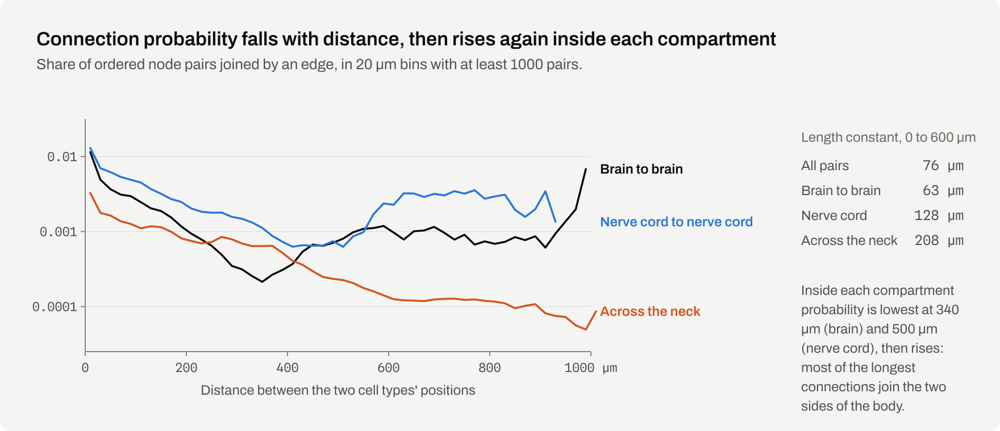
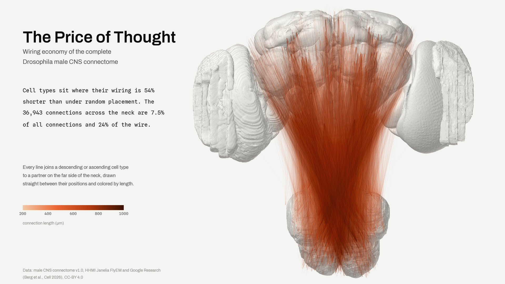
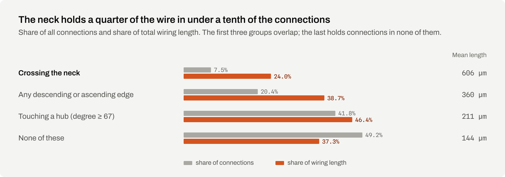
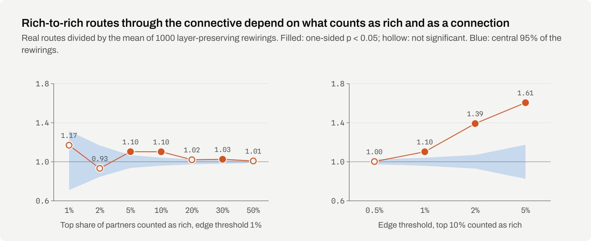
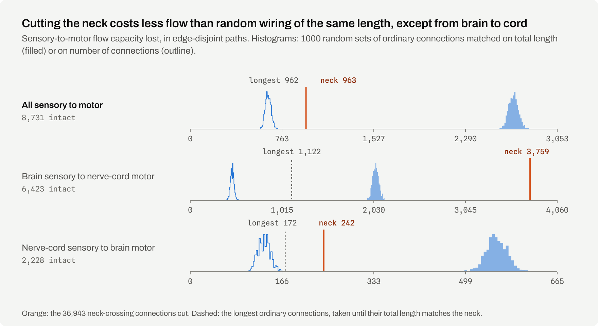
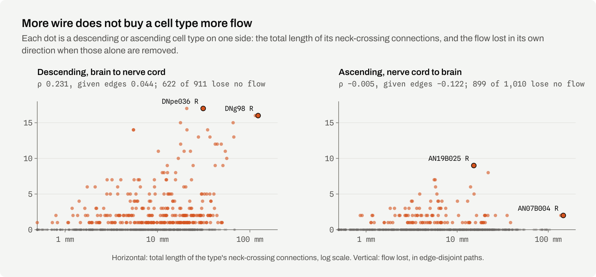
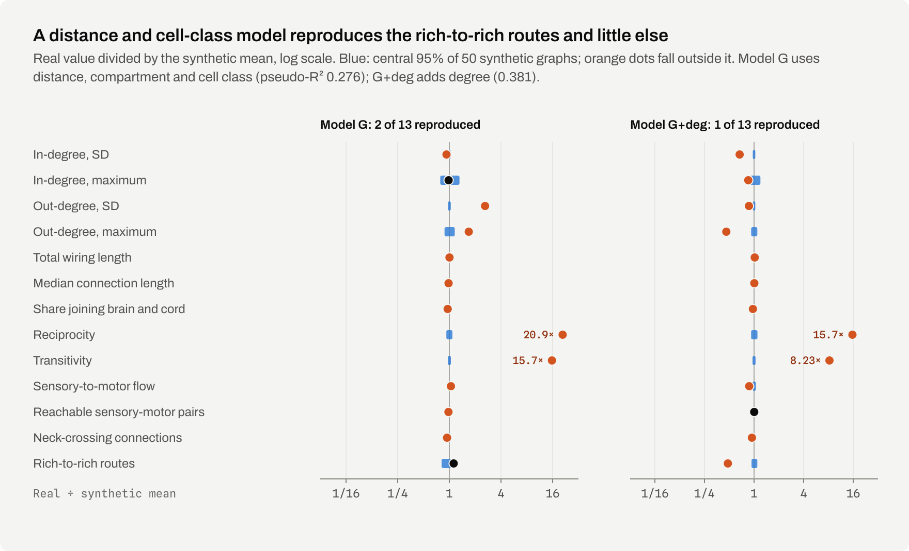
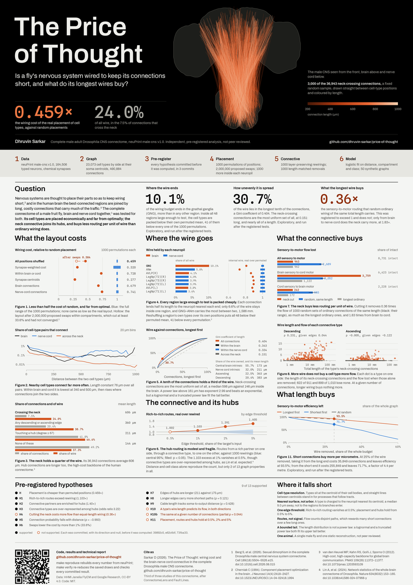

<h1 align="center"><a href="https://dhruvin-sarkar.github.io/price-of-thought/"></a></h1>

<p align="center"><b>Economically, but not optimally, and its most expensive wires buy no more than ordinary long ones.</b> The cell types of the male fruit fly's central nervous system are placed so that their connections use 0.459 times the wire of random placements of the same positions, yet simple swaps still cut at least 33.6%. The 7.5% of connections that cross the neck between brain and nerve cord hold 24.0% of all wire and join well-connected cell types, much as the costly hub connections of the human brain do. Cutting them removes less sensory-to-motor routing than random wiring of the same length, and the same as the longest ordinary connections, except in the direction from brain to nerve cord.<br><sub>Dhruvin Sarkar. An independent, pre-registered analysis of public connectome data, not peer reviewed.</sub></p>

<p align="center"><a href="https://dhruvin-sarkar.github.io/price-of-thought/">Illustrated&nbsp;findings</a>&emsp;<a href="https://dhruvin-sarkar.github.io/price-of-thought/#budget">The&nbsp;budget</a>&emsp;<a href="https://dhruvin-sarkar.github.io/price-of-thought/#connective">The&nbsp;connective</a>&emsp;<a href="https://dhruvin-sarkar.github.io/price-of-thought/#lookup">Any&nbsp;cell&nbsp;type</a>&emsp;<a href="paper/report.pdf">Technical&nbsp;report</a>&emsp;<a href="results/preregistration.md">Pre-registration</a>&emsp;<a href="results/prior_art.md">Prior&nbsp;art&nbsp;and&nbsp;scope</a>&emsp;<a href="#the-poster">Poster</a></p>

## Abstract

HHMI Janelia and Google Research have released a complete wiring diagram of an adult male fruit fly's central nervous system, brain and nerve cord together.[^berg] We asked whether it is wired economically, in the sense that its components are placed so as to keep connections short,[^cherniak] and what its most expensive wiring, the neck connective of descending and ascending neurons, buys in return. In the human connectome the most connected regions are joined by long, costly connections that carry a large share of communication;[^heuvel2012] the fly's connective is the obvious candidate for the same role. The connectome was represented as a graph of 23,073 cell types resolved by side, with 490,884 connections, each type placed at the centroid of its neurons' cell bodies. The real placement costs 0.459 times the wire of 1000 random reassignments of the same positions (z = −278.8), and 0.728 times when positions move only within brain or nerve cord; it is not a local optimum. The connective's cell types are over-represented among hubs (odds ratio 3.22), and routes through it join well-connected types on the two sides 1.103 times as often as rewiring predicts, though that excess vanishes when weaker connections are counted. Cutting it removes 0.36 times the sensory-to-motor flow capacity that random wiring of equal length removes, and 1.83 times from brain to nerve cord. Attributed to the neuropils, only 6.6% of the wire stays inside one region, and all 48 regions large enough to test are wired internally more cheaply than permutations of their own cell types; over connections the budget is uneven (Gini 0.404) but its upper tail is fitted better by a lognormal than by a power law. Five analyses added after the registered tests find that a long connection carries about as many synapses as a short one (ρ = −0.054), so the 117-fold fall in synapses per micrometre with length is the denominator; that a quarter of the wire taken from the long end of the length distribution leaves 93.5% of the graph's efficiency against 71.7% for the same wire taken from the short end; that degree does not predict how far a cell type sits from the centre of its compartment (ρ = −0.043) although types sit 0.397 times as far from their own partners as from degree-matched random ones; that the two hemispheres' wiring budgets differ by a median factor of 1.13 with no systematic side bias (p = 0.109); and that the 89 neuropils form a network which is not small-world by wire and divides into exactly two communities, the brain and the nerve cord. Of thirteen hypotheses registered before the statistics were computed, nine are supported and four are not.

## Results

<p><picture><source media="(prefers-color-scheme: dark)" srcset="assets/readme/stat-plate-dark.svg"></picture></p>

> [!IMPORTANT]
> These are structural results on a static wiring diagram aggregated to cell types. Wiring cost is the straight-line distance between cell-type positions, not the length of real neuronal processes, and flow capacity counts disjoint paths, not information transmitted or behaviour. Nothing here simulates neural activity or says how the nervous system develops.

**The thirteen pre-specified checks**

Every hypothesis was committed, with its direction, statistic and null, before the statistic was computed. Nine hold and four do not; the four that do not are set out under [where it falls short](#where-it-falls-short) and are given the same space here as the nine.

- [x] The real placement is cheaper than 1000 permutations of the same positions (0.459 of the permuted mean, 0 of 1000 as cheap; also within brain or nerve cord alone)
- [x] Rich-to-rich routes through the connective exceed layer-preserving rewirings (1.103 times the rewired mean, p = 0.001)
- [x] Rich partners are over-represented among the connective's partners (1.40 times a uniform redraw)
- [x] Descending and ascending cell types are over-represented among hubs (odds ratio 3.22)
- [ ] Cutting the neck costs more flow than random wiring of equal length (**not supported**: 0.36 times as much)
- [x] Connection probability falls with distance (ρ = −0.993 over all pairs; not within one compartment alone)
- [x] The placement is not a local optimum: cost-reducing swaps exist and cut more than 1% (at least 33.6%)
- [x] Connections of high-degree cell types are longer (mean 211 against 175 µm)
- [x] Connection length correlates with edge betweenness (ρ = 0.121, weak)
- [x] Skeleton cable length correlates with soma-to-output distance (ρ = 0.428, between classes rather than within them)
- [ ] A connective type's wire length predicts the flow it carries (**not supported**: ρ = 0.231 descending, −0.005 ascending)
- [ ] That correlation survives control for the number of connections (**not supported**: partial ρ = 0.044)
- [ ] Placement, routes and hubs hold at edge thresholds of 0.5%, 2% and 5% (**not supported**: routes vanish at 0.5%)

<details>
<summary>All headline values</summary>

| | value |
|---|---|
| cell types by side / connections | 23,073 / 490,884 |
| typed neurons | 164,506 |
| pre-registered hypotheses, supported / not supported | 9 / 4 of 13 |
| neck-crossing connections | 36,943, 7.5% of connections and 24.0% of wire |
| placement cost against random, all positions / within compartment | 0.459 (z = −278.8) / 0.728 |
| further saving from cost-reducing swaps, a lower bound | 33.6% |
| length constant of connection probability, first 600 µm | 76 µm |
| mean length, edges of high-degree types / others | 211 against 175 µm |
| rich-to-rich routes, real / rewired mean | 7,454 / 6,760, ratio 1.103, p = 0.001 |
| partner enrichment / hub odds ratio | 1.40 / 3.22 (Fisher p = 1.5 × 10⁻⁷⁹) |
| flow lost cutting the neck / random wiring of equal length | 963 / 2,689, ratio 0.36 |
| brain-to-cord flow lost, ratio to random wiring of equal length | 1.83 |
| price against value, descending types, given edge count | partial ρ = 0.044 |
| wire staying inside one neuropil | 6.6%, 6,154 mm over 86,881 connections |
| neuropils tested for internal placement, and those below their permuted mean | 48 / 48 |
| neuropils cheaper than at least 95% of their own permutations | 45 of 48 |
| concentration of the budget, Gini / share held by the longest tenth | 0.404 / 30.7% |
| properties reproduced by the distance, compartment and cell-class model | 2 of 13 |

<sub>Source: <a href="results/spatial_optimality.json">results/spatial_optimality.json</a>, <a href="results/wiring_economy_extensions.json">results/wiring_economy_extensions.json</a>, <a href="results/connective_richclub.json">results/connective_richclub.json</a>, <a href="results/connective_value.json">results/connective_value.json</a>, <a href="results/connective_price.json">results/connective_price.json</a>, <a href="results/generative_comparison.json">results/generative_comparison.json</a>, <a href="results/wire_atlas.json">results/wire_atlas.json</a>, <a href="results/wire_concentration.json">results/wire_concentration.json</a></sub>

</details>

## Placement

<p><a href="https://dhruvin-sarkar.github.io/price-of-thought/#placement"><picture><source media="(prefers-color-scheme: dark)" srcset="assets/readme/fig-placement-dark.svg"></picture></a></p>

**Figure 1. The real placement is less than half as costly as random placement, and a third more costly than it needs to be.** Each test keeps the graph and the set of positions and shuffles only which cell type sits where, 1000 times.[^cherniak] The full shuffle moves brain types into the nerve cord and is an easy null to beat; shuffling only within brain or within nerve cord still leaves the real layout 27% cheaper, so the economy is not just the separation of the two. Greedy swaps of position between two cell types of the same compartment, each kept if it shortens the wire, then cut the real layout by at least 33.6%. As in *C. elegans*, the layout is far cheaper than random and far from optimal;[^chen][^gushchin] long connections that shorten processing paths are the kind that keep a layout from its optimum.[^kaiser]

<details>
<summary>Values behind Figure 1</summary>

| analysis | real / permuted cost | z | permutations at or below real |
|---|---:|---:|---:|
| soma positions, unweighted (primary) | 0.459 | −278.8 | 0 / 1000 |
| synapse-weighted cost | 0.320 | −37.3 | 0 / 1000 |
| permutation within compartment | 0.728 | −156.9 | 0 / 1000 |
| synapse-centroid positions | 0.277 | −337.4 | 0 / 1000 |
| brain subgraph only | 0.679 | −169.8 | 0 / 1000 |
| nerve-cord subgraph only | 0.741 | −64.7 | 0 / 1000 |

The real placement costs 93,095 mm of wire. Of 2,000,000 proposed swaps, 50,050 lowered the cost, together to 61,778 mm. The search had not converged (the last 100,000 proposals still saved 0.33%), and it ignores every physical constraint on where cell bodies and neuropils can lie.

<sub>Source: <a href="results/spatial_optimality.md">results/spatial_optimality.md</a>, <a href="results/spatial_permutation_costs.csv">results/spatial_permutation_costs.csv</a>, <a href="results/wiring_economy_extensions.md">results/wiring_economy_extensions.md</a></sub>

</details>

<p><a href="https://dhruvin-sarkar.github.io/price-of-thought/#placement"><picture><source media="(prefers-color-scheme: dark)" srcset="assets/readme/fig-distance-dark.svg"></picture></a></p>

**Figure 2. Nearby cell types connect far more often, except at the longest distances.** Connection probability falls with distance across all pairs (Spearman ρ = −0.993 over 51 bins of 20 µm), with a length constant of 76 µm over the first 600 µm. Inside the brain and inside the nerve cord the fall is not monotonic and the rank correlation is not significant (ρ = −0.154 and −0.159, p = 0.14 each): probability reaches a minimum at 340 µm and 500 µm, then rises again, because most of the longest connections join a cell type on one side of the body to one on the other. The hypothesis is therefore supported over all pairs and not within a compartment taken alone. Pairs across the neck start less likely to connect and fall more slowly.

<details>
<summary>Values behind Figure 2</summary>

| pairs | edges | Spearman ρ | p | length constant, 0 to 600 µm | probability minimum |
|---|---:|---:|---:|---:|---:|
| all pairs | 490,884 | −0.993 | 9.4 × 10⁻⁴⁸ | 76 µm | |
| brain to brain | 319,431 | −0.154 | 0.14 | 63 µm | 340 µm |
| nerve cord to nerve cord | 133,277 | −0.159 | 0.14 | 128 µm | 500 µm |
| across the neck | 38,176 | −0.988 | 9.2 × 10⁻⁴² | 208 µm | |

The last row counts every connection joining a brain cell type to a nerve-cord one, which is a slightly wider set than the 36,943 that a descending or ascending type owns. Beyond 600 µm there are 2,015 brain and 1,176 nerve-cord connections; 61% and 57% of them join opposite sides of the body, which is why the curves turn up again. Per-bin pair and edge counts are in [results/distance_dependence.csv](results/distance_dependence.csv).

<sub>Source: <a href="results/wiring_economy_extensions.md">results/wiring_economy_extensions.md</a></sub>

</details>

## Where the wire goes

<p><a href="https://dhruvin-sarkar.github.io/price-of-thought/"></a><br><sub>All 36,943 neck-crossing connections at once, drawn between the cell-type positions they join and coloured by length. The same connections can be turned in the browser on <a href="https://dhruvin-sarkar.github.io/price-of-thought/">the site</a>.</sub></p>

<p><a href="https://dhruvin-sarkar.github.io/price-of-thought/#connective"><picture><source media="(prefers-color-scheme: dark)" srcset="assets/readme/fig-cost-dark.svg"></picture></a></p>

**Figure 3. The neck holds a quarter of the wire in under a tenth of the connections.** A neck-crossing connection joins a descending or ascending cell type to a partner on the far side of the neck; there are 36,943 of them, with a mean length of 606 µm against 189.6 µm for all connections. Connections that touch a hub, a cell type in the top tenth by degree, are longer than the rest (mean 211 against 175 µm, one-sided Mann-Whitney p < 10⁻³⁰⁰). This is the high-cost backbone described in the human and *C. elegans* connectomes.[^heuvel2012][^towlson] Longer connections also lie on somewhat more shortest paths (Spearman ρ = 0.121 between length and edge betweenness).

<details>
<summary>Values behind Figure 3</summary>

| connections | share of connections | share of wire | mean length |
|---|---:|---:|---:|
| crossing the neck | 7.5% | 24.0% | 606 µm |
| any descending or ascending edge | 20.4% | 38.7% | 360 µm |
| touching a hub (degree at least 67) | 41.8% | 46.4% | 211 µm |
| none of these | 49.2% | 37.3% | 144 µm |

The first three groups overlap.

<sub>Source: <a href="results/wiring_economy_extensions.md">results/wiring_economy_extensions.md</a></sub>

</details>

## The budget across the regions

<p><a href="https://dhruvin-sarkar.github.io/price-of-thought/#budget"><picture><source media="(prefers-color-scheme: dark)" srcset="assets/readme/fig-atlas-dark.svg"></picture></a></p>

**Figure 4. The wire ends unevenly across the neuropils, and almost every region large enough to test is packed cheaply.** Each connection lends half its length to the neuropil nearest each of its ends, so every region is charged for the wire that ends in it. 89 of the 105 published neuropil surfaces hold cell types, and only 6.6% of the wire stays inside one of them; the rest runs between regions. The gnathal ganglia hold 10.1% of the budget, more than any other region, and the heaviest route between two regions, from there to the abdominal neuromere, carries 1,586 mm over 2,101 connections. Repeating the placement test inside a region, over that region's own cell types and its own positions, puts all 48 regions large enough to test below their permuted mean, 41 of them below every one of the 1000 permutations. Three regions are not reliably cheaper than their own reshuffles: AL(L) sits at 0.974 of its permuted mean with 171 of the 1000 permutations as cheap, AL(R) at 0.960 with 53, and AME(R) at 0.939 with 231. AL(R) misses the α = 0.05 line by four permutations in a thousand, and the nerve-cord neuropil HTct(UTct-T3)(R), at 0.886 with 49, clears it by one; the two should be read as one borderline result rather than as a difference between the regions. The antennal lobes, whose glomeruli are a textbook case of orderly wiring, are on this measure no cheaper than chance: their order is not an order that shortens wire.

<details>
<summary>Values behind Figure 4</summary>

| neuropil | share of all wire | internal connections | internal / permuted | permutations as cheap |
|---|---:|---:|---:|---:|
| GNG | 10.1% | 15,310 | 0.809 | 0 of 1000 |
| ANm | 5.8% | 11,979 | 0.729 | 0 of 1000 |
| AVLP(R) | 4.1% | 5,881 | 0.863 | 0 of 1000 |
| SAD | 3.3% | 1,842 | 0.682 | 0 of 1000 |
| gL(L), the most economical | 0.9% | 233 | 0.428 | 0 of 1000 |
| AME(R) | 0.2% | 84 | 0.939 | 231 of 1000 |
| AL(R) | 2.3% | 2,904 | 0.960 | 53 of 1000 |
| AL(L), the closest to chance | 2.4% | 3,139 | 0.974 | 171 of 1000 |

The fourteen regions with the largest shares hold 56.4% of the budget between them. Every neuropil, the wire it holds and the wire running between each pair is in [results/wire_atlas.md](results/wire_atlas.md).

<sub>Source: <a href="results/wire_atlas.md">results/wire_atlas.md</a>, <a href="results/wire_atlas.json">results/wire_atlas.json</a></sub>

</details>

<p><a href="https://dhruvin-sarkar.github.io/price-of-thought/#budget"><picture><source media="(prefers-color-scheme: dark)" srcset="assets/readme/fig-concentration-dark.svg"></picture></a></p>

**Figure 5. A tenth of the connections holds nearly a third of the wire, and the tail is not a power law.** Sorted longest first, the longest 1% of connections hold 4.6% of the wiring budget and the longest 10% hold 30.7%, a Gini coefficient of 0.404. Inside the brain and inside the nerve cord the spread is narrower (0.343 and 0.334), and the neck-crossing connections are the most uniform of all (0.151): they are long, a median of 597.6 µm against 146.3 µm inside the brain, and nearly all of a length. A power law fitted to the upper tail above 161 µm has exponent 2.99 and beats an exponential, but a lognormal and a truncated power law both fit it better, which is what a distribution bounded by the size of the nervous system looks like. Counting a connection for the class of cell type at each of its ends, central brain intrinsic types hold 55.7% of the budget and nerve cord intrinsic types 32.0%, while ascending and descending types hold 22.5% and 20.4% of it on the longest connections of any class, means of 363 and 383 µm.

<details>
<summary>Values behind Figure 5</summary>

| group | connections | wire | mean length | median | Gini | longest 10% hold |
|---|---:|---:|---:|---:|---:|---:|
| all | 490,884 | 93,095 mm | 189.6 µm | 154.3 µm | 0.404 | 30.7% |
| within the brain | 319,431 | 49,540 mm | 155.1 µm | 146.3 µm | 0.343 | 23.6% |
| within the nerve cord | 133,277 | 21,855 mm | 164.0 µm | 145.2 µm | 0.334 | 24.0% |
| across the neck | 36,943 | 22,371 mm | 605.6 µm | 597.6 µm | 0.151 | 14.6% |

The groups are views of the same connections, not a partition. Weighed against the power law fitted above 161 µm over 231,054 connections, by normalized log-likelihood ratio:

| alternative | log-likelihood ratio | favoured |
|---|---:|---|
| exponential | 46.81 | the power law |
| lognormal | −45.52 | the lognormal |
| truncated power law | −62.52 | the truncated power law |

Each comparison has p < 0.0001. The wire owned by all twenty classes of cell type is in [results/wire_concentration.md](results/wire_concentration.md).

<sub>Source: <a href="results/wire_concentration.md">results/wire_concentration.md</a>, <a href="results/wire_concentration.json">results/wire_concentration.json</a></sub>

</details>

## The connective as a hub backbone

<p><a href="https://dhruvin-sarkar.github.io/price-of-thought/#connective"><picture><source media="(prefers-color-scheme: dark)" srcset="assets/readme/fig-routes-dark.svg"></picture></a></p>

**Figure 6. The connective favours well-connected partners, but its rich-to-rich routing is modest and fragile.** A rich-club organization is one in which well-connected nodes are more densely interconnected than their degrees predict.[^colizza][^heuvel2011] Lin et al. expected descending and ascending neurons to join a rich club spanning the whole nervous system, and noted this needed a complete CNS connectome.[^lin] Here connective cell types are over-represented among hubs (24.4% of descending and 23.2% of ascending types against 8.8% of others, odds ratio 3.22), and their partners are enriched for well-connected types (1.40 times a uniform redraw). The route statistic counts two-step paths from a rich partner on one side, through a connective type, to a rich partner on the other: 7,454 real routes against 6,760 ± 143 in 1000 rewirings that keep every degree in each layer (ratio 1.103, p = 0.001). The excess comes entirely from ascending routes, depends on where the line for "rich" is drawn, and disappears when connections carrying 0.5% of a target's input are counted.

<details>
<summary>Values behind Figure 6</summary>

| routes, top 10% rich | real | rewired mean ± SD | ratio | p |
|---|---:|---:|---:|---:|
| all (primary) | 7,454 | 6,760 ± 143 | 1.103 | 0.001 |
| descending, brain to cord | 1,911 | 1,941 ± 61 | 0.984 | 0.71 |
| ascending, cord to brain | 5,543 | 4,819 ± 127 | 1.150 | 0.001 |

| edge threshold | connections | route ratio | p | hub odds ratio | placement ratio |
|---|---:|---:|---:|---:|---:|
| 0.5% | 942,400 | 1.002 | 0.42 | 3.99 | 0.460 |
| 1% | 490,884 | 1.103 | 0.001 | 3.22 | 0.459 |
| 2% | 216,862 | 1.391 | 0.001 | 2.22 | 0.455 |
| 5% | 52,217 | 1.605 | 0.001 | 1.33 | 0.439 |

p = (1 + k) / 1001, where k is the number of rewirings with at least as many routes; 0.001 is the smallest attainable.

<sub>Source: <a href="results/connective_richclub.md">results/connective_richclub.md</a>, <a href="results/threshold_robustness.md">results/threshold_robustness.md</a></sub>

</details>

## What the connective buys

<p><a href="https://dhruvin-sarkar.github.io/price-of-thought/#connective"><picture><source media="(prefers-color-scheme: dark)" srcset="assets/readme/fig-value-dark.svg"></picture></a></p>

**Figure 7. Per unit of wire, the neck carries less routing than ordinary wiring, except from brain to nerve cord.** Flow capacity is the number of edge-disjoint paths from sensory to motor cell types, the measure of Fault Lines.[^faultlines] The intact graph supports 8,731. Cutting the 36,943 neck-crossing connections removes 963; 1000 random sets of ordinary connections of the same total length, about 153,000 shorter connections each, remove 2,689 on average. The pre-registered hypothesis was that the neck would cost more, and it costs less: the ratio is 0.36. Per connection the neck carries more (1.49 times an equal number of random connections), and against the longest ordinary connections of the same total length it carries the same: those remove 962. Its distinctive contribution is directional. Cutting the neck removes 59% of the flow from brain sensory to nerve-cord motor types, 1.83 times the random loss, and 11% of the reverse.

<details>
<summary>Values behind Figure 7</summary>

| comparison | flow lost, neck | flow lost, null mean | ratio | p |
|---|---:|---:|---:|---:|
| all flow, equal length (primary) | 963 | 2,689 | 0.36 | 1.0 |
| brain sensory to nerve-cord motor, equal length | 3,759 of 6,423 | 2,052 | 1.83 | 0.001 |
| nerve-cord sensory to brain motor, equal length | 242 of 2,228 | 555 | 0.44 | 1.0 |
| all flow, equal connection count | 963 | 648 | 1.49 | 0.001 |
| all flow, longest ordinary connections | 963 | 962 | 1.00 | |

No sensory-motor pair is disconnected by the cut. Silencing every connection of the descending and ascending types, not only the neck-crossing ones, removes 6,202 of the 6,423 units from brain to nerve cord.

<sub>Source: <a href="results/connective_value.md">results/connective_value.md</a>, <a href="results/connective_value_nulls.csv">results/connective_value_nulls.csv</a></sub>

</details>

<p><a href="https://dhruvin-sarkar.github.io/price-of-thought/#connective"><picture><source media="(prefers-color-scheme: dark)" srcset="assets/readme/fig-price-dark.svg"></picture></a></p>

**Figure 8. More wire does not buy a cell type more flow.** For each descending or ascending cell type on one side, its price is the total length of its neck-crossing connections and its value the flow lost in its own direction when they alone are removed. Most types can be removed at no cost to flow. Among descending types price and value are correlated (ρ = 0.231), but at a given number of connections longer wiring buys nothing more (partial ρ = 0.044, p = 0.09); among ascending types they are unrelated. Both parts of the pre-registered hypothesis therefore fail, in both directions. The most expensive ascending type, `AN07B004`, has 146 mm of wire and carries 2 units, while `DNge002` carries 14 with 5.5 mm.

<details>
<summary>Values behind Figure 8</summary>

| direction | types | lose no flow | ρ | partial ρ given connections |
|---|---:|---:|---:|---:|
| descending | 911 | 622 | 0.231 | 0.044 |
| ascending | 1,010 | 899 | −0.005 | −0.122 |

Every type's price, value and edge count is in [results/connective_price.csv](results/connective_price.csv), which GitHub shows as a searchable table.

<sub>Source: <a href="results/connective_price.md">results/connective_price.md</a></sub>

</details>

## A model with distance and cell class

<p><a href="https://dhruvin-sarkar.github.io/price-of-thought/#model"><picture><source media="(prefers-color-scheme: dark)" srcset="assets/readme/fig-generative-dark.svg"></picture></a></p>

**Figure 9. Distance, compartment and cell class reproduce the rich-to-rich routes, and little else.** Model G predicts each connection from the distance between two cell types, whether they share a compartment, and their pair of cell classes; it knows nothing of the real degrees. Earlier generative models of the fly brain combined distance with degree.[^salova] Graphs drawn from model G reproduce 2 of 13 properties of the real graph, and one of them is the number of rich-to-rich routes through the connective: 6,636 on average against 7,454 real. The route excess over degree-preserving rewiring therefore lies within what distance and cell class produce on their own. Neither model reproduces reciprocity or clustering, as expected when every pair is drawn independently. The model was registered as a protocol without a hypothesis: which properties it reproduced was to be reported either way.

<details>
<summary>Values behind Figure 9</summary>

| property | real | model G mean | model G central 95% | reproduced |
|---|---:|---:|---:|---|
| in-degree, SD | 5.26 | 5.67 | 5.63 to 5.72 | no |
| in-degree, maximum | 60 | 61.1 | 49 to 78 | yes |
| out-degree, SD | 25.19 | 9.65 | 9.56 to 9.75 | no |
| out-degree, maximum | 395 | 234.6 | 212 to 264 | no |
| total wiring length | 93,095 mm | 92,666 mm | 92,326 to 92,946 mm | no |
| median connection length | 154.3 µm | 157.6 µm | 157.2 to 157.9 µm | no |
| share joining brain and cord | 7.78% | 8.13% | 8.06% to 8.20% | no |
| reciprocity | 0.0793 | 0.0038 | 0.0036 to 0.0040 | no |
| transitivity | 0.0799 | 0.0051 | 0.0050 to 0.0052 | no |
| sensory-to-motor flow | 8,731 | 8,365 | 8,168 to 8,580 | no |
| reachable sensory-motor pairs | 269,011 | 275,573 | 275,250 to 275,617 | no |
| neck-crossing connections | 36,943 | 39,241 | 38,931 to 39,587 | no |
| rich-to-rich routes | 7,454 | 6,636 | 5,540 to 7,600 | yes |

| model | pseudo-R² | cross-validated AUC |
|---|---:|---:|
| distance only | 0.165 | 0.786 |
| model G | 0.276 | 0.847 |
| model G+deg, adding degrees | 0.381 | 0.899 |

<sub>Source: <a href="results/generative_model.md">results/generative_model.md</a>, <a href="results/generative_comparison.json">results/generative_comparison.json</a>, <a href="results/generative_comparison.csv">results/generative_comparison.csv</a></sub>

</details>

## After the registered tests

Five analyses were run once the thirteen registered hypotheses had been tested and the report written. None of them carries a registered hypothesis, none had a direction fixed in advance, and their p-values are uncorrected; like the wire atlas and the concentration of the budget above, they are reported as description and not as tests. Every one of the five carries a null or a negative result somewhere in it, and those are given the same space here as the positives. Nothing below changes any registered outcome.

### What a micrometre of wire buys in synapses

<p><picture><source media="(prefers-color-scheme: dark)" srcset="assets/readme/fig-synapses-dark.svg"></picture></p>

**Figure 10. A long connection carries about as many synapses as a short one.** The 490,884 connections hold 78,192,944 synapses over 93,095 mm of wire, 0.840 synapses per micrometre. Sorted into ten equal groups by length, the shortest tenth buys 13.37 synapses per micrometre and the longest 0.11, a factor of 117. Almost all of that fall is the length in the denominator. The rank correlation between a connection's length and the number of synapses it carries is −0.054, and Pearson's r between the logarithms of the two is −0.063; at 490,884 connections a correlation that small still returns a p-value at the floor of double precision, which is a statement about the number of connections and not about the size of the effect. The median connection carries 40 synapses in the shortest decile and 37 in the longest. The same holds between the two groups that differ most in length: neck-crossing connections average 606 µm against 156 µm elsewhere and buy 0.103 synapses per micrometre against 1.073, a factor of 10.4, yet carry a median of 37 synapses against 40. Synapses per micrometre is a ratio whose numerator is flat and whose denominator spans the length distribution, so its decline is closer to arithmetic than to a discovered relationship. What the extra wire buys is reach, not weight. The null is the result, and no hypothesis covers it.

<details>
<summary>Values behind Figure 10</summary>

| decile | length range | mean length | synapses | mean | median | per µm | observed / expected |
|---|---:|---:|---:|---:|---:|---:|---:|
| 1 | 0.3 to 46 µm | 26 µm | 17,172,183 | 349.8 | 40 | 13.374 | 2.20 |
| 2 | 46 to 79 µm | 63 µm | 9,228,320 | 188.0 | 43 | 2.991 | 1.18 |
| 3 | 79 to 105 µm | 92 µm | 8,538,399 | 173.9 | 43 | 1.889 | 1.09 |
| 4 | 105 to 130 µm | 117 µm | 10,761,396 | 219.2 | 44 | 1.868 | 1.38 |
| 5 | 130 to 154 µm | 142 µm | 10,124,219 | 206.2 | 41 | 1.448 | 1.30 |
| 6 | 154 to 178 µm | 166 µm | 6,697,240 | 136.4 | 42 | 0.822 | 0.86 |
| 7 | 178 to 206 µm | 191 µm | 4,124,877 | 84.0 | 39 | 0.439 | 0.53 |
| 8 | 206 to 248 µm | 226 µm | 3,930,275 | 80.1 | 38 | 0.355 | 0.50 |
| 9 | 248 to 361 µm | 290 µm | 4,350,969 | 88.6 | 35 | 0.305 | 0.56 |
| 10 | 361 to 1004 µm | 583 µm | 3,265,066 | 66.5 | 37 | 0.114 | 0.42 |

Each decile holds 49,088 or 49,089 connections. The expected density is the mean synapse count over all 490,884 connections divided by the decile's mean length, the density the decile would show if synapse count did not depend on length at all; a decile buying its synapses at the going rate sits at 1.

| group | connections | wire | synapses | per µm | median synapses | ρ | Pearson r on logs |
|---|---:|---:|---:|---:|---:|---:|---:|
| all | 490,884 | 93,095 mm | 78,192,944 | 0.840 | 40 | −0.054 | −0.063 |
| across the neck | 36,943 | 22,371 mm | 2,296,720 | 0.103 | 37 | 0.089 | 0.092 |
| elsewhere | 453,941 | 70,724 mm | 75,896,224 | 1.073 | 40 | −0.048 | −0.054 |

<sub>Source: <a href="results/synapse_value.md">results/synapse_value.md</a>, <a href="results/synapse_value.json">results/synapse_value.json</a></sub>

</details>

### What its length buys in connectivity

<p><picture><source media="(prefers-color-scheme: dark)" srcset="assets/readme/fig-tradeoff-dark.svg"></picture></p>

**Figure 11. Per micrometre, short connections buy more connectivity; per connection, long ones are worth more.** Connections are removed cumulatively from one end of the length distribution and what is left is measured: efficiency, the mean of 1/d over ordered pairs of cell types, estimated from one fixed sample of 300 source cell types used at every point of every schedule, and the size of the largest weakly connected component. The whole graph has efficiency 0.2152 and holds 23,070 of its 23,073 cell types in one component. Taking a quarter of the wire, 23,274 mm, from the long end costs 35,849 connections, 7.3% of them, and leaves efficiency at 93.5%; the same wire from the short end costs 255,849 connections, 52.1%, and leaves it at 71.7%. That is 0.28% of the starting efficiency lost per metre of wire from the long end against 1.22% from the short end, a factor of 4.4. The reason is arithmetic rather than subtle: the median connection is 154 µm long against a mean of 190 µm, so the same budget taken from the short end removes 7.1 times as many connections. Matched on the number of connections instead of the wire, the comparison reverses. Removing the 35,849 longest leaves 93.5% while removing the same number at random leaves 97.8% ± 0.2% over five draws, so the longest connections are individually worth more to the graph than typical ones. They are simply not worth their length. Nothing here was registered in advance.

<details>
<summary>Values behind Figure 11</summary>

Efficiency is the mean of 1/d over ordered pairs of cell types, d the directed shortest path in connections. Characteristic path length is the more familiar measure and the wrong one here: removal is what makes pairs unreachable, and the mean of a set containing infinities is undefined, whereas an unreachable pair contributes a well-defined zero to efficiency. The curve is sampled at 18 points, the sources drawn once from seed 20960916, and the random schedule is the mean of 5 draws matched on the number of connections removed.

| schedule | connections removed | share of connections | efficiency | share of the whole graph | largest component |
|---|---:|---:|---:|---:|---:|
| longest first | 35,849 | 7.3% | 0.2013 | 93.5% | 99.99% |
| shortest first | 255,849 | 52.1% | 0.1544 | 71.7% | 98.94% |
| at random, matched on count | 35,849 | 7.3% | 0.2105 | 97.8% ± 0.2% | 99.99% |

All three rows are taken at 25% of the wire removed for the first two and at the matching number of connections for the third. Efficiency falls to half its starting value after 38.9% of the wire is taken from the short end, and not within the 60% sampled from the long end, where it still stands at 69.5%.

None of the three schedules breaks the graph apart over the range sampled. With 60% of the wire gone the long-end schedule has cost 31% of the efficiency while leaving 99.90% of the cell types in one component, and the short-end schedule has cost 86% of it while still leaving 79.5% of them in one. Component size is a blunt instrument at this density: efficiency has collapsed while the graph is still almost entirely one piece. That is a null for the component measure rather than evidence that the graph is robust in any useful sense.

<sub>Source: <a href="results/length_tradeoff.md">results/length_tradeoff.md</a>, <a href="results/length_tradeoff.json">results/length_tradeoff.json</a></sub>

</details>

### Where the best connected cell types sit

<p><picture><source media="(prefers-color-scheme: dark)" srcset="assets/readme/fig-hubs-dark.svg"></picture></p>

**Figure 12. Degree does not say how centrally a cell type sits, but a type sits close to the cells it contacts.** A heavily connected cell type pays its position on every one of its connections, so wiring economy predicts that the best connected types sit centrally. Over all 23,073 cell types the rank correlation between total degree and distance from the centroid of the types in the same scope is −0.043. Split by compartment the two halves do not agree in sign: +0.018 over the 16,052 brain types and −0.144 over the 7,021 nerve-cord types, which is the largest correlation in the table. Distance is measured from the centroid of the scope rather than of the whole specimen, because a shared centre would rank a type by which compartment it belongs to rather than by where it sits inside it. The second test is not a null. Each type is compared with 1000 redraws in which it keeps its degree and takes that many partners uniformly at random from the other types: the mean distance from a type to the centroid of its real partners is 127.3 µm against 320.7 µm for random partners, a ratio of 0.397 (z = −622.7, 0 of 1000 redraws as near), and 95.4% of types lie nearer their own partners than their own null mean. Placement economy here is local rather than radial. Neither result was predicted in advance.

<details>
<summary>Values behind Figure 12</summary>

| scope | types | median distance from the centre | degree against distance, ρ | wire against distance, ρ |
|---|---:|---:|---:|---:|
| all | 23,073 | 297.1 µm | −0.043 | 0.002 |
| brain | 16,052 | 162.5 µm | 0.018 | −0.098 |
| nerve cord | 7,021 | 157.8 µm | −0.144 | −0.054 |

`wire` is the summed length of the connections a type takes part in. Every correlation in the table is below 0.15 in absolute value, and the brain and the nerve cord lean opposite ways, which is why they are reported apart: pooling them would cancel two weak tendencies into one number belonging to neither compartment.

| scope | distance to own partners | degree-matched random partners | ratio | z | redraws at or below real |
|---|---:|---:|---:|---:|---:|
| all | 127.3 µm | 320.7 ± 0.31 µm | 0.397 | −622.7 | 0 / 1000 |
| brain | 120.6 µm | 259.3 ± 0.35 µm | 0.465 | −393.7 | 0 / 1000 |
| nerve cord | 142.6 µm | 460.9 ± 0.60 µm | 0.309 | −530.6 | 0 / 1000 |

The redraw keeps a type's degree, never draws the type itself, and draws with replacement; 1000 draws, seeded from 20360916. 23,070 of the 23,073 types have at least one connection and are tested. The type furthest below its own null is `SNppxx` on the right of the nerve cord, 18.4 µm from the centroid of its 402 partners, 29.1 null standard deviations below its own mean.

<sub>Source: <a href="results/hub_placement.md">results/hub_placement.md</a>, <a href="results/hub_placement.json">results/hub_placement.json</a></sub>

</details>

### The two sides of the body

<p><picture><source media="(prefers-color-scheme: dark)" srcset="assets/readme/fig-symmetry-dark.svg"></picture></p>

**Figure 13. The two hemispheres hold the same wire, and neither holds systematically more.** Of the 89 neuropils that hold cell types, 72 form 36 left-right pairs and carry 75.4% of the wire. Within a pair the two sides hold wire within a factor of 1.13 of each other at the median and 1.30 on average, and across all pairs the right side holds a geometric mean of 1.132 times the left. Two nulls test that. If the two hemispheres are wired alike then the sign of a pair's log ratio is arbitrary, so negating each pair's ratio at random gives the null distribution of their mean: the observed mean is −0.124 against a null spread of 0.0836 (z = −1.49, two-sided p = 0.109 over 1000 sign flips), and no side bias survives. Matching each left neuropil to a right neuropil drawn at random instead of to its own counterpart gives a mean absolute log ratio of 1.869 ± 0.179 against 0.260 observed, with 0 of 1000 matchings as small. Counterparts are far more alike than arbitrary neuropils, which is what the naming asserts and is worth confirming, but it is a weak null: it sets no scale for how alike two copies of one structure ought to be. The widest gap is LA, where the right copy holds 13.5 times the wire of the left over 4 cell types against 1. The left-right difference in this specimen's wiring budget is a null result, and it was not predicted.

<details>
<summary>Values behind Figure 13</summary>

| test | observed | null | z | p |
|---|---:|---:|---:|---:|
| mean log ratio, sign-flip null | −0.124 | 0 ± 0.0836 | −1.49 | 0.109 |
| mean absolute log ratio, random matching | 0.260 | 1.869 ± 0.179 | | 0.0010 |
| mean left-minus-right internal cost ratio, sign-flip null | −0.0074 | 0 ± 0.0132 | −0.56 | 0.607 |

The first test is two-sided; the other two are one-sided, with p = (1 + k) / 1001. The third covers the 20 pairs whose internal placement test ran on both sides: whatever placement economy a neuropil has, its opposite copy has about the same amount of it, the mean absolute difference being 0.0389 on ratios that all sit below one.

| group | neuropils | share of all wire |
|---|---:|---:|
| paired, left and right | 72 in 36 pairs | 75.4% |
| carrying no hemisphere suffix | 12 | 24.6% |
| one side of a structure whose other side holds no cell type here | 5 | 0.03% |

The 12 without a suffix are named in the results file and include the largest single holder of wire in the specimen, the gnathal ganglia; the 5 one-sided neuropils are listed rather than dropped. Every pair's wire, share and log ratio is in [results/wire_symmetry.md](results/wire_symmetry.md).

<sub>Source: <a href="results/wire_symmetry.md">results/wire_symmetry.md</a>, <a href="results/wire_symmetry.json">results/wire_symmetry.json</a></sub>

</details>

### The regions as a network

**The regions form a dense network that is not small-world by wire, and splits in two.** Collapsing the cell-type graph onto the neuropils gives 89 regions joined by 2,698 weighted edges, 68.9% of the 3,916 pairs that could be joined; 93.4% of the wire runs between two regions and the rest stays inside one. Each connection lends half its length to the region nearest each of its ends, the rule the wire atlas uses, and the recomputed matrix reproduces the atlas total of 93,095 mm and every one of the 40 pairs the atlas saves. The gnathal ganglia are the largest hub, holding 16,058 mm of wire to 85 of the other 88 regions, 9.2% of all between-region wire, and the 15 largest regions hold 56.8% of it between them. Against 1000 degree-preserving rewirings the network is 1.099 times as clustered by wire but its weighted paths are 10.1 times longer, not shorter, which puts the wire-weighted small-world ratio at 0.109. It is not small-world. The unweighted structure cannot settle the question either way, because at 69% density almost every pair of regions is already joined: clustering is 0.872 against a null mean of 0.862 and the mean path is 1.32 steps against 1.31. Louvain on the wire-weighted graph returns exactly 2 communities, modularity 0.229, and all 100 random seeds return the same partition. They follow the brain and nerve cord split and nothing else: adjusted Rand 0.626 against compartment, −0.010 against hemisphere and 0.000 against thoracic segment. Of the 36 neuropils present on both sides only ICL has its two copies in different communities, and the leg neuropils of all three thoracic segments sit together. These are groupings of anatomy by wire, not functional modules, and none of it was registered in advance.

<details>
<summary>Values behind the region network</summary>

Clustering is the mean local clustering coefficient and path length the mean shortest path over all pairs; the weighted versions weigh a pair by its wire, a step along the heaviest pair of regions costing one and a thinner pair proportionally more. Both nulls preserve every region's number of partners exactly. The rewired null randomizes which pairs are joined and deals the multiset of per-pair wire values over the rewired edges; the weight-shuffled null leaves the real topology alone and permutes only the wire, so the unweighted measures are the real ones by construction.

| metric | real | rewired null | real / rewired | weight-shuffled null | real / shuffled |
|---|---:|---:|---:|---:|---:|
| clustering | 0.872 | 0.862 ± 0.002 | 1.011 | 0.872 ± 0.000 | 1.000 |
| path length | 1.319 | 1.312 ± 0.001 | 1.005 | 1.319 ± 0.000 | 1.000 |
| weighted clustering | 0.947 | 0.862 ± 0.005 | 1.099 | 0.872 ± 0.005 | 1.086 |
| weighted path length | 292.4 | 29.0 ± 13.9 | 10.100 | 29.6 ± 14.4 | 9.888 |

1000 draws of each null; every ratio has p = 0.002 except the two the weight-shuffled null reproduces by construction.

| anatomical split | regions labelled | groups | adjusted Rand | normalized mutual information |
|---|---:|---:|---:|---:|
| brain or nerve cord | 89 | 2 | 0.626 | 0.584 |
| left or right | 77 | 2 | −0.010 | 0.002 |
| thoracic segment | 18 | 3 | 0.000 | 0.000 |

The correspondence with the compartment is strong but not exact. The second community holds every one of the 23 nerve-cord neuropils together with 9 brain neuropils, `GNG`, `SAD`, `IB`, `ICL(R)`, `CV-anterior`, `CRN`, `FLA(R)`, `FLA(L)` and `VES(R)`, which are the gnathal and ventral-posterior regions lying against the neck. On wire alone they group with the nerve cord rather than with the rest of the brain. Every region, its strength and its community is in [results/neuropil_network.md](results/neuropil_network.md).

<sub>Source: <a href="results/neuropil_network.md">results/neuropil_network.md</a>, <a href="results/neuropil_network.json">results/neuropil_network.json</a></sub>

</details>

## Further results

**Positions stand in for cable between classes, not within them.** Cell-type positions are only worth using if they track the cable a neuron actually grows. Skeletons were pulled for a stratified sample of 500 neurons, and their total cable length does correlate with the straight-line distance from soma to the centroid of their output synapses (Spearman ρ = 0.428, one-sided p = 5.5 × 10⁻²⁴). The correlation is carried by the differences between classes: within each of the four classes sampled, |ρ| is below 0.12 and none is significant. Positions therefore capture that descending and ascending neurons grow more cable than local interneurons, and say nothing about which individual neuron of a class grows more ([cable_length.md](results/cable_length.md)).

**Longer connections carry slightly more traffic.** Connection length and edge betweenness are positively but weakly related (ρ = 0.121 over all 490,884 connections, 0.084 over the 452,708 that stay within one compartment). Length buys some centrality, not much ([wiring_economy_extensions.md](results/wiring_economy_extensions.md)).

**Two of the three headline tests survive every edge threshold.** The graph was rebuilt at 0.5%, 2% and 5% of a target's input synapses, holding positions and compartments fixed, and three tests were repeated with the original procedures and seeds. Placement holds everywhere (0.439 to 0.460 of the permuted mean, 0 of 1000 permutations as cheap at every threshold) and so does hub over-representation (odds ratio 3.99, 3.22, 2.22 and 1.33, each with p below 10⁻⁴). Rich-to-rich routing does not: the ratio rises with the threshold, from 1.002 at 0.5% to 1.605 at 5%, so the excess is carried by the strongest connections and is absent once weak ones are admitted ([threshold_robustness.md](results/threshold_robustness.md)).

**What was already known, and what was not.** Component placement optimality, rich-club organization and distance-dependent wiring have all been tested before, in *C. elegans*, in the mammalian cortex and in the FlyWire brain. Every claim here was checked against that literature before it was made, and the references, what each one establishes and what it leaves open for a complete CNS connectome are set out in [prior_art.md](results/prior_art.md).

## Where it falls short

> [!CAUTION]
> Four of the thirteen pre-registered hypotheses are not supported, and they are reported as they stand. They are listed first, before the general limitations, because a study that pre-registers its predictions owes its failures the same prominence as its successes.

| hypothesis, as registered | what the result says | figure |
|---|---|---|
| Cutting the neck costs more flow than random wiring of equal length | It costs less. The cut removes 963 units of sensory-to-motor flow against 2,689 for length-matched random wiring, a ratio of 0.36. Only the direction from brain to nerve cord goes the registered way, at 1.83. | [Figure 7](#what-the-connective-buys) |
| A connective type's wire length predicts the flow it carries, in both directions | Only one direction correlates at all: ρ = 0.231 among 911 descending types, −0.005 among 1,010 ascending types. | [Figure 8](#what-the-connective-buys) |
| That correlation survives control for the number of connections | It does not, in either direction: partial ρ = 0.044 (p = 0.09) descending and −0.122 ascending. What a type carries follows from how many connections it has, not how long they are. | [Figure 8](#what-the-connective-buys) |
| Placement, routes and hubs keep their direction and significance at edge thresholds of 0.5%, 2% and 5% | Placement and hubs do. Rich-to-rich routing falls to 1.002 (p = 0.42) at 0.5%, so the hypothesis fails on one of its three tests. | [Figure 6](#the-connective-as-a-hub-backbone) |

A fifth hypothesis holds only in part: connection probability falls with distance over all pairs (ρ = −0.993), but within the brain alone and within the nerve cord alone the rank correlation is not significant (p = 0.14 each), because the longest connections in each compartment mostly join the two sides of the body.

The limits of what the design can show at all:

- **Resolution:** the graph is aggregated to cell types by side, each placed at the centroid of its cell bodies. Within a class, soma-to-output distance does not predict a neuron's cable length, so positions capture differences between classes, not the cable of individual neurons.
- **Cost measure:** straight-line distance between centroids stands in for real processes, which follow neuropil tracts.
- **Neuropil attribution:** a cell type is charged to the neuropil surface nearest its cell bodies, not to where its synapses lie, so the wire a region holds is a property of the endpoints of its connections.
- **Tail fit:** connection length is bounded by the size of the nervous system, so the power-law comparison weighs imperfect descriptions of a truncated distribution against each other.
- **Edge threshold:** every result uses a 1% input threshold. Placement and hub results hold from 0.5% to 5%; rich-to-rich routing does not hold at 0.5%.
- **The connective set:** it is defined by majority superclass. Sensory ascending neurons also pass through the neck but are treated as sensory inputs, so their wiring is not in the removed set.
- **Value measure:** flow capacity counts unweighted disjoint paths, so it rewards many short connections over fewer long ones. The count-matched and longest-connection comparisons are reported alongside the length-matched one for that reason.
- **Swap search:** greedy, stopped before convergence, and blind to the physical constraints on where neuropils and cell bodies can lie.
- **Generative models:** both draw each pair independently, so neither can produce reciprocity or clustering.
- **Exploratory additions:** the wire atlas, the concentration of the budget, the within-neuropil placement tests and the five analyses under [after the registered tests](#after-the-registered-tests) were all run once the registered analyses were complete. They carry no hypothesis, no direction fixed in advance and no correction for multiplicity, and they describe this specimen rather than estimate an effect.
- **One animal:** a single male fly and one static reconstruction.
- **Review:** none of this has been peer reviewed.

## Explore the site

[The site](https://dhruvin-sarkar.github.io/price-of-thought/) is an illustrated version of everything above, with every figure drawn live from the same result files and the neck connective rotatable in three dimensions.

- **[The opening](https://dhruvin-sarkar.github.io/price-of-thought/):** the nervous system seen from the front, with all 36,943 neck-crossing connections coloured by length and turnable in the browser.
- **[Placement](https://dhruvin-sarkar.github.io/price-of-thought/#placement):** the permutation tests and the swap search, and connection probability against distance.
- **[The budget](https://dhruvin-sarkar.github.io/price-of-thought/#budget):** where the wire ends, region by region, each region's own internal placement test, and how unevenly the budget is spread over connections and over classes of cell type.
- **[The connective](https://dhruvin-sarkar.github.io/price-of-thought/#connective):** what the neck costs, whom it joins, what cutting it removes, and what an individual cell type's wire buys.
- **[Any cell type](https://dhruvin-sarkar.github.io/price-of-thought/#lookup):** all 1,921 descending and ascending cell types in a sortable table, each with its number of neck-crossing connections, the wire they hold and the flow lost when they alone are removed.
- **[A wiring model](https://dhruvin-sarkar.github.io/price-of-thought/#model):** the thirteen properties, and which of them distance, compartment and cell class reproduce.
- **[What it buys](https://dhruvin-sarkar.github.io/price-of-thought/#buys):** synapses bought per micrometre of wire by length decile, and what removing wire from each end of the length distribution costs in connectivity.
- **[The anatomy](https://dhruvin-sarkar.github.io/price-of-thought/#anatomy):** where the best-connected cell types sit, whether the two sides of the animal cost the same, and the regions as a network in their own right.
- **[Methods and what they cannot show](https://dhruvin-sarkar.github.io/price-of-thought/#methods):** the thirteen pre-registered hypotheses with their outcomes, how every number was computed, the settings, the software and the references.

## Methods

<p><a href="https://dhruvin-sarkar.github.io/price-of-thought/#methods"><picture><source media="(prefers-color-scheme: dark)" srcset="assets/readme/methods-pipeline-dark.svg"></picture></a></p>

1. **Data.** The male CNS connectome, `male-cns:v1.0`, queried through neuPrint.[^berg] 164,506 neurons carry a cell type.
2. **Spatial graph.** Each node is a cell type on one side of the body, at the centroid of its neurons' cell bodies, or of their synapses for the 934 nodes, mostly sensory, whose cell bodies lie outside the CNS. An edge $u \to v$ is kept when it supplies at least 1% of the target's input synapses $w$ from typed neurons:

   ```math
   \frac{w(u \to v)}{\sum_{u'} w(u' \to v)} \ge 0.01
   ```

   Pooled across sides, the same rule gives exactly the 11,751-type graph of ConnectomeLens and Fault Lines.
3. **Pre-registration.** All thirteen hypotheses, each with its direction, statistic, null and threshold, were committed before they were computed, in `39892c5`, `e62c6df` and `73fba33`. Each results file keeps that section unchanged and the scripts append beneath it; `make verify` checks that the section has not moved since its registration commit and that the commit predates the results it governs ([index](results/preregistration.md)).
4. **Wiring cost and placement.** The cost of an edge set is $C = \sum_{(u,v)} \lVert x_u - x_v \rVert$. The real $C$ is compared with 1000 permutations $\pi$ of the positions over the nodes, with the one-sided empirical p-value

   ```math
   p = \frac{1 + \#\{\, i : C(\pi_i) \le C_{\mathrm{real}} \,\}}{1 + 1000}
   ```

   The swap search proposes 2,000,000 exchanges of position within a compartment and keeps each one that lowers $C$. The same statistic, restricted to one neuropil, tests a region's own cell types over its own positions.
5. **Rich club.** A partner's richness is its degree among non-connective types; the top 10% of brain and of nerve-cord partners are rich. The route count is $R = \sum_{c} r^{\mathrm{in}}_c \, r^{\mathrm{out}}_c$ over connective types $c$, with $r$ the rich partners on the far side of each layer. Each of the four layers of connective edges is rewired 1000 times by degree-preserving swaps.
6. **Value.** Flow capacity $F$ is a unit-capacity maximum flow from a supersource feeding 751 sensory nodes to a supersink drained by 367 motor nodes, the Fault Lines implementation copied unchanged. The neck-crossing edges are compared with 1000 random sets of non-connective edges matched on total length, 1000 matched on count, and the longest non-connective edges of the same length.
7. **Generative model.** Logistic regression of edge presence on distance, its logarithm, a shared compartment and the ordered pair of superclasses, fitted on all edges and five sampled non-edges per edge, with the intercept corrected for sampling. 50 synthetic graphs per model are drawn with the expected edge count fixed to the real one.
8. **Checks.** The placement, route and hub tests are repeated at edge thresholds of 0.5%, 2% and 5%. `make verify` re-reduces the saved draws where a row-level table is committed, regenerates every report, rebuilds the site's data from the results, and checks the headline numbers here and in the paper against the result files.

<details>
<summary>Protocol settings</summary>

| setting | value |
|---|---|
| node | cell type by side: soma hemisphere, or nerve-root hemisphere without a CNS soma |
| edge threshold | at least 1% of the target node's input synapses from typed neurons; self-loops dropped |
| compartment | brain-dominant if most synapses in `CentralBrain`, `Optic(L)`, `Optic(R)` rather than `VNC` |
| connective set | majority superclass `descending_neuron` or `ascending_neuron`: 951 and 1,096 nodes |
| placement null | 1000 uniform permutations of positions; within-compartment and subgraph variants |
| swap search | 2,000,000 proposals between soma-placed nodes of one compartment, greedy |
| rich-club null | 1000 rewirings of each connective layer, 10 swaps per edge, no multi-edges |
| value null | 1000 random non-connective sets matched on total length, each within 0.01% |
| generative sampling | all edges and 2,454,420 uniform non-edges; 5-fold cross-validated AUC |
| synthetic graphs | 50 per model, independent Bernoulli draws with a shift fixing the expected edge count |
| empirical p | (1 + null values at least as extreme) / (1 + N), one-sided, α = 0.05 |
| neuropil attribution | nearest of 105 published surfaces, each connection charged half its length at each end |
| within-neuropil null | 1000 permutations of a region's own cell types over its own positions, for the 48 regions with at least 12 types and 50 internal connections |
| cable-length sample | 500 neurons, stratified: 100 descending, 100 ascending, 150 central brain intrinsic, 150 nerve cord intrinsic |
| partner-distance null | 1000 redraws per cell type, degree kept, partners drawn uniformly from the other types with replacement |
| side-symmetry nulls | 1000 sign flips of the 36 pairs' log ratios; 1000 matchings of each left neuropil to a random right one |
| region-network nulls | 1000 degree-preserving rewirings and 1000 weight shuffles of the 89-region graph; Louvain over 100 seeds |
| removal schedules | 18 points on the wire axis, efficiency from 300 source nodes fixed once, the random schedule a mean of 5 draws |
| tail fit | `powerlaw`, lengths rounded to the micrometer, weighed against lognormal, exponential and truncated power law |
| seeds | base 20260916 plus a fixed offset per analysis, set in each module |

</details>

<details>
<summary>Software</summary>

| package | version |
|---|---|
| Python | 3.12.12 |
| neuprint-python | 0.6.3 |
| igraph | 1.0.0 |
| NumPy / SciPy / pandas | 2.5.3 / 1.18.1 / 3.0.5 |
| scikit-learn | 1.9.1 |
| powerlaw | 2.0.0 |
| navis | 1.12.0 |
| trimesh | 5.1.0 |
| matplotlib / fontTools | 3.11.2 / 4.65.0 |
| pandoc / typst | 3.11 / 0.15.1 |

</details>

## The poster

<p align="center"><a href="assets/readme/price-of-thought-poster.png"></a></p>
<p align="center">One-page summary, 3508 × 4960 pixels. It carries nine of the thirteen figures above, in the same numbering; a single sheet will not hold them all. <a href="assets/readme/price-of-thought-poster.png">Open the full-size poster</a></p>

## Data and outputs

Every number on this page comes from a file in this repository. These are the ones worth opening directly, with nothing installed and nothing run.

| file | what it holds |
|---|---|
| [results/preregistration.md](results/preregistration.md) | every hypothesis, the commit it was registered in, and its outcome |
| [results/spatial_optimality.md](results/spatial_optimality.md) | placement against 1000 permutations |
| [results/wiring_economy_extensions.md](results/wiring_economy_extensions.md) | distance dependence, swaps, where the wire goes, length and traffic |
| [results/connective_richclub.md](results/connective_richclub.md) | rich-club routing, partner enrichment and hubs |
| [results/connective_value.md](results/connective_value.md) | the value of the connective against cost-matched wiring |
| [results/connective_price.csv](results/connective_price.csv) | price and value of every descending and ascending cell type |
| [results/generative_model.md](results/generative_model.md) | the logistic wiring models and their synthetic graphs |
| [results/wire_atlas.md](results/wire_atlas.md) | the wire each neuropil holds, and its internal placement test |
| [results/wire_concentration.md](results/wire_concentration.md) | how unevenly the budget is spread, and which classes own it |
| [results/cable_length.md](results/cable_length.md) | whether positions stand in for the cable a neuron grows |
| [results/synapse_value.md](results/synapse_value.md) | synapses per micrometre against synapses per connection, by length decile |
| [results/length_tradeoff.md](results/length_tradeoff.md) | what each end of the length distribution buys in connectivity |
| [results/hub_placement.md](results/hub_placement.md) | degree against distance from the centre, and distance to a type's own partners |
| [results/wire_symmetry.md](results/wire_symmetry.md) | the wire each side of every paired neuropil holds |
| [results/neuropil_network.md](results/neuropil_network.md) | the region network, its small-world tests and its communities |
| [results/threshold_robustness.md](results/threshold_robustness.md) | the headline tests at three other edge thresholds |
| [results/prior_art.md](results/prior_art.md) | the prior work checked before any claim was made |
| [paper/report.md](paper/report.md) | the technical report, also as [PDF](paper/report.pdf) |
| [the site](https://dhruvin-sarkar.github.io/price-of-thought/) | the same findings with every figure drawn live, and all 36,943 neck-crossing connections rotatable in the browser |

## Reproduce

Requirements: Python 3.12, Node 22, GNU Make, and network access to neuPrint and the public `flyem-male-cns` bucket. The `paper` target also needs pandoc with typst.

```sh
python -m venv .venv && . .venv/bin/activate   # .venv\Scripts\activate on Windows
pip install -r requirements.txt
make reproduce   # data, analyze, hero, readme, poster, social, export, test, verify and paper
npm --prefix web ci && npm --prefix web run build   # web/dist
```

The stages can also be run on their own: `make data` (schema and spatial graph), `make analyze` (every test and null), `make hero` (hero image and its front view), `make readme` (the figures on this page, drawn from `results/` with their text set as outlines in Archivo and Spline Sans Mono, DejaVu where those font files are absent), `make poster` (the one-page summary and its preview), `make social` (the link-preview card), `make export` (the site's copy of the results, written to `web/public/data/`), `make test` (unit tests), `make verify` (below) and `make paper`, which is last in the chain because it is the only stage that needs pandoc.

What `make verify` establishes differs from analysis to analysis, and the badge should be read accordingly. Seven of its checks re-reduce a statistic from the row-level draws committed beside it: the 1000 permuted placement costs, the rewired rich-to-rich route counts, the cost-matched removal draws, the distance-dependence bins, the per-cell-type price table, the cable-length sample and the synthetic-graph properties. A number that moved without its draws moving fails there. The wire atlas, the concentration of the budget, hub placement, synapses against length, the length tradeoff and the region network ship no row-level table, so their checks test the committed result against its own report and its own internal totals rather than recomputing it. The remaining checks compare the committed results, reports, figures, site data and headline numbers against each other. Exactly one check, `verify/check_spatial_graph.py`, recomputes from the source connectome, and it needs the neuPrint cache under `data/`, which is not committed, so it reports SKIP in continuous integration. A green badge means every committed number is consistent with the draws, reports and figures beside it, not that the pipeline was re-run from neuPrint.

Raw neuPrint data are cached under `data/` and are not committed. The public dataset can be queried anonymously; set `NEUPRINT_APPLICATION_CREDENTIALS` to use a token. All randomness is seeded from 20260916. The analyses use multiprocessing, with worker counts set in the `Makefile`, and were run on a machine with 16 GB of RAM. The slow steps are the permutation and rewiring nulls, each of which repeats its statistic 1000 times, and the edge-threshold repeat, which runs three of them again on three more graphs.

<details open>
<summary>Pipeline modules and outputs</summary>

| step | module | output |
|---|---|---|
| neuPrint schema and connective set | `pipeline/schema_discovery.py` | [results/schema.md](results/schema.md), [results/connective_set.json](results/connective_set.json) |
| spatial graph | `pipeline/build_spatial_graph.py` | 23,073 nodes, 490,884 edges: [results/spatial_graph.md](results/spatial_graph.md) |
| wiring cost | `pipeline/wiring_cost.py` | edge lengths and set costs |
| placement | `pipeline/spatial_permutation_test.py` | [results/spatial_optimality.md](results/spatial_optimality.md) |
| wiring economy | `pipeline/wiring_economy_extensions.py` | [results/wiring_economy_extensions.md](results/wiring_economy_extensions.md) |
| cable length | `pipeline/cable_length_validation.py` | [results/cable_length.md](results/cable_length.md) |
| rich club | `pipeline/connective_richclub.py`, `pipeline/rewiring.py` | [results/connective_richclub.md](results/connective_richclub.md) |
| value | `pipeline/connective_value.py`, `pipeline/connectivity_metrics.py` | [results/connective_value.md](results/connective_value.md) |
| price and value by type | `pipeline/connective_price.py` | [results/connective_price.md](results/connective_price.md) |
| generative model | `pipeline/generative_model.py`, `pipeline/generative_comparison.py` | [results/generative_model.md](results/generative_model.md) |
| wire by neuropil | `pipeline/wire_atlas.py` | [results/wire_atlas.md](results/wire_atlas.md) |
| concentration of the budget | `pipeline/wire_concentration.py` | [results/wire_concentration.md](results/wire_concentration.md) |
| synapses against length | `pipeline/synapse_value.py` | [results/synapse_value.md](results/synapse_value.md) |
| connectivity against length | `pipeline/length_tradeoff.py` | [results/length_tradeoff.md](results/length_tradeoff.md) |
| degree, position and partners | `pipeline/hub_placement.py` | [results/hub_placement.md](results/hub_placement.md) |
| left against right | `pipeline/wire_symmetry.py` | [results/wire_symmetry.md](results/wire_symmetry.md) |
| the region network | `pipeline/neuropil_network.py` | [results/neuropil_network.md](results/neuropil_network.md) |
| threshold robustness | `pipeline/threshold_robustness.py` | [results/threshold_robustness.md](results/threshold_robustness.md) |
| hero image and front view | `pipeline/hero_render.py`, `pipeline/front_view.py` | [assets/hero.png](assets/hero.png), [results/front_view.json](results/front_view.json) |
| README figures | `pipeline/readme_assets.py` | plates, figures and methods diagram as SVG in `assets/readme/` |
| poster | `pipeline/poster.py`, `pipeline/qr_code.py` | [assets/readme/price-of-thought-poster.png](assets/readme/price-of-thought-poster.png) |
| link-preview card | `pipeline/social_card.py` | [assets/social-preview.png](assets/social-preview.png) |
| site data | `export/build_static_json.py` | `web/public/data/site.json`, and `scene.json`, the neuropil shell and all 36,943 neck-crossing connections quantised for the rotatable view |

`web/` holds the site: React and Vite, hand-written CSS, and three.js loaded only when the rotatable view is asked for. `verify/` holds one check script per result, and `tests/` holds the unit tests. Both run in continuous integration on every push, and a push that touches `web/` publishes the site to GitHub Pages.

</details>

## A three-part study

This is the third of three analyses of the same connectome, built to the same standard and sharing a graph construction:

1. [ConnectomeLens](https://github.com/dhruvin-sarkar/ConnectomeLens) asks whether the male wiring alone identifies the cell types annotated as sexually dimorphic.
2. [Fault Lines](https://github.com/dhruvin-sarkar/fault-lines) asks how much of the nervous system can be removed before sensory input no longer reaches motor output.
3. The Price of Thought asks what the wiring costs, and what its most expensive part buys.

The 1% input threshold and the type graph are the same in all three; pooled across sides, this study's graph is exactly the 11,751-type graph of the other two. Where a measure recurs it is the same code: the flow capacity used here is the Fault Lines implementation, unchanged.

## Credits and citation

The data are the male adult *Drosophila* CNS connectome from HHMI Janelia FlyEM and Google Research, released under CC-BY 4.0. Please cite the original work:

> Berg S, et al. (2026). Sexual dimorphism in the complete *Drosophila* male central nervous system connectome. *Cell* 189(18):5504-5526.e15. doi:[10.1016/j.cell.2026.08.015](https://doi.org/10.1016/j.cell.2026.08.015)

The data were accessed through [neuPrint](https://neuprint.janelia.org), and neuropil meshes were read from the public `flyem-male-cns` bucket. Citation metadata for this repository is in [CITATION.cff](CITATION.cff), which GitHub's "Cite this repository" button reads.

Code is released under the [MIT License](LICENSE).

### Citing this work

```bibtex
@software{sarkar2026priceofthought,
  author = {Sarkar, Dhruvin},
  title  = {The Price of Thought: wiring cost and the brain-nerve cord connective in the complete {Drosophila} male {CNS} connectome},
  year   = {2026},
  url    = {https://github.com/dhruvin-sarkar/price-of-thought},
  note   = {Independent analysis of public connectome data, not peer reviewed}
}
```

[^berg]: Berg S, et al. (2026). Sexual dimorphism in the complete *Drosophila* male central nervous system connectome. *Cell* 189(18):5504-5526.e15. doi:[10.1016/j.cell.2026.08.015](https://doi.org/10.1016/j.cell.2026.08.015)
[^cherniak]: Cherniak C (1994). Component placement optimization in the brain. *J Neurosci* 14(4):2418-2427. doi:[10.1523/JNEUROSCI.14-04-02418.1994](https://doi.org/10.1523/JNEUROSCI.14-04-02418.1994)
[^heuvel2012]: van den Heuvel MP, Kahn RS, Goñi J, Sporns O (2012). High-cost, high-capacity backbone for global brain communication. *PNAS* 109(28):11372-11377. doi:[10.1073/pnas.1203593109](https://doi.org/10.1073/pnas.1203593109)
[^chen]: Chen BL, Hall DH, Chklovskii DB (2006). Wiring optimization can relate neuronal structure and function. *PNAS* 103(12):4723-4728. doi:[10.1073/pnas.0506806103](https://doi.org/10.1073/pnas.0506806103)
[^gushchin]: Gushchin A, Tang A (2015). Total wiring length minimization of *C. elegans* neural network: a constrained optimization approach. *PLOS ONE* 10(12):e0145029. doi:[10.1371/journal.pone.0145029](https://doi.org/10.1371/journal.pone.0145029)
[^kaiser]: Kaiser M, Hilgetag CC (2006). Nonoptimal component placement, but short processing paths, due to long-distance projections in neural systems. *PLoS Comput Biol* 2(7):e95. doi:[10.1371/journal.pcbi.0020095](https://doi.org/10.1371/journal.pcbi.0020095)
[^towlson]: Towlson EK, Vértes PE, Ahnert SE, Schafer WR, Bullmore ET (2013). The rich club of the *C. elegans* neuronal connectome. *J Neurosci* 33(15):6380-6387. doi:[10.1523/JNEUROSCI.3784-12.2013](https://doi.org/10.1523/JNEUROSCI.3784-12.2013)
[^colizza]: Colizza V, Flammini A, Serrano MA, Vespignani A (2006). Detecting rich-club ordering in complex networks. *Nat Phys* 2(2):110-115. doi:[10.1038/nphys209](https://doi.org/10.1038/nphys209)
[^heuvel2011]: van den Heuvel MP, Sporns O (2011). Rich-club organization of the human connectome. *J Neurosci* 31(44):15775-15786. doi:[10.1523/JNEUROSCI.3539-11.2011](https://doi.org/10.1523/JNEUROSCI.3539-11.2011)
[^lin]: Lin A, et al. (2024). Network statistics of the whole-brain connectome of *Drosophila*. *Nature* 634(8032):153-165. doi:[10.1038/s41586-024-07968-y](https://doi.org/10.1038/s41586-024-07968-y)
[^faultlines]: Sarkar D (2026). Fault Lines: attack tolerance and structural robustness of the complete *Drosophila* male CNS connectome. Companion repository by the same author, not peer reviewed and not part of the prior-art review. [github.com/dhruvin-sarkar/fault-lines](https://github.com/dhruvin-sarkar/fault-lines)
[^salova]: Salova A, Kovács IA (2025). Combined topological and spatial constraints are required to capture the structure of neural connectomes. *Netw Neurosci* 9(1):181-206. doi:[10.1162/netn_a_00428](https://doi.org/10.1162/netn_a_00428)
