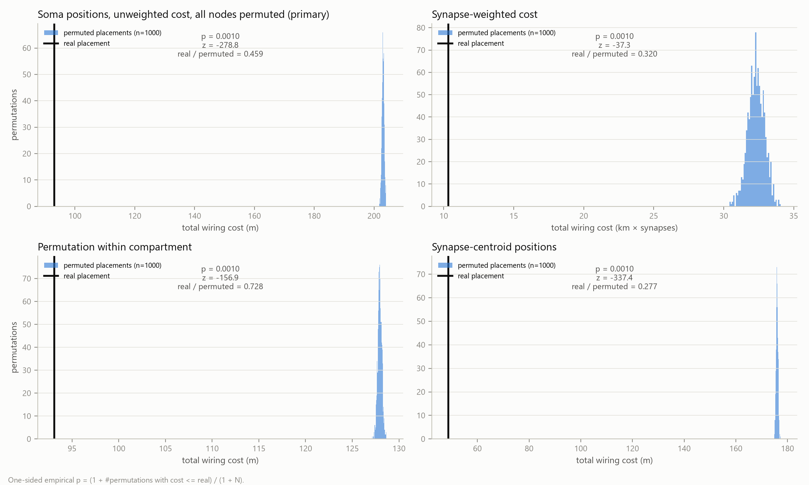
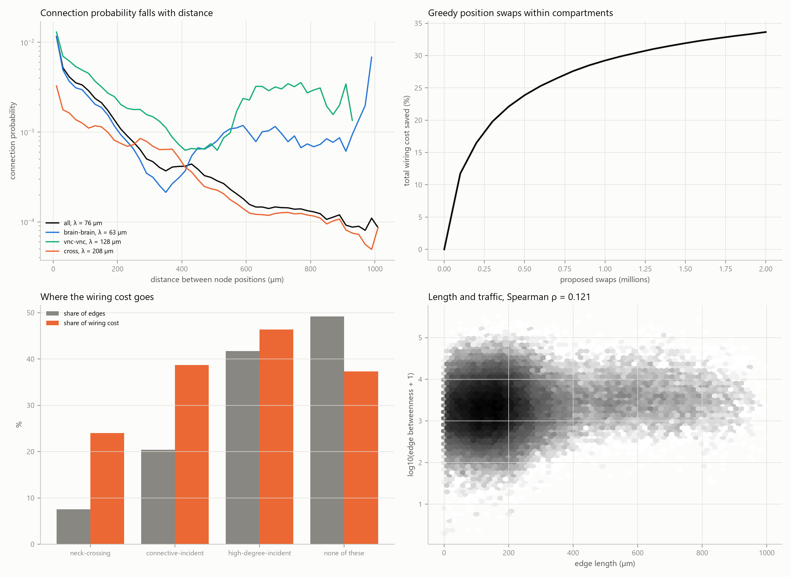
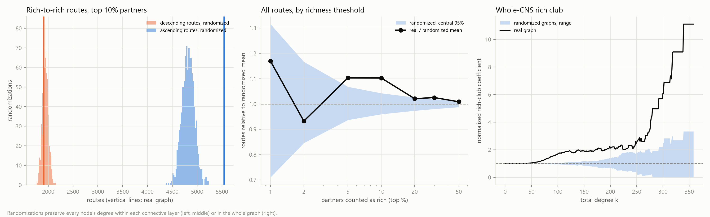
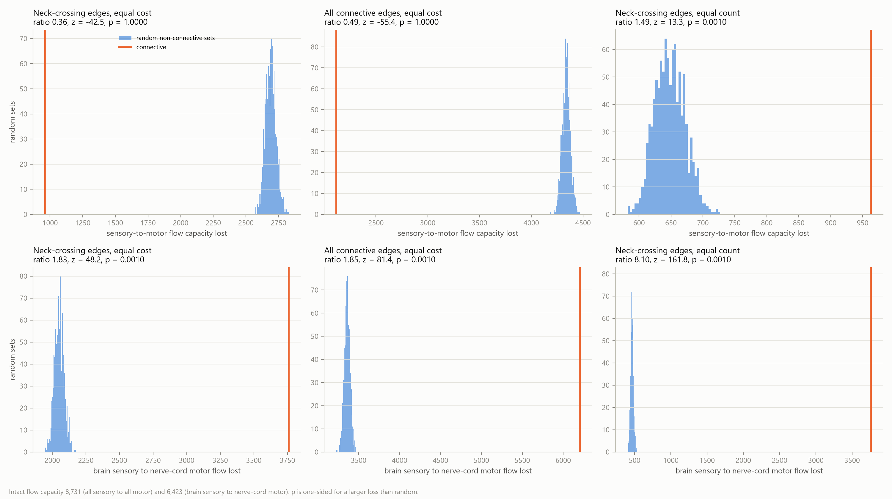
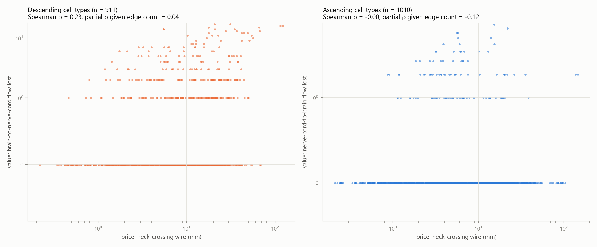

# Abstract

The complete connectome of the adult male *Drosophila* central nervous system (neuPrint `male-cns:v1.0`) was represented as a directed graph of 23,073 cell types resolved by hemisphere, with 490,884 connections and each type placed at the centroid of its neurons' cell bodies. Three questions were pre-registered.

First, placement. The real layout costs 0.459 times the mean of 1000 random reassignments of the same positions (none as cheap), and 0.728 times when positions are shuffled only within brain or nerve cord. It is not a local optimum: cost-reducing swaps lower the total by at least 33.6%.

Second, the neck connective of descending and ascending neurons. Its neck-crossing connections are 7.5% of edges but 24.0% of wiring cost. Their partners are enriched for high-degree types, and connective types are over-represented among hubs (odds ratio 3.22). Rich-to-rich routes through the connective exceed a degree-preserving null by 1.103 (p = 0.001). That excess vanishes at a lower edge threshold, however, and a model using only distance, compartment and cell class reproduces it.

Third, value. Cutting the connective removes 0.36 times the sensory-to-motor flow capacity lost with random wiring of equal total length, but 1.83 times in the brain-to-nerve-cord direction. Across cell types, wire length does not predict flow once the number of connections is controlled for.

The fly concentrates its most expensive wiring on well-connected cell types. That wiring carries no more flow per unit length than ordinary long wiring, except from brain to nerve cord.

# Introduction

This report is the third part of a three-part study of one connectome, the complete male *Drosophila* central nervous system (Berg et al. 2026). ConnectomeLens asked whether the male wiring alone carries a detectable signature of the cell types annotated as sexually dimorphic. Fault Lines asked how much of the nervous system has to be removed before sensory input no longer reaches motor output. This part asks what the wiring costs in physical length, and what the most expensive part of it, the connective between brain and nerve cord, buys in return.

Wiring economy is the idea that nervous systems place their components so as to keep the total length of their connections small. Ramón y Cajal (1909–1911) stated it as a law of conservation of space, time and material. Cherniak (1994, 1995) treated it as a component-placement problem. He found the layout of *C. elegans* ganglia and of mammalian cortical areas at or near the cheapest of the arrangements he examined.

Later work qualified the result:

- Chen, Hall and Chklovskii (2006) found the *C. elegans* layout cheaper than random, yet well above the optimum they computed for it.
- Kaiser and Hilgetag (2006) showed that rearranging components can cut wiring by about 48%, because long-range projections that shorten processing paths are kept. Ahn, Jeong and Kim (2006) reached a similar conclusion.
- Gushchin and Tang (2015) found the real *C. elegans* layout 30.6% cheaper than random, while a constrained optimization of 86 interneurons cut a further 35.1%.

Placement cheaper than random is therefore not placement that is optimal, and the two claims are tested separately here.

Rich-club organization is the tendency of highly connected nodes to be more densely interconnected than their degrees alone predict (Colizza et al. 2006). In the human connectome the rich club is costly. Its connections are long and make up a disproportionate share of total wiring, and they carry a disproportionate share of the shortest communication paths (van den Heuvel and Sporns 2011; van den Heuvel et al. 2012). The same high-cost, high-capacity pattern has been reported in *C. elegans*: the connections of an 11-neuron rich club account for 48% of total wiring cost (Towlson et al. 2013).

The fly's neck connective is the most obvious candidate for such a backbone. Descending neurons carry signals from brain to nerve cord and ascending neurons from nerve cord to brain. Each must span the neck, so their connections cannot share in the local economy that keeps most wiring short.

Both ideas have already been examined in the fly brain, and this study extends that work rather than starting it:

- Rivera-Alba et al. (2011) found the arrangement of neurons in a lamina cartridge cheaper than a million random rearrangements.
- Salova and Kovács (2025) shuffled neuron positions across the hemibrain and found shuffled layouts about twice as costly as the real one. They also found connection probability decaying exponentially with distance, and fitted generative models combining degree with wiring length.
- Péntek and Ercsey-Ravasz (2025) fitted an exponential distance rule model to FlyWire neuropils.
- Lin et al. (2024) found a neuron-level rich club in the FlyWire brain against a degree-preserving null. They expected ascending and descending neurons to belong to a rich club spanning the whole central nervous system, and noted that testing this required a complete CNS connectome.

Two recent network analyses of the FlyWire brain are the closest prior work:

- Grindrod, Lambiotte and Sahasrabuddhe (2024) studied 32,272 central-brain neurons. They found 67 Infomap modules, 21 of which carry 94% of the flow, arranged in a significant SpringRank hierarchy and spatially interleaved rather than compact.
- Sulyok, Balogh and Palla (2026) compared the real three-dimensional coordinates of 132,483 neurons with hyperbolic and Node2vec embeddings. Real coordinates predict connections with an AUC of 0.862 but support greedy routing in only 7.5% of attempts, and every embedding outperforms them.

Neither paper measures wiring cost, tests a rich club, fits a generative wiring model, or contains the nerve cord. In FlyWire, ascending and descending neurons appear only as their parts inside the brain.

The two whole-CNS connectomes have already identified the connective as a bottleneck, by other measures. Berg et al. (2026) computed maximum flow from sensory modalities to motor domains and found descending and ascending neurons with much higher flow utilization than other classes. Bates et al. (2026), in a female brain-and-nerve-cord connectome, found them with high betweenness on sensory-to-effector paths. Neither measures what the connective costs in wire, whether it favours highly connected partners, or whether removing it does more damage than removing ordinary wiring of the same length.

To our knowledge, this is the first test of wiring economy and rich-club organization on a single synapse-resolution connectome of an entire central nervous system, with the brain–nerve cord connective treated as its own class of connections. It adds four things at cell-type resolution:

1. a placement permutation test spanning brain, nerve cord and connective;
2. a degree-preserving test of whether connective routes join high-degree types on the two sides, which addresses the expectation of Lin et al. (2024) directly;
3. the loss of sensory-to-motor flow capacity when the connective is removed, against removing non-connective wiring of equal total length;
4. a test of whether a generative model built on distance, compartment and cell class reproduces these statistics.

# Data and Methods

## Spatially embedded cell-type graph

All data were retrieved from neuPrint (`male-cns:v1.0`) with `neuprint-python`; coordinates were converted at the dataset's 8 nm voxel size, and the somata of typed neurons span 730 × 514 × 995 µm. The 164,506 typed neurons were grouped into nodes, each a cell type on one side of the body (the soma hemisphere, or the nerve-root hemisphere for neurons without a CNS soma), since pooling a bilateral type would place it on the midline. This gives 23,073 nodes.

A node sits at the centroid of its neurons' soma positions when at least half of them have one (22,139 nodes). Otherwise it sits at the synapse-weighted centroid of its neurons' synapses (934 nodes, 751 of them sensory, whose cell bodies lie in the periphery). A node is brain-dominant if more than half of its synapses in `CentralBrain`, `Optic(L)`, `Optic(R)` and `VNC` lie in the first three, and nerve cord–dominant otherwise: 16,052 and 7,021 nodes.

A directed edge joins two nodes when the connection supplies at least 1% of the target node's input synapses from typed neurons; self-connections are excluded. The graph has 490,884 edges. The same rule applied to types pooled across sides reproduces exactly the 11,751-type, 243,439-edge graph used in ConnectomeLens and Fault Lines.

## The connective

Each cell type takes the superclass held by most of its neurons. Descending types (`descending_neuron`, 480 types) and ascending types (`ascending_neuron`, 563 types) form the connective set: 951 descending and 1,096 ascending nodes, 8.9% of all nodes. As a cross-check, 85.4% of typed neurons with synapses inside the neck connective ROI (`CV`) are descending or ascending neurons. Sensory ascending neurons, whose axons also pass through the neck, have no CNS soma to place and are treated as sensory, not connective.

Partners are all non-connective nodes, split by compartment into brain partners B (14,950) and nerve-cord partners V (6,076). A neck-crossing edge joins a connective node to a partner on the far side of the neck: DN → V, V → DN, AN → B or B → AN. There are 36,943 such edges.

## Wiring cost

The cost of an edge is the Euclidean distance between its endpoints' positions; the cost of an edge set is the sum over its edges, each counted once. Edge lengths have median 154.3 µm and mean 189.6 µm.

Node positions stand in for the length of real neuronal processes. As a check, skeletons were retrieved for a stratified random sample of 500 neurons: 100 descending, 100 ascending, 150 central-brain intrinsic and 150 nerve-cord intrinsic. Their total cable length was compared with the distance from soma to the centroid of the neuron's presynaptic sites.

## Placement test

The primary test compared the real total unweighted cost with 1000 uniform random permutations of the position-to-node assignment, with the graph and the multiset of positions unchanged. Secondary versions were:

- the synapse-weighted cost;
- permutation only within compartments;
- synapse centroids as positions for every node;
- the brain and nerve-cord subgraphs separately.

Distance from a local optimum was estimated with 2,000,000 proposed swaps of position between two soma-placed nodes of the same compartment, each accepted if it lowered the total cost, following Kaiser and Hilgetag (2006) and Gushchin and Tang (2015). Connection probability was measured in 20 µm distance bins, and an exponential P(d) = a·exp(−d/λ) was fitted over 0–600 µm.

## Rich-club tests

A partner's richness is its total degree in the subgraph of non-connective nodes, so no connective edge contributes to it. Rich brain and rich nerve-cord partners are those at or above the 90th percentile of richness within B and within V. A route is a two-edge path through one connective node, b → DN → v or v → AN → b. The statistic R is the number of rich-to-rich routes: the sum over connective nodes of their rich inputs times their rich outputs on the opposite side.

The four layers of connective edges (B → DN, DN → V, V → AN, AN → B) were randomized independently by degree-preserving edge swaps (10 swaps per edge, no multi-edges), 1000 times. Every partner keeps its number of connective edges in each layer and every connective node keeps its in- and out-degree; only which partner attaches to which connective node changes.

Two secondary tests were run:

- whether rich partners are over-represented among connective partners, against a null that redraws each connective node's partners uniformly;
- whether descending and ascending nodes are over-represented among nodes at or above the 90th percentile of total degree (Fisher exact test).

The rich-club coefficient of the whole graph was normalized by 100 degree-preserving randomizations.

## Value tests

Sensory-to-motor value uses the definitions of Fault Lines, with the code copied unchanged:

- **Flow capacity** is the maximum number of edge-disjoint directed paths from any sensory node to any motor node, computed as a unit-capacity maximum flow between a supersource and a supersink.
- **Reachable pairs** is the number of (sensory, motor) pairs joined by a directed path.

The sensory set has 751 nodes (390 brain, 361 nerve cord) and the motor set 367 nodes (86 brain, 281 nerve cord). Descending neurons, which Fault Lines counted among motor outputs, are excluded here because they are part of what is removed.

The primary test removed the 36,943 neck-crossing edges. It compared the loss with removals of 1000 random sets of non-connective edges matched to their total length: edges were taken in random order until the running total reached that length, and every set came within 0.01% of it. Secondary comparisons were:

- sets matched on edge count instead of length;
- the longest non-connective edges up to the same total length;
- silencing every edge incident on a connective node;
- flow in each direction across the neck.

For each connective node, *price* is the summed length of its neck-crossing edges. *Value* is the loss of flow in the direction the node carries when those edges alone are removed. Price and value were correlated across descending and across ascending nodes, then again with the number of neck-crossing edges partialled out.

## Generative model

Edge presence over ordered node pairs was modelled by logistic regression, fitted in scikit-learn on all 490,884 edges and 2,454,420 uniformly sampled non-edges. The intercept was corrected for the sampling ratio. Model G uses:

- distance, and the logarithm of distance;
- whether the two nodes share a compartment;
- a one-hot term for the ordered pair of superclasses.

A secondary model, G+deg, adds the logarithms of source out-degree and target in-degree. Fit is reported as McFadden pseudo-R², AIC and 5-fold cross-validated ROC AUC.

Fifty synthetic graphs per model were drawn as independent Bernoulli trials, with a scalar shift solved so that the expected edge count equals the real one. Each synthetic graph was compared with the real graph on thirteen properties. A property counts as reproduced when the real value lies within the central 95% of the synthetic values.

## Robustness, pre-registration and software

The placement, route and hub tests were repeated at edge thresholds of 0.5%, 2% and 5%. Every hypothesis, with its direction, statistic, null and threshold, was committed before the statistic was computed (commits `39892c5`, `e62c6df` and `73fba33`); each results file keeps that section unchanged and the scripts only append beneath it. Empirical one-sided p-values are (1 + null values at least as extreme) / (1 + N), so the smallest attainable with 1000 draws is 0.0010. Software: Python 3.12, igraph 1.0.0, NumPy 2.5.3, SciPy 1.18.1, pandas 3.0.5, scikit-learn 1.9.1, navis 1.12.0 and neuprint-python 0.6.3, pinned in `requirements.txt`; `make reproduce` rebuilds every result from neuPrint.

# Results

## Placement is far cheaper than random, and far from optimal

The real placement costs 93,095 mm of wire, 0.459 times the mean of 1000 random reassignments of the same positions (z = −278.8). No permutation came as low (p = 0.0010, the smallest attainable). Every secondary analysis points the same way:

| analysis | real / permuted cost | z | permutations at or below real |
|---|---|---|---|
| soma positions, unweighted (primary) | 0.459 | −278.8 | 0 / 1000 |
| synapse-weighted cost | 0.320 | −37.3 | 0 / 1000 |
| permutation within compartment | 0.728 | −156.9 | 0 / 1000 |
| synapse-centroid positions | 0.277 | −337.4 | 0 / 1000 |
| brain subgraph only | 0.679 | −169.8 | 0 / 1000 |
| nerve-cord subgraph only | 0.741 | −64.7 | 0 / 1000 |

: Placement test. Each row compares the real wiring cost with 1000 permutations of node positions.

The full permutation moves brain types into the nerve cord and is an easy null to beat. Shuffling only within compartments still leaves the real layout 27% cheaper, so the economy is not just the separation of brain and nerve cord.

Connection probability falls with distance (Spearman ρ = −0.993 across 51 bins with at least 1000 pairs), with a length constant of 76 µm over the first 600 µm. Within the brain and within the nerve cord the fall is not monotonic. Probability reaches a minimum at 340 µm between brain nodes and at 500 µm between nerve-cord nodes. It then rises again at the longest distances, where most edges join opposite sides of the body.

The real placement is not a local optimum. Of 2,000,000 proposed swaps within a compartment, 50,050 lowered the cost. Together they reduced it from 93,095 mm to 61,778 mm, a 33.64% reduction.

The search had not converged (the last 100,000 proposals still saved 0.33%), so this is a lower bound, and it ignores every physical constraint on where cell bodies and neuropils can lie.

The cable-length check supports node positions as a between-class measure only. Across the 500 sampled neurons, skeleton cable length correlates with soma-to-output distance (ρ = 0.428, p = 5.5 × 10^−24^): descending and ascending neurons have more cable (medians 4,592 and 3,898 µm) than intrinsic neurons (1,428 and 1,713 µm). Within each superclass, however, |ρ| is below 0.12.

## The connective is expensive, and its partners are well connected

Neck-crossing edges are 7.5% of all edges and 24.0% of total wiring cost, with a mean length of 606 µm against 189.6 µm for all edges. Counting every edge incident on a connective node, the connective carries 20.4% of edges and 38.7% of cost.

Edges incident on high-degree nodes (total degree at least 67, the 90th percentile) are longer than other edges: mean 211 against 175 µm (one-sided Mann-Whitney p < 10^−300^). The high-cost backbone reported in human and *C. elegans* connectomes is therefore present here. Long edges also carry somewhat more traffic: edge length correlates with directed edge betweenness at ρ = 0.121, and at ρ = 0.084 among edges within one compartment.

Descending and ascending nodes are over-represented among the most connected nodes of the whole graph. At or above the 90th percentile of total degree lie 24.4% of descending nodes, 23.2% of ascending nodes and 8.8% of other nodes (odds ratio 3.22, Fisher p = 1.5 × 10^−79^). This is the expectation of Lin et al. (2024).

The connective's partners are also enriched for well-connected types. 14.4% of connective edges have a rich partner, against 10.2% ± 0.1% when each connective node's partners are redrawn uniformly (ratio 1.40, z = 33.9, p = 0.0010).

The normalized rich-club coefficient of the whole graph exceeds all 100 randomized graphs from total degree 12 upwards, although at that degree the excess is negligible. The coefficient reaches 1.1 at degree 59, 1.5 at 88 and 2 at 172.

## Rich-to-rich routing through the connective is modest and fragile

At the 1% threshold, 7,454 two-step routes pass through a connective node from a rich partner on one side to a rich partner on the other. That is 1.103 times the mean of 1000 layer-preserving rewirings (6,760 ± 143, z = 4.8, p = 0.0010), so the primary hypothesis is supported.

The excess is carried entirely by ascending routes (ratio 1.150, p = 0.0010); descending routes are at chance (0.984, p = 0.71). The excess also depends on how "rich" is defined. It is significant when the top 5%, 10% or 30% of partners count as rich, and not significant at 1%, 2%, 20% or 50%.

The result also depends on the edge threshold, and the pre-registered robustness hypothesis failed because of it:

| edge threshold | edges | real / rewired routes | p | hub odds ratio | placement ratio |
|---|---|---|---|---|---|
| 0.5% | 942,400 | 1.002 | 0.42 | 3.99 | 0.460 |
| 1% | 490,884 | 1.103 | 0.0010 | 3.22 | 0.459 |
| 2% | 216,862 | 1.391 | 0.0010 | 2.22 | 0.455 |
| 5% | 52,217 | 1.605 | 0.0010 | 1.33 | 0.439 |

: Robustness to the edge threshold. Placement and hub over-representation hold at every threshold; rich-to-rich routing does not hold at 0.5%.

The route enrichment grows as weak connections are dropped and disappears when they are added. Rich-to-rich routing through the connective is therefore a property of its strongest connections, not of its wiring as a whole. Placement economy, and the over-representation of connective types among hubs, hold at every threshold.

## The connective buys less flow per unit of wire than ordinary wiring, except from brain to nerve cord

The intact graph supports 8,731 edge-disjoint sensory-to-motor paths. Cutting the 36,943 neck-crossing edges (22.37 m of wire) removes 963 of them. Random non-connective sets of the same total length, about 153,000 shorter edges each, remove 2,689 ± 41 (ratio 0.36, z = −42.5, p = 1.0).

The primary value hypothesis is not supported: per unit of wire, neck-crossing wiring carries less sensory-to-motor flow than ordinary wiring. No sensory-motor pair is disconnected by the cut. Every pair the connective joins is also joined by a path that avoids the neck-crossing edges.

The loss is concentrated in one direction:

| comparison | flow lost, connective | flow lost, null mean | ratio | p |
|---|---|---|---|---|
| all flow, equal length (primary) | 963 | 2,689 | 0.36 | 1.0 |
| brain sensory → nerve-cord motor, equal length | 3,759 of 6,423 | 2,052 | 1.83 | 0.0010 |
| nerve-cord sensory → brain motor, equal length | 242 of 2,228 | 555 | 0.44 | 1.0 |
| all flow, equal edge count | 963 | 648 | 1.49 | 0.0010 |
| brain → nerve cord, equal edge count | 3,759 | 464 | 8.10 | 0.0010 |
| all flow, longest non-connective edges | 963 | 962 | 1.00 | — |

: Value of the neck-crossing edges. Null sets are 1000 random sets of non-connective edges matched on total length (primary) or on edge count; the last row is a single deterministic set.

Cutting the neck removes 59% of the flow from brain sensory to nerve-cord motor nodes, 1.83 times what random wiring of equal length removes. In the other direction it removes 11%, 0.44 times the random loss.

Per connection, neck-crossing edges carry more flow: they remove 1.49 times the flow of an equal number of random non-connective edges.

The comparison that most directly answers whether the connective is special is the last row. The 84,008 longest non-connective edges, each at least 207 µm long, together match the connective's total length. Removing them costs 962 units of flow, one fewer than the connective. On this measure the connective is worth what long wiring of its length is worth. The exception is its brain-to-nerve-cord direction, where the longest edges remove only 1,122 units against its 3,759.

Silencing every edge of the descending and ascending neurons, not only the neck-crossing ones, removes 2,118 units of flow, 0.49 times a length-matched null. It also removes 6,202 of the 6,423 units from brain to nerve cord and 1,543 of the 2,228 from nerve cord to brain, 1.85 and 1.72 times the null. What crosses between brain and nerve cord depends almost entirely on these neurons, the bottleneck Berg et al. (2026) described.

## Across cell types, the price of the connective does not predict its value

For a single descending or ascending cell type, removing its neck-crossing edges usually costs no flow at all: this holds for 622 of 911 descending nodes and 899 of 1,010 ascending nodes. The remaining wiring supports the same maximum flow.

Among descending nodes, price and value are correlated (ρ = 0.231, p = 7.6 × 10^−13^). Controlling for the number of neck-crossing edges leaves almost nothing (partial ρ = 0.044, p = 0.09): at a given number of connections, longer wiring buys no more flow. Among ascending nodes, price and value are unrelated (ρ = −0.005). Both price–value hypotheses therefore fail.

The extremes show why:

- The most expensive ascending type, AN07B004, has 316 neck-crossing edges and 146 mm of wire on one side and carries 2 units of flow.
- The descending type DNge002 carries 14 units with 5.5 mm of wire.
- The most expensive descending type, DNg98, is also among the most valuable (123 mm, 16 units).

## A distance and cell-class model reproduces the rich-to-rich routes but little else

Distance alone explains connections moderately well, with McFadden pseudo-R² 0.165 and cross-validated AUC 0.786. The other terms add fit as follows:

| model | pseudo-R² | cross-validated AUC |
|---|---|---|
| distance only | 0.165 | 0.786 |
| + compartment | 0.165 | 0.787 |
| + superclass pairing (model G) | 0.276 | 0.847 |
| + source and target degree (model G+deg) | 0.381 | 0.899 |

: Fit of the nested generative models.

In model G, the log-odds of a connection fall by 0.248 per 100 µm of distance, and a shared compartment adds 0.698. The four largest class-pairing terms all involve descending neurons.

Model G reproduces 2 of the 13 compared properties: the maximum in-degree and the number of rich-to-rich routes through the connective. Its synthetic graphs have 6,636 such routes (central 95% 5,540–7,600) against 7,454 real. The model knows nothing of the real degree sequence. The route count that exceeds degree-preserving rewiring by 10% therefore lies within the range that distance, compartment and cell class produce on their own.

Model G+deg matches the out-degree distribution far better (Kolmogorov-Smirnov distance 0.039 against 0.351). It reproduces only reachable pairs, however, and makes rich-to-rich routes 2.1 times too frequent.

Neither model reproduces the local structure of the real graph, which has 21 and 16 times the reciprocity of their graphs and 16 and 8 times their transitivity, as expected when every ordered pair is drawn independently. Neither reproduces total wiring cost, median edge length, the number of neck-crossing edges (39,241 under model G against 36,943) or flow capacity (8,365 against 8,731).

# Discussion

The fly's CNS is laid out economically in the weaker sense later work settled on, not in the strong sense of Cherniak's near-optimal layouts. At cell-type resolution, across brain, nerve cord and connective, the real layout is less than half as costly as random placements of the same positions. It is a quarter cheaper even when types are shuffled only within their compartment. The hemibrain neuron shuffles of Salova and Kovács (2025) found real layouts about half as costly as shuffled ones; the ratio here, 0.459, is similar at a different resolution and over the whole CNS.

Like the *C. elegans* layout, the fly's is far from the cheapest possible arrangement: greedy swaps remove at least a third of its wire, a margin close to Gushchin and Tang's for worm interneurons. Wiring cost is one pressure among several. The long connections that keep the layout from its optimum are the kind Kaiser and Hilgetag (2006) argued shorten processing paths.

The connective is where those long connections concentrate. It is 7.5% of connections and a quarter of the wire, and in two respects it looks like the hub backbone of mammalian connectomes. Its cell types are over-represented among the most connected types of the CNS, as Lin et al. (2024) predicted, and it favours well-connected partners on both sides.

The result the rich-club framing most directly predicts is that the connective preferentially joins hubs of the brain to hubs of the nerve cord. That result is weaker:

- the excess is 10%, and comes entirely from ascending routes;
- it disappears when weaker connections are counted;
- a model with no knowledge of degree produces as many such routes.

Partner enrichment and hub membership are robust; rich-to-rich routing specifically is not.

The value result reverses the simplest version of the hypothesis. The pre-registered comparison asked whether the connective buys more flow than random wiring of the same length. It buys less, because the same length buys four times as many short connections elsewhere, and flow capacity counts disjoint paths.

Per connection the connective carries more flow than ordinary connections, and against the longest ordinary connections of the same total length it carries the same flow: on this measure it is valued as long wiring in general is valued. Its distinctive contribution is directional, 1.83 times the brain-to-nerve-cord flow of random wiring of its length and less than half of the reverse. Nor does spending more wire buy more flow for individual cell types: most can be removed without loss, and among those that matter, value follows the number of connections rather than their length.

Returning to the question in the title: the fly places its most expensive wiring on well-connected cell types, as the human connectome does. On these measures, however, that wiring does not return more sensory-to-motor capacity per unit length than ordinary long wiring, except in the brain-to-nerve-cord direction.

# What this does and does not show

This analysis shows three things about one male fly CNS:

- the placement of its cell types is cheaper than random placement;
- the connective's cell types sit among its hubs;
- how much the connective's wiring contributes to one measure of sensory-to-motor routing, measured against three explicitly constructed comparison sets.

It does not show that wiring economy is a law of nervous-system organization, or that the placement is optimal. The generative model reproduces or fails to reproduce specific statistics; it does not describe how the nervous system develops. Flow capacity is a structural count of disjoint paths, not a measure of information transmitted, of behaviour, or of anything cognitive. The results extend the FlyWire brain analyses cited above to data those studies did not have; they do not revise them.

# Limitations

- **Resolution.** The graph is aggregated to cell types by hemisphere, and each type is placed at the centroid of its somata. Within a class, soma-to-output distance does not predict a neuron's cable length. Positions therefore capture differences in wiring cost between classes, not the cable of individual neurons.
- **Cost measure.** Euclidean distance between centroids stands in for the length of real processes, which follow neuropil tracts rather than straight lines.
- **Edge threshold.** Every result uses a 1% input threshold. The placement and hub results hold from 0.5% to 5%; the rich-to-rich route result does not hold at 0.5%.
- **The connective set.** It is defined by majority superclass. Sensory ascending neurons also pass through the neck, but they are treated as sensory inputs because their cell bodies lie outside the CNS. Their neck-crossing wiring is therefore not part of the removed set.
- **Value measure.** Flow capacity counts unweighted edge-disjoint paths, so it rewards many short connections over fewer long ones. For that reason the length-matched comparison is reported alongside count-matched and longest-edge comparisons, not replaced by them.
- **Swap search.** The search is greedy and was stopped before convergence. It also ignores the physical constraints that fix where neuropils and cell-body layers can lie.
- **Generative models.** Both draw each ordered pair independently, so they cannot produce reciprocity or clustering.
- **Data.** The data are one animal, one sex and one static reconstruction.
- **Source version.** The flow analysis of Berg et al. (2026) was read in its bioRxiv version (v2, October 2025); the published version could differ.

# References

Ahn Y-Y, Jeong H, Kim BJ (2006). Wiring cost in the organization of a biological neuronal network. *Physica A* 367:531–537. doi:10.1016/j.physa.2005.12.013

Bates AS, Phelps JS, Kim M, Yang HH, et al. (2026). Distributed control circuits across a brain-and-cord connectome. *Nature* 656(8129):957–970. doi:10.1038/s41586-026-10735-w

Berg S, et al. (2026). Sexual dimorphism in the complete *Drosophila* male central nervous system connectome. *Cell* 189(18):5504–5526.e15. doi:10.1016/j.cell.2026.08.015

Chen BL, Hall DH, Chklovskii DB (2006). Wiring optimization can relate neuronal structure and function. *PNAS* 103(12):4723–4728. doi:10.1073/pnas.0506806103

Cherniak C (1994). Component placement optimization in the brain. *J Neurosci* 14(4):2418–2427. doi:10.1523/JNEUROSCI.14-04-02418.1994

Cherniak C (1995). Neural component placement. *Trends Neurosci* 18(12):522–527. doi:10.1016/0166-2236(95)98373-7

Colizza V, Flammini A, Serrano MA, Vespignani A (2006). Detecting rich-club ordering in complex networks. *Nat Phys* 2(2):110–115. doi:10.1038/nphys209

Grindrod P, Lambiotte R, Sahasrabuddhe R (2024). Modularity, hierarchical flows and symmetry of the Drosophila connectome. arXiv:2412.13202

Gushchin A, Tang A (2015). Total wiring length minimization of *C. elegans* neural network: a constrained optimization approach. *PLOS ONE* 10(12):e0145029. doi:10.1371/journal.pone.0145029

Kaiser M, Hilgetag CC (2006). Nonoptimal component placement, but short processing paths, due to long-distance projections in neural systems. *PLoS Comput Biol* 2(7):e95. doi:10.1371/journal.pcbi.0020095

Lin A, et al. (2024). Network statistics of the whole-brain connectome of *Drosophila*. *Nature* 634(8032):153–165. doi:10.1038/s41586-024-07968-y

Péntek B, Ercsey-Ravasz M (2025). The exponential distance rule-based network model predicts topology and reveals functionally relevant properties of the *Drosophila* projectome. *Netw Neurosci* 9(3):869–895. doi:10.1162/netn_a_00455

Ramón y Cajal S (1909–1911). *Histologie du système nerveux de l'homme et des vertébrés*, trans. L. Azoulay. Paris: Maloine. English translation by N. Swanson and L. W. Swanson (1995), *Histology of the Nervous System of Man and Vertebrates*, Oxford University Press.

Rivera-Alba M, et al. (2011). Wiring economy and volume exclusion determine neuronal placement in the *Drosophila* brain. *Curr Biol* 21(23):2000–2005. doi:10.1016/j.cub.2011.10.022

Salova A, Kovács IA (2025). Combined topological and spatial constraints are required to capture the structure of neural connectomes. *Netw Neurosci* 9(1):181–206. doi:10.1162/netn_a_00428

Sulyok B, Balogh SG, Palla G (2026). Network geometry of the Drosophila brain. arXiv:2602.16417

Towlson EK, Vértes PE, Ahnert SE, Schafer WR, Bullmore ET (2013). The rich club of the *C. elegans* neuronal connectome. *J Neurosci* 33(15):6380–6387. doi:10.1523/JNEUROSCI.3784-12.2013

van den Heuvel MP, Sporns O (2011). Rich-club organization of the human connectome. *J Neurosci* 31(44):15775–15786. doi:10.1523/JNEUROSCI.3539-11.2011

van den Heuvel MP, Kahn RS, Goñi J, Sporns O (2012). High-cost, high-capacity backbone for global brain communication. *PNAS* 109(28):11372–11377. doi:10.1073/pnas.1203593109
