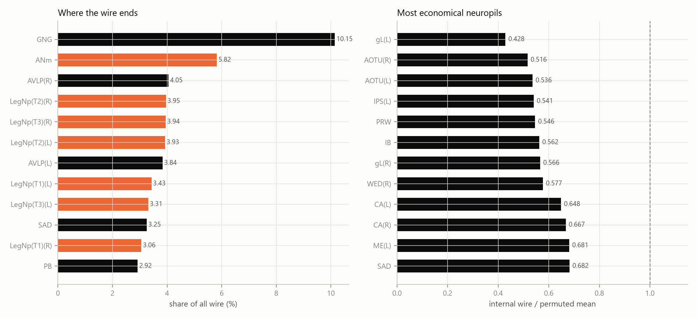
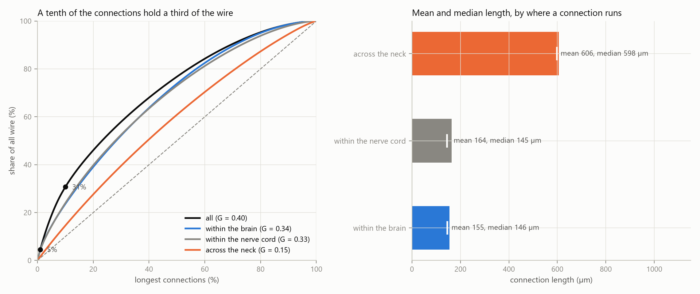

# Abstract

The complete connectome of the adult male *Drosophila* central nervous system (neuPrint `male-cns:v1.0`) was represented as a directed graph of 23,073 cell types resolved by hemisphere, with 490,884 connections and each type placed at the centroid of its neurons' cell bodies. Three questions were pre-registered.

First, placement. The real layout costs 0.459 times the mean of 1000 random reassignments of the same positions (z = −278.8, p = 0.0010; none as cheap), and 0.728 times when positions are shuffled only within brain or nerve cord. It is not a local optimum: cost-reducing swaps lower the total by at least 33.6%.

Second, the neck connective of descending and ascending neurons. Its neck-crossing connections are 7.5% of all connections but 24.0% of wiring cost. Their partners are enriched for high-degree types, and connective types are over-represented among hubs (odds ratio 3.22). Rich-to-rich routes through the connective exceed a degree-preserving null by 1.103 (z = 4.8, p = 0.0010). That excess vanishes at a lower input threshold, its split between ascending and descending routes reverses across thresholds, and a model using only distance, compartment and cell class reproduces it.

Third, value. Cutting the connective removes 0.36 times the sensory-to-motor flow capacity lost with random wiring of equal total length (z = −42.5, p = 1.0 against the registered direction), but 1.83 times in the brain-to-nerve-cord direction (z = 48.2, p = 0.0010). Across cell types, wire length does not predict flow once the number of connections is controlled for (partial ρ = 0.044 descending, −0.122 ascending).

Two exploratory analyses accompany these tests. Attributed to the neuropils, only 6.6% of the wiring budget stays inside one region, and all 48 regions large enough to test are wired internally more cheaply than permutations of their own cell types, the antennal lobes least clearly. Over connections the budget is unevenly but not extremely spread: the longest tenth hold 30.7% of it, and a lognormal fits the upper tail better than a power law.

The fly concentrates its most expensive wiring on well-connected cell types. That wiring carries no more sensory-to-motor flow per unit length than ordinary long wiring, except from brain to nerve cord. Four of the thirteen registered hypotheses failed, and both the rich-to-rich excess and the direction it comes from change with the input threshold, so these are statements about one static wiring diagram under one set of definitions.

# Introduction

This report is the third part of a three-part study of one connectome, the complete male *Drosophila* central nervous system (Berg et al. 2026). ConnectomeLens asked whether the male wiring alone carries a detectable signature of the cell types annotated as sexually dimorphic. Fault Lines asked how much of the nervous system has to be removed before sensory input no longer reaches motor output. This part asks what the wiring costs in physical length, and what the most expensive part of it, the connective between brain and nerve cord, buys in return.

Wiring economy is the idea that nervous systems place their components so as to keep the total length of their connections small. Ramón y Cajal (1909–1911) stated it as a law of conservation of space, time and material. Cherniak (1994, 1995) treated it as a component-placement problem. He found the layout of *C. elegans* ganglia and of mammalian cortical areas at or near the cheapest of the arrangements he examined.

Later work qualified the result:

- Chen, Hall and Chklovskii (2006) found the *C. elegans* layout cheaper than random, yet well above the optimum they computed for it.
- Kaiser and Hilgetag (2006) showed that rearranging components can cut wiring by about 48%, because long-range projections that shorten processing paths are kept. Ahn, Jeong and Kim (2006) reached a similar conclusion.
- Gushchin and Tang (2015) found the real *C. elegans* layout 30.6% cheaper than random, while a constrained optimization of 86 interneurons cut a further 35.1%.

Placement cheaper than random is therefore not placement that is optimal, and the two claims are tested separately here.

Rich-club organization is the tendency of highly connected vertices to be more densely interconnected than their degrees alone predict (Colizza et al. 2006). In the human connectome the rich club is costly. Its connections are long and make up a disproportionate share of total wiring, and they carry a disproportionate share of the shortest communication paths (van den Heuvel and Sporns 2011; van den Heuvel et al. 2012). The same high-cost, high-capacity pattern has been reported in *C. elegans*: the connections of an 11-neuron rich club account for 48% of total wiring cost (Towlson et al. 2013).

The fly's neck connective is the most obvious candidate for such a backbone. Descending neurons carry signals from brain to nerve cord and ascending neurons from nerve cord to brain. Each must span the neck, so their connections cannot share in the local economy that keeps most wiring short.

Both ideas have already been examined in the fly brain, and this study extends that work rather than starting it:

- Rivera-Alba et al. (2011) found the arrangement of neurons in a lamina cartridge cheaper than a million random rearrangements.
- Salova and Kovács (2025) shuffled neuron positions across the hemibrain and found shuffled layouts about twice as costly as the real one. They also found connection probability decaying exponentially with distance, and fitted generative models combining degree with wiring length.
- Péntek and Ercsey-Ravasz (2025) fitted an exponential distance rule model to FlyWire neuropils.
- Lin et al. (2024) found a neuron-level rich club in the FlyWire brain against a degree-preserving null. They expected ascending and descending neurons to belong to a rich club spanning the whole central nervous system, and noted that testing this required a complete CNS connectome.

Two recent network analyses of the FlyWire brain connectome (Dorkenwald et al. 2024; Schlegel et al. 2024) are the closest prior work:

- Grindrod, Lambiotte and Sahasrabuddhe (2024) studied 32,272 central-brain neurons. They found 67 Infomap modules, 21 of which carry 94% of the flow, arranged in a significant SpringRank hierarchy and spatially interleaved rather than compact.
- Sulyok, Balogh and Palla (2026) compared the real three-dimensional coordinates of 132,483 neurons with hyperbolic and Node2vec embeddings. Real coordinates predict connections with an AUC of 0.862 but support greedy routing in only 7.5% of attempts, and every embedding outperforms them.

Neither paper measures wiring cost, tests a rich club, fits a generative wiring model, or contains the nerve cord. In FlyWire, ascending and descending neurons appear only as their parts inside the brain; in the male ventral nerve cord connectome (Takemura et al. 2024), only as their parts inside the cord.

The two whole-CNS connectomes have already identified the connective as a bottleneck, by other measures. Berg et al. (2026) computed maximum flow from sensory modalities to motor domains and found descending and ascending neurons with much higher flow utilization than other classes. Bates et al. (2026), in a female brain-and-nerve-cord connectome, found them with high betweenness on sensory-to-effector paths. Neither measures what the connective costs in wire, whether it favours highly connected partners, or whether removing it does more damage than removing ordinary wiring of the same length.

To our knowledge, this is the first test of wiring economy and rich-club organization on a single synapse-resolution connectome of an entire central nervous system, with the brain–nerve cord connective treated as its own class of connections. It adds four things at cell-type resolution:

1. a placement permutation test spanning brain, nerve cord and connective;
2. a degree-preserving test of whether connective routes join high-degree types on the two sides, which addresses the expectation of Lin et al. (2024) directly;
3. the loss of sensory-to-motor flow capacity when the connective is removed, against removing non-connective wiring of equal total length;
4. a test of whether a generative model built on distance, compartment and cell class reproduces these statistics.

# Data and Methods

## Spatially embedded cell-type graph

All data were retrieved from neuPrint (Plaza et al. 2022), dataset `male-cns:v1.0`, with `neuprint-python`; coordinates were converted at the dataset's 8 nm voxel size, and the somata of typed neurons span 730 × 514 × 995 µm. The 164,506 typed neurons were grouped so that each vertex of the graph is one annotated cell type on one side of the body (the soma hemisphere, or the nerve-root hemisphere for neurons without a CNS soma), since pooling a bilateral type would place it on the midline. This gives 23,073 vertices and, at the threshold set below, 490,884 directed arcs.

Below, a *cell type* always means one of those vertices and a *connection* one of those arcs. The words node and edge are kept only inside the standard technical terms that have no other name: in-degree and out-degree, edge-disjoint paths, degree-preserving edge swaps, edge betweenness, and the non-edges sampled by the generative model.

A cell type sits at the centroid of its neurons' soma positions when at least half of them have one (22,139 types). Otherwise it sits at the synapse-weighted centroid of its neurons' synapses (934 types, 751 of them sensory, whose cell bodies lie in the periphery). A cell type is brain-dominant if more than half of its synapses in `CentralBrain`, `Optic(L)`, `Optic(R)` and `VNC` lie in the first three, and nerve cord–dominant otherwise: 16,052 and 7,021 types.

A directed connection joins two cell types when it supplies at least 1% of the target's input synapses from typed neurons; self-connections are excluded. The same rule applied to types pooled across sides reproduces exactly the 11,751-type, 243,439-connection graph used in ConnectomeLens and Fault Lines.

## The connective

Each cell type takes the superclass held by most of its neurons. Descending types (`descending_neuron`) number 480 pooled across sides and ascending types (`ascending_neuron`) 563; resolved by hemisphere they form the connective set of 951 descending and 1,096 ascending cell types, 8.9% of all cell types. As a cross-check, 85.4% of typed neurons with synapses inside the neck connective ROI (`CV`) are descending or ascending neurons. Sensory ascending neurons, whose axons also pass through the neck, have no CNS soma to place and are treated as sensory, not connective.

Partners are all non-connective cell types, split by compartment into brain partners B (14,950) and nerve-cord partners V (6,076). A neck-crossing connection joins a connective cell type to a partner on the far side of the neck: DN → V, V → DN, AN → B or B → AN. There are 36,943 such connections.

## Wiring cost

The cost of a connection is the Euclidean distance between its endpoints' positions; the cost of a set of connections is the sum over the set, each connection counted once. Connection lengths have median 154.3 µm and mean 189.6 µm. Throughout, the length of a single connection is given in micrometres and the summed length of a set of connections in millimetres.

Cell-type positions stand in for the length of real neuronal processes. As a check, skeletons were retrieved for a stratified random sample of 500 neurons: 100 descending, 100 ascending, 150 central-brain intrinsic and 150 nerve-cord intrinsic. Their total cable length was compared with the distance from soma to the centroid of the neuron's presynaptic sites.

## Placement test

The primary test compared the real total unweighted cost with 1000 uniform random permutations of the position-to-type assignment, with the graph and the multiset of positions unchanged. Secondary versions were:

- the synapse-weighted cost;
- permutation only within compartments;
- synapse centroids as positions for every cell type;
- the brain and nerve-cord subgraphs separately.

Distance from a local optimum was estimated with 2,000,000 proposed swaps of position between two soma-placed cell types of the same compartment, each accepted if it lowered the total cost, following Kaiser and Hilgetag (2006) and Gushchin and Tang (2015). Connection probability was measured in 20 µm distance bins, and an exponential P(d) = a·exp(−d/λ) was fitted over 0–600 µm, over all pairs and separately within the brain, within the nerve cord and across the two compartments.

## Wire by neuropil

The 105 published neuropil surfaces were simplified onto a 3 µm grid and pooled into one search tree. Each cell type takes the neuropil whose surface lies nearest its position, and each connection lends half its length to the neuropil at each of its ends, so the wire attributed to the regions sums to the total. A neuropil's internal connections are those with both endpoints assigned to it.

Placement inside a region was tested with the statistic of the primary placement test restricted to that region: the summed length of its internal connections against 1000 permutations of which of its own cell types sits at which of its own positions. It is reported for neuropils with at least 12 cell types and 50 internal connections. These region tests were not planned as a family and carry no registered hypothesis; where they are read as significance, a Bonferroni threshold across the 48 tested regions is stated alongside.

## Concentration of the wiring budget

Connections were sorted longest first and the cumulative share of wire taken against the cumulative share of connections; the Gini coefficient is one minus twice the area under the same curve taken shortest first. It was computed over all connections and over those within the brain, within the nerve cord and across the neck.

The upper tail of the length distribution was fitted with the `powerlaw` package (Alstott et al. 2014), which selects the lower bound minimizing the Kolmogorov-Smirnov distance above it (Clauset et al. 2009) and then fits the exponent by maximum likelihood. Lengths were rounded to the micrometer first, which cuts the candidate lower bounds from half a million to about a thousand without moving the fit by more than the rounding. The fit was weighed against a lognormal, an exponential and a truncated power law by the normalized log-likelihood ratio of Vuong (1989), a positive ratio favouring the power law.

Wire was also attributed to cell classes, each connection counted for the majority superclass at each of its two ends. That majority is taken within a cell type on one side, and differs a little from the connective set above, which takes it over the cell type pooled across sides: 1,089 types have `ascending_neuron` as their majority superclass, against the 1,096 ascending types of the connective set.

## Rich-club tests

A partner's richness is its total degree in the subgraph of non-connective cell types, so no connective connection contributes to it. Rich brain and rich nerve-cord partners are those at or above the 90th percentile of richness within B and within V. A route is a two-connection path through one connective cell type, b → DN → v or v → AN → b. The statistic R is the number of rich-to-rich routes: the sum over connective cell types of their rich inputs times their rich outputs on the opposite side.

The four layers of connective connections (B → DN, DN → V, V → AN, AN → B) were randomized independently by degree-preserving edge swaps (Maslov and Sneppen 2002; 10 swaps per connection, no multi-edges), 1000 times. Every partner keeps its number of connective connections in each layer and every connective cell type keeps its in- and out-degree; only which partner attaches to which connective cell type changes.

The registered richness threshold is the top 10%. R was also computed at the top 1, 2, 5, 20, 30 and 50%, as an exploratory curve around it; the treatment of those six is set out under Robustness and multiple comparisons.

Two secondary tests were run:

- whether rich partners are over-represented among connective partners, against a null that redraws each connective cell type's partners uniformly;
- whether descending and ascending types are over-represented among cell types at or above the 90th percentile of total degree (Fisher exact test).

The rich-club coefficient of the whole graph was normalized by 100 degree-preserving randomizations.

## Value tests

Sensory-to-motor value uses the definitions of Fault Lines, with the code copied unchanged:

- **Flow capacity** is the maximum number of edge-disjoint directed paths from any sensory to any motor cell type, computed as a unit-capacity maximum flow between a supersource and a supersink; by Menger's theorem and max-flow min-cut duality (Menger 1927; Ford and Fulkerson 1956) the two quantities are the same.
- **Reachable pairs** is the number of (sensory, motor) pairs joined by a directed path.

The sensory set has 751 cell types (390 brain, 361 nerve cord) and the motor set 367 (86 brain, 281 nerve cord). Descending neurons, which Fault Lines counted among motor outputs, are excluded here because they are part of what is removed, so the intact capacities of the two studies are not comparable.

The primary test removed the 36,943 neck-crossing connections. It compared the loss with removals of 1000 random sets of non-connective connections matched to their total length: connections were taken in random order until the running total reached that length, and every set came within 0.01% of it. Secondary comparisons were:

- sets matched on connection count instead of length;
- the longest non-connective connections up to the same total length;
- silencing every connection incident on a connective cell type;
- flow in each direction across the neck.

For each connective cell type, *price* is the summed length of its neck-crossing connections. *Value* is the loss of flow in the direction the type carries when those connections alone are removed. Price and value were correlated across descending and across ascending types, then again with the number of neck-crossing connections partialled out.

## Generative model

Connection presence over ordered pairs of cell types was modelled by logistic regression, fitted in scikit-learn (Pedregosa et al. 2011) on all 490,884 connections and 2,454,420 uniformly sampled non-edges. The intercept was corrected for the sampling ratio. Model G uses:

- distance, and the logarithm of distance;
- whether the two cell types share a compartment;
- a one-hot term for the ordered pair of superclasses.

A secondary model, G+deg, adds the logarithms of source out-degree and target in-degree. Fit is reported as McFadden pseudo-R², AIC and 5-fold cross-validated ROC AUC.

Fifty synthetic graphs per model were drawn as independent Bernoulli trials, with a scalar shift solved so that the expected connection count equals the real one. Each synthetic graph was compared with the real graph on thirteen properties. A property counts as reproduced when the real value lies within the central 95% of the synthetic values.

## Robustness and multiple comparisons

The placement, route and hub tests were repeated at input thresholds of 0.5%, 2% and 5%, with positions and compartments unchanged. Empirical one-sided p-values are (1 + null values at least as extreme) / (1 + N), so the smallest attainable with 1000 draws is 0.0010.

Two families of tests are larger than the hypotheses that govern them. The rich-to-rich route statistic was computed at seven richness thresholds, of which only the top 10% is pre-registered; the other six are exploratory. Their p-values are reported uncorrected and beside a Bonferroni threshold across the seven, α = 0.05/7 = 0.0071. The within-neuropil placement tests cover 48 regions and carry no registered hypothesis; they are likewise reported uncorrected and beside α = 0.05/48 = 0.00104. No other analysis in this report involves a family of tests.

## Pre-registration

Thirteen hypotheses were registered across three commits. Each was written into the hypothesis section of its results file and committed before the statistic it governs was computed: `39892c5` (placement, before the spatial graph existed on disk), `e62c6df` (rich club, value, the wiring-economy extensions, the cable-length check, and the generative-model protocol) and `73fba33` (price against value, input-threshold robustness). The scripts only append beneath those sections. `verify/check_preregistration.py` checks that every hypothesis section is unchanged since its registration commit, that each commit predates the first commit of the results it governs, and that each results JSON records the same commit; `results/preregistration.md` indexes them and prints the command that recovers the wording at each commit. Four of the thirteen failed: H4, H10, H10b and H11 (Table 1).

| | hypothesis | direction | outcome |
|---|---|---|---|
| H | real placement is cheaper than permutations of the same positions | lower cost | supported |
| H1 | rich-to-rich routes through the connective exceed layer-preserving rewirings | more routes | supported |
| H2 | rich partners are over-represented among connective partners | enriched | supported |
| H3 | descending and ascending types are over-represented among hubs | odds ratio above 1 | supported |
| H4 | cutting the neck costs more flow than random wiring of equal length | more flow lost | **not supported** |
| H5 | connection probability falls with distance | negative correlation | supported over all pairs |
| H6 | the real placement is not a local optimum under swaps | saving above 1% | supported |
| H7 | connections of high-degree cell types are longer | longer | supported |
| H8 | connection length correlates with edge betweenness | positive | supported, weak |
| H9 | skeleton cable length correlates with soma-to-output distance | positive | supported |
| H10 | a connective cell type's wire length correlates with the flow it carries | positive, both directions | **not supported** |
| H10b | the correlation survives control for the number of connections | positive, both directions | **not supported** |
| H11 | placement, routes and hubs keep direction and significance at 0.5%, 2% and 5% | unchanged | **not supported** |

Table: The thirteen registered hypotheses and their outcomes, as indexed in `results/preregistration.md`. The generative model was registered as a protocol without a hypothesis: which of thirteen properties the model reproduces was to be reported either way.

The wire atlas, the concentration of the wiring budget and the within-neuropil placement tests carry no registered hypothesis. All three were run after the registered tests and are reported as exploratory description.

## Software

| package | version |
|---|---|
| Python | 3.12.12 |
| neuprint-python | 0.6.3 |
| igraph | 1.0.0 |
| NumPy / SciPy / pandas | 2.5.3 / 1.18.1 / 3.0.5 |
| scikit-learn | 1.9.1 |
| navis | 1.12.0 |
| powerlaw | 2.0.0 |
| networkx | 3.6.1 |
| matplotlib | 3.11.2 |
| pyarrow | 25.0.1 |
| pandoc / typst | 3.11 / 0.15.1 |

Table: Software versions.

Software versions are listed in Table 2 and every dependency is pinned in `requirements.txt`. The pipeline is a set of Python modules in `pipeline/`, run through `make` (Table 3).

| target | what it runs |
|---|---|
| `make data` | schema discovery, the spatially embedded cell-type graph |
| `make analyze` | placement permutations, rich club, value, wiring-economy extensions |
| | cable length, price against value, input-threshold robustness |
| | generative model and comparison, wire atlas, wire concentration |
| `make hero` | the hero rendering and the front view of the connective |
| `make readme` | README plates and figures, drawn from `results/` |
| `make export` | data for the interactive site |
| `make paper` | this report, with pandoc and the typst engine |
| `make poster` | the one-page poster |
| `make test` | unit tests (`pytest`) |
| `make verify` | checks of every committed result against its invariants |

Table: Make targets.

`make reproduce` runs `data`, `analyze`, `hero`, `readme`, `paper`, `test` and `verify` in that order and rebuilds every result from neuPrint.

**Randomness.** The base seed is 20260916, and each analysis adds a fixed offset to it so that no two draw the same stream. The 1000 placement permutations are seeded from 20560916 and the greedy swap search from 21060916; the within-compartment placement permutations use 21110916 plus the compartment index. Layer randomization *i* of the rich-club test uses 20660916 + 10*i*, the partner-redraw null of the endpoint-enrichment test 20660923, and whole-graph randomization *i* 20710916 + *i*. The value nulls use 20760916 plus a per-family and per-draw offset, the generative model's negative sampling 20860916, synthetic graph *i* of a model 20960916 plus a per-model and per-draw offset, and the cable-length sample 21160916. Within-neuropil permutation *i* uses 20260916 + *i*. The input-threshold repeats reuse the seeds of the analyses they repeat.

**Verification.** `make verify` runs eighteen check scripts in `verify/`, one for each result plus `check_preregistration.py`, `check_references.py`, `check_citations.py` and `check_document_numbers.py`. They check each result file against its own invariants and against the others, that the pre-registration sections are unchanged since their registration commits, that every file path named in the README, this report and the result files resolves, that every reference here is one verified in `results/prior_art.md` and is cited in the text, and that every headline number in this report and the README is the number in the result file it comes from. Checks whose inputs are absent report SKIP rather than failing. Twenty-two test modules in `tests/` cover graph construction, wiring cost, the placement permutation, the connective set, the rich-club and value statistics, the price analysis, rewiring, the connectivity metrics, the generative model, the input-threshold repeats, the wire atlas and wire concentration, the wiring-economy extensions, the cable-length check, the renderings and the site export. `pytest` and `make verify` run in continuous integration on every push, alongside a build of the site. Every number reported here is read from a file under `results/`.

**Availability.** Code, derived results, figures and site data are available at <https://github.com/dhruvin-sarkar/price-of-thought> under the MIT license, with citation metadata in `CITATION.cff`; the raw neuPrint cache is not redistributed and is rebuilt by `make data`. An interactive presentation of the results is available at <https://dhruvin-sarkar.github.io/price-of-thought/>.

# Results

## Placement is far cheaper than random, and far from optimal

The real placement costs 93,095 mm of wire, 0.459 times the mean of 1000 random reassignments of the same positions (z = −278.8). No permutation came as low (p = 0.0010, the smallest attainable). Every secondary analysis points the same way (Table 4, Figure 1):

| analysis | real / permuted cost | z | permutations at or below real |
|---|---|---|---|
| soma positions, unweighted (primary) | 0.459 | −278.8 | 0 / 1000 |
| synapse-weighted cost | 0.320 | −37.3 | 0 / 1000 |
| permutation within compartment | 0.728 | −156.9 | 0 / 1000 |
| synapse-centroid positions | 0.277 | −337.4 | 0 / 1000 |
| brain subgraph only | 0.679 | −169.8 | 0 / 1000 |
| nerve-cord subgraph only | 0.741 | −64.7 | 0 / 1000 |

Table: Placement test. Each row compares the real wiring cost with 1000 permutations of cell-type positions.

The full permutation moves brain types into the nerve cord and is an easy null to beat. Shuffling only within compartments still leaves the real layout 27% cheaper, so the economy is not just the separation of brain and nerve cord.

Connection probability falls with distance (Spearman ρ = −0.993 across 51 bins with at least 1000 pairs), with a length constant of 76 µm over the first 600 µm. Within the brain and within the nerve cord the fall is not monotonic, and neither rank correlation is significant: ρ = −0.154 between brain cell types and ρ = −0.159 between nerve-cord cell types, p = 0.14 in both cases. Probability reaches a minimum at 340 µm between brain cell types and at 500 µm between nerve-cord cell types. It then rises again at the longest distances, where most connections join opposite sides of the body. The exponential fit gives a different length constant in each setting: 63 µm within the brain, 128 µm within the nerve cord, and 208 µm across the two compartments. The neck crossings themselves have a median length of 597.6 µm, about three times that last constant, so they are made well beyond the range over which crossing between the compartments stays probable.

The real placement is not a local optimum. Of 2,000,000 proposed swaps within a compartment, 50,050 lowered the cost. Together they reduced it from 93,095 mm to 61,778 mm, a 33.64% reduction.

The search had not converged (the last 100,000 proposals still saved 0.33%), so this is a lower bound, and it ignores every physical constraint on where cell bodies and neuropils can lie.

{width=95%}

The cable-length check supports cell-type positions as a between-class measure only (Figure 2). Across the 500 sampled neurons, skeleton cable length correlates with soma-to-output distance (ρ = 0.428, p = 5.5 × 10^−24^): descending and ascending neurons have more cable (medians 4,592 and 3,898 µm) than intrinsic neurons (1,428 and 1,713 µm). Within each superclass, however, |ρ| is below 0.12.

{width=75%}

## Inside the neuropils, placement is economical too

This analysis was added after the registered tests, carries no registered hypothesis and is exploratory throughout.

Each cell type was assigned to the nearest of the 105 published neuropil surfaces. Cell types fall in 89 of them, at a median distance of 9.02 µm from the surface they are assigned to, and each connection lends half its length to the neuropil at each of its ends. Only 6.6% of the wire, 6,154 mm over 86,881 connections, stays inside one neuropil; the rest runs between them. The heaviest route between two regions joins the gnathal ganglia (GNG) to the abdominal neuromere (ANm), 1,586 mm over 2,101 connections.

The budget is not spread evenly over the regions (Table 5, Figure 3). GNG holds 10.1% of all wire, the largest share of any neuropil, ahead of ANm at 5.8%; the six leg neuropils of the nerve cord hold between 3.1% and 4.0% each.

| neuropil | compartment | cell types | wire (mm) | share of wire | internal connections | internal / permuted | z |
|---|---|---|---|---|---|---|---|
| GNG | brain | 1,918 | 9,445 | 10.1% | 15,310 | 0.809 | −33.39 |
| ANm | nerve cord | 1,108 | 5,420 | 5.8% | 11,979 | 0.729 | −23.94 |
| AVLP(R) | brain | 1,135 | 3,772 | 4.1% | 5,881 | 0.863 | −15.62 |
| LegNp(T2)(R) | nerve cord | 803 | 3,682 | 4.0% | 3,764 | 0.885 | −9.19 |
| LegNp(T3)(R) | nerve cord | 759 | 3,673 | 3.9% | 2,603 | 0.894 | −8.75 |
| LegNp(T2)(L) | nerve cord | 799 | 3,654 | 3.9% | 3,791 | 0.895 | −10.44 |
| AVLP(L) | brain | 1,075 | 3,572 | 3.8% | 5,096 | 0.879 | −11.18 |
| LegNp(T1)(L) | nerve cord | 667 | 3,192 | 3.4% | 1,751 | 0.891 | −7.72 |
| LegNp(T3)(L) | nerve cord | 636 | 3,082 | 3.3% | 1,740 | 0.922 | −5.72 |
| SAD | brain | 677 | 3,030 | 3.3% | 1,842 | 0.682 | −18.80 |
| LegNp(T1)(R) | nerve cord | 590 | 2,845 | 3.1% | 1,493 | 0.885 | −7.40 |
| PB | brain | 820 | 2,719 | 2.9% | 2,277 | 0.767 | −13.35 |

Table: Wire by neuropil. The twelve neuropils holding most wire, of the 89 that hold cell types. `internal / permuted` is the summed length of a neuropil's internal connections against the mean of 1000 permutations of which of its own cell types sits at which of its own positions.

Of the 89 neuropils, 48 hold enough cell types and internal connections to take that permutation test. All 48 come out below their permuted mean, and in 41 of them no permutation of the region's own cell types over its own positions was as short. The most economical are the mushroom body lobe gL(L) at 0.428 of its permuted mean (z = −10.40) and the two anterior optic tubercles, AOTU(R) at 0.516 and AOTU(L) at 0.536. The economy of the layout is therefore not only the separation of brain from nerve cord, nor of one neuropil from the next: it holds again inside nearly every region, over the positions that region already has.

Seven regions are the exception, and the two nearest the α = 0.05 line fall on either side of it. The antennal lobes come closest to chance: AL(L) is at 0.974 of its permuted mean with 171 of 1000 permutations as short or shorter (z = −1.00, p = 0.1718), and AL(R) at 0.960 with 53 (z = −1.62, p = 0.0539), which misses α by four permutations in a thousand. The nerve-cord neuropil HTct(UTct-T3)(R) is at 0.886 with 49 (z = −1.64, p = 0.0499), and clears α by one. Nothing but those four permutations separates the two, and the pair should be read as one borderline result rather than as a difference between the regions. Of the remaining four, the accessory medulla AME(R) is at 0.939 with 231 (z = −0.75, p = 0.2318), while HTct(UTct-T3)(L) at 16 permutations (p = 0.0170), LOP(L) at 2 (p = 0.0030) and LOP(R) at 1 (p = 0.0020) are below α. None of the seven reaches the Bonferroni threshold for 48 regions, α = 0.05/48 = 0.00104, which only the 41 regions at the smallest attainable p, 1/1001 = 0.00100, clear. AL(L) holds 551 cell types and 3,139 internal connections, more than all but a few of the regions tested, and the two hemispheres agree. Inside the antennal lobes, the arrangement of cell types over their own positions saves little or no wire.

{width=85%}

## The wiring budget is concentrated, and its upper tail is not a power law

This analysis was also added after the registered tests and is exploratory.

The 490,884 connections hold 93,095 mm of wire between them, and they hold it unequally (Table 6, Figure 4). Sorted longest first, the longest 1% hold 4.6% of the budget, the longest 10% hold 30.7% and the longest quarter 52.2%; the Gini coefficient of the length distribution is 0.404. The longest tenth therefore carries 3.1 times its proportional share of the budget, and the longest quarter 2.1 times. That is uneven, but it is not the kind of concentration the rich-club literature describes: Towlson et al. (2013) report an eleven-neuron club holding 48% of the wiring cost of *C. elegans*, a concentration onto a handful of cells rather than onto a tenth of the connections. The two figures are not measured over the same objects, and nothing in the length distribution here singles out a small set of connections in that way.

| group | connections | wire (mm) | mean (µm) | median (µm) | 99th percentile (µm) | Gini | longest 10% |
|---|---|---|---|---|---|---|---|
| all | 490,884 | 93,095 | 189.6 | 154.3 | 808.8 | 0.404 | 30.7% |
| within the brain | 319,431 | 49,540 | 155.1 | 146.3 | 544.7 | 0.343 | 23.6% |
| within the nerve cord | 133,277 | 21,855 | 164.0 | 145.2 | 570.5 | 0.334 | 24.0% |
| across the neck | 36,943 | 22,371 | 605.6 | 597.6 | 941.4 | 0.151 | 14.6% |

Table: Length and concentration by where a connection runs. The groups are views of the same 490,884 connections, not a partition: a connection between a brain type and a nerve-cord type that is neither descending nor ascending falls in none of the last three.

Neck-crossing connections are the longest and also the most uniform. Their median length, 597.6 µm, is four times the 146.3 µm within the brain, while their Gini, 0.151, is less than half the 0.343 within it. Crossing the neck costs about the same whichever pair of cell types does it.

The upper tail is heavier than an exponential, but a power law is not the best description of it. Fitted above 161 µm, over 231,054 connections, the exponent is 2.99. By normalized log-likelihood ratio the power law beats an exponential (46.81) and loses to both a lognormal (−45.52) and a truncated power law (−62.52), each comparison with p < 0.0001. The longest connection in the graph is 1,003.9 µm, against the 995 µm the somata span along their longest axis: the distribution is cut off by the extent of the nervous system itself, which is what the truncated fit picks up and the plain power law cannot.

| class | cell types | connections | wire (mm) | share of wire | mean length (µm) | median (µm) |
|---|---|---|---|---|---|---|
| central brain intrinsic | 13,027 | 300,466 | 51,887 | 55.7% | 172.7 | 152.0 |
| nerve cord intrinsic | 5,393 | 141,088 | 29,829 | 32.0% | 211.4 | 158.1 |
| ascending | 1,089 | 57,516 | 20,906 | 22.5% | 363.5 | 306.7 |
| descending | 951 | 49,647 | 19,013 | 20.4% | 383.0 | 332.9 |
| visual projection | 681 | 31,050 | 4,866 | 5.2% | 156.7 | 149.8 |
| nerve cord sensory | 328 | 18,765 | 2,730 | 2.9% | 145.5 | 123.9 |
| optic lobe intrinsic | 529 | 17,415 | 2,338 | 2.5% | 134.2 | 127.0 |
| central brain sensory | 342 | 13,299 | 1,574 | 1.7% | 118.4 | 97.1 |

Table: Wire by cell class, for the eight classes that own most of it. A connection is counted for the class at each of its two ends, so the shares add to more than one.

Central brain intrinsic types, 13,027 of the 23,073 cell types, touch connections holding 55.7% of the wire, and nerve cord intrinsic types 32.0% (Table 7). The 1,089 ascending and 951 descending types touch 22.5% and 20.4% of it, and their connections are the longest of any class with more than a thousand connections: mean 363.5 and 383.0 µm against 172.7 µm for central brain intrinsic types.

{width=85%}

## The connective is expensive, and its partners are well connected

Neck-crossing connections are 7.5% of all connections and 24.0% of total wiring cost, with a mean length of 606 µm against 189.6 µm for all connections. Counting every connection incident on a connective cell type, the connective carries 20.4% of connections and 38.7% of cost.

Connections incident on high-degree cell types (total degree at least 67, the 90th percentile) are longer than other connections: mean 211 against 175 µm, median 161 against 150 µm (one-sided Mann-Whitney p < 10^−300^). The gap in the middle of the distribution is therefore 11 µm, and the 41.8% of connections incident on a high-degree cell type carry 46.4% of the cost, 1.11 times their proportional share. The high-cost backbone reported in human and *C. elegans* connectomes is present here only in this weak form: high-degree cell types do attract longer wiring, but they do not concentrate the budget on it. Long connections also carry somewhat more traffic (Figure 5): connection length correlates with directed edge betweenness at ρ = 0.121, and at ρ = 0.084 among connections within one compartment.

{width=95%}

Descending and ascending types are over-represented among the most connected cell types of the whole graph. At or above the 90th percentile of total degree lie 24.4% of descending types, 23.2% of ascending types and 8.8% of other types (odds ratio 3.22, Fisher p = 1.5 × 10^−79^). This is the expectation of Lin et al. (2024).

The connective's partners are also enriched for well-connected types. 14.4% of connective connections have a rich partner, against 10.2% ± 0.1% when each connective cell type's partners are redrawn uniformly (ratio 1.40, z = 33.9, p = 0.0010).

The normalized rich-club coefficient of the whole graph exceeds all 100 randomized graphs from total degree 12 upwards, although at that degree the excess is negligible. The coefficient reaches 1.1 at degree 59, 1.5 at 88 and 2 at 172.

## Rich-to-rich routing through the connective is modest and fragile

At the 1% input threshold, 7,454 two-step routes pass through a connective cell type from a rich partner on one side to a rich partner on the other. That is 1.103 times the mean of 1000 layer-preserving rewirings (6,760 ± 143, z = 4.8, p = 0.0010), so the primary hypothesis is supported.

At this threshold the excess is carried entirely by ascending routes (ratio 1.150, p = 0.0010); descending routes are at chance (0.984, p = 0.71). It also depends on how "rich" is defined (Figure 6). R was computed at seven richness thresholds. It is significant when the top 5%, 10% or 30% of partners count as rich (p = 0.0020, 0.0010 and 0.0040) and not when the top 1%, 2%, 20% or 50% do. Only the top 10% carries the registered hypothesis and the other six are exploratory, but all three significant values also fall below a Bonferroni threshold across the seven, α = 0.0071, so the pattern is not an artefact of trying several definitions.

{width=95%}

The result depends more sharply on the input threshold, and the pre-registered robustness hypothesis failed because of it (Table 8):

| input threshold | connections | real / rewired routes | p | descending ratio (p) | ascending ratio (p) | hub odds ratio | placement ratio |
|---|---|---|---|---|---|---|---|
| 0.5% | 942,400 | 1.002 | 0.42 | 1.042 (0.0090) | 0.979 (0.89) | 3.99 | 0.460 |
| 1% | 490,884 | 1.103 | 0.0010 | 0.984 (0.71) | 1.150 (0.0010) | 3.22 | 0.459 |
| 2% | 216,862 | 1.391 | 0.0010 | 0.857 (0.99) | 1.533 (0.0010) | 2.22 | 0.455 |
| 5% | 52,217 | 1.605 | 0.0010 | 1.311 (0.042) | 1.725 (0.0010) | 1.33 | 0.439 |

Table: Robustness to the input threshold. Placement and hub over-representation hold at every threshold; rich-to-rich routing does not hold at 0.5%, and the split between descending and ascending routes holds nowhere.

The route enrichment grows as weak connections are dropped and disappears when they are added. Rich-to-rich routing through the connective is therefore a property of its strongest connections, not of its wiring as a whole.

The ascending–descending asymmetry does not survive the sweep either. At 0.5% the significant direction is the descending one (1.042, p = 0.0090) and the ascending is not significant (0.979, p = 0.89), the reverse of the 1% result. At 2% the ascending excess is larger (1.533) while the descending ratio falls further below one (0.857, p = 0.99). At 5% both directions are significant (1.311, p = 0.042 and 1.725, p = 0.0010). The direction of the asymmetry therefore changes with the threshold, and only the 1% figures were registered. That the excess is ascending is a statement about the 1% graph and cannot be read as a property of the connective.

Placement economy and the over-representation of connective types among hubs hold at every threshold, the hub odds ratio falling steadily from 3.99 to 1.33 as weak connections are dropped.

## The connective buys less flow per unit of wire than ordinary wiring, except from brain to nerve cord

The intact graph supports 8,731 edge-disjoint sensory-to-motor paths. Cutting the 36,943 neck-crossing connections (22,371 mm of wire) removes 963 of them. Random non-connective sets of the same total length, about 153,000 shorter connections each, remove 2,689 ± 41 (ratio 0.36, z = −42.5, p = 1.0).

The primary value hypothesis is not supported: per unit of wire, neck-crossing wiring carries less sensory-to-motor flow than ordinary wiring. No sensory-motor pair is disconnected by the cut. Every pair the connective joins is also joined by a path that avoids the neck-crossing connections.

The loss is concentrated in one direction (Table 9, Figure 7):

| comparison | flow lost, connective | flow lost, null mean | ratio | p |
|---|---|---|---|---|
| all flow, equal length (primary) | 963 | 2,689 | 0.36 | 1.0 |
| brain sensory → nerve-cord motor, equal length | 3,759 of 6,423 | 2,052 | 1.83 | 0.0010 |
| nerve-cord sensory → brain motor, equal length | 242 of 2,228 | 555 | 0.44 | 1.0 |
| all flow, equal connection count | 963 | 648 | 1.49 | 0.0010 |
| brain → nerve cord, equal connection count | 3,759 | 464 | 8.10 | 0.0010 |
| all flow, longest non-connective connections | 963 | 962 | 1.00 | — |

Table: Value of the neck-crossing connections. Null sets are 1000 random sets of non-connective connections matched on total length (primary) or on count; the last row is a single deterministic set.

Cutting the neck removes 59% of the flow from brain sensory to nerve-cord motor cell types, 1.83 times what random wiring of equal length removes. In the other direction it removes 11%, 0.44 times the random loss.

Per connection, neck-crossing connections carry more flow: they remove 1.49 times the flow of an equal number of random non-connective connections.

The comparison that most directly answers whether the connective is special is the last row. The 84,008 longest non-connective connections, each at least 207 µm long, together match the connective's total length. Removing them costs 962 units of flow, one fewer than the connective. On this measure the connective is worth what long wiring of its length is worth. The exception is its brain-to-nerve-cord direction, where the longest connections remove only 1,122 units against its 3,759.

Silencing every connection of the descending and ascending cell types, not only the neck-crossing ones, removes 2,118 units of flow, 0.49 times a length-matched null. It also removes 6,202 of the 6,423 units from brain to nerve cord and 1,543 of the 2,228 from nerve cord to brain, 1.85 and 1.72 times the null. What crosses between brain and nerve cord depends almost entirely on these neurons, the bottleneck Berg et al. (2026) described.

{width=85%}

## Across cell types, the price of the connective does not predict its value

Two hypotheses were registered at the level of the single cell type. H10 asked whether a connective cell type's wire length correlates with the flow it carries, separately among descending and among ascending types. H10b asked whether any such correlation survives control for the number of neck-crossing connections the type has. Neither is supported, and they fail differently on the two sides of the neck.

For a single descending or ascending cell type, removing its neck-crossing connections usually costs no flow at all: this holds for 622 of 911 descending and 899 of 1,010 ascending types. The remaining wiring supports the same maximum flow, so most individual members of the connective are, on this measure, individually dispensable.

Among descending types, price and value are correlated (ρ = 0.231, p = 7.6 × 10^−13^). Controlling for the number of neck-crossing connections leaves almost nothing (partial ρ = 0.044, p = 0.09): at a given number of connections, longer wiring buys no more flow. Among ascending types price and value are unrelated (ρ = −0.005, p = 0.56) and the partial correlation is negative (−0.122).

What separates the two directions is how strongly the number of connections predicts value at all. Among descending types the rank correlation between connection count and value is 0.227; among ascending types it is 0.027. The descending price–value correlation, 0.231, is almost exactly the correlation that connection count already supplies, which is what partialling removes. On the ascending side there is nothing for price to inherit: neither wire nor connection count predicts the flow an ascending type carries in its own direction.

The ranked extremes make the failure concrete (Table 10, Figure 8). Of the fifteen most expensive ascending types, thirteen carry no nerve-cord-to-brain sensory-to-motor flow of their own at all. The most expensive after the two copies of AN07B004 is AN09B004, with 103.9 mm of neck-crossing wire over 123 connections on the left and 91.0 mm over 110 on the right; removing those connections costs nothing in either case. AN06B009, ANXXX027, AN00A006, AN08B018, AN05B101 and AN02A002 are the same, each spending between 74 and 99 mm for no flow. The two exceptions are the copies of AN07B004 itself, the most expensive cell type anywhere in the connective, with 316 and 313 neck-crossing connections and 146.2 and 137.4 mm of wire; each carries 2 units of flow, 0.01 per millimetre.

| direction | cell type | side | connections | price (mm) | flow value |
|---|---|---|---|---|---|
| descending | DNg98 | R | 177 | 122.8 | 16 |
| descending | DNg98 | L | 172 | 114.6 | 16 |
| descending | DNae009 | L | 93 | 68.8 | 0 |
| descending | DNae009 | R | 93 | 67.7 | 0 |
| descending | DNg08 | L | 88 | 55.5 | 0 |
| descending | DNg08 | R | 82 | 53.3 | 0 |
| ascending | AN07B004 | R | 316 | 146.2 | 2 |
| ascending | AN07B004 | L | 313 | 137.4 | 2 |
| ascending | AN09B004 | L | 123 | 103.9 | 0 |
| ascending | AN06B009 | R | 184 | 98.9 | 0 |
| ascending | ANXXX027 | L | 112 | 95.9 | 0 |
| ascending | AN09B004 | R | 110 | 91.0 | 0 |

Table: The most expensive cell types of the connective in each direction, by the summed length of their neck-crossing connections, with the flow capacity lost when those connections alone are cut. Every cell type's figures are in `results/connective_price.csv`.

The descending side is less extreme but shows the same thing at the top. DNg98 is both the most expensive descending type, at 122.8 and 114.6 mm on the two sides, and among the most valuable, at 16 units each. Immediately behind it, DNae009 spends 68.8 and 67.7 mm on 93 neck-crossing connections per side and carries no flow, and DNg08 spends 55.5 and 53.3 mm on 88 and 82 connections and also carries none. Four of the fifteen most expensive descending types carry zero and three more carry one.

Value per millimetre runs the other way entirely. The best-value descending type, DNge002, carries 14 units on 5.5 mm over 14 connections, 2.54 units per millimetre, nearly twenty times DNg98's 0.13; DNpe034 and DNpe036 carry between 14 and 17 units each on 17.8 to 34.9 mm. On the ascending side ANXXX191 carries 7 units on 5.6 mm and AN07B042 7 units on 5.7 mm, against AN07B004's 2 on 146.2 mm. The cell types that carry the most flow across the neck are not the ones that spend the most wire on it.

That is the substance of both failures. Price tracks value among descending types only through the number of connections, and not at all among ascending ones, where the largest expenditures in the whole connective buy nothing this measure can see. What a zero means here is limited: flow capacity counts edge-disjoint paths, so it records only that the rest of the wiring still supports the same maximum flow once that type's neck crossings are gone, not that the type is idle or that the animal could spare it.

{width=75%}

## A distance and cell-class model reproduces the rich-to-rich routes but little else

Distance alone explains connections moderately well, with McFadden pseudo-R² 0.165 and cross-validated AUC 0.786. The other terms add fit as follows (Table 11):

| model | pseudo-R² | cross-validated AUC |
|---|---|---|
| distance only | 0.165 | 0.786 |
| + compartment | 0.165 | 0.787 |
| + superclass pairing (model G) | 0.276 | 0.847 |
| + source and target degree (model G+deg) | 0.381 | 0.899 |

Table: Fit of the nested generative models.

Model G carries two distance terms. The log-odds of a connection fall by 0.248 per 100 µm of distance and by a further 0.705 per unit of log distance, so the penalty is steepest over the first few tens of micrometres and flattens beyond them; a shared compartment adds 0.698. The four largest class-pairing terms all involve descending neurons.

Model G reproduces 2 of the 13 compared properties: the maximum in-degree and the number of rich-to-rich routes through the connective (Figure 9). Its synthetic graphs have 6,636 such routes (central 95% 5,540–7,600) against 7,454 real. The model knows nothing of the real degree sequence. The route count that exceeds degree-preserving rewiring by 10% therefore lies within the range that distance, compartment and cell class produce on their own.

Model G+deg matches the out-degree distribution far better (Kolmogorov-Smirnov distance 0.039 against 0.351). It reproduces only reachable pairs, however, and makes rich-to-rich routes 2.1 times too frequent.

Neither model reproduces the local structure of the real graph, which has 21 and 16 times the reciprocity of their graphs and 16 and 8 times their transitivity, as expected when every ordered pair is drawn independently. Neither reproduces total wiring cost, median connection length, the number of neck-crossing connections (39,241 under model G against 36,943) or flow capacity (8,365 against 8,731).

{width=95%}

## Sensitivity and robustness checks

- **Input threshold.** Placement holds at every threshold tested, with a cost ratio between 0.460 and 0.439, and hub over-representation holds with an odds ratio falling from 3.99 to 1.33. Rich-to-rich routing fails at 0.5% and its ascending–descending split reverses between thresholds, so H11 is not supported (Table 8).
- **Cost measure.** The placement result holds under the synapse-weighted cost (0.320), under synapse centroids as positions for every cell type (0.277) and within the brain and nerve cord separately (0.679 and 0.741), as well as under the primary unweighted cost (Table 4).
- **Richness definition.** Three of seven richness thresholds give a significant route excess, and all three stay below a Bonferroni threshold across the seven (α = 0.0071). The primary 10% threshold was registered in advance.
- **Null construction for value.** The three nulls disagree, and all three are reported: against equal total length the connective removes 0.36 times the flow, against an equal number of connections 1.49 times, and against the longest non-connective connections of the same total length 1.00 times (Table 9).
- **Removal set.** Cutting only the neck crossings removes 963 units of flow; silencing every connection incident on a connective cell type removes 2,118. Both fall below their length-matched nulls overall and rise above them in the brain-to-nerve-cord direction (1.83 and 1.85).
- **Position measure.** Skeleton cable length tracks soma-to-output distance across classes (ρ = 0.428) but not within them (|ρ| < 0.12), so cost differences between classes are supported and differences between individual neurons of one class are not.
- **Swap search.** The greedy search was stopped before convergence, with the last 100,000 proposals still saving 0.33%, so the 33.64% reduction is a lower bound and not an estimate of the optimum.
- **Tail fit.** The power-law fit of the length distribution loses to both a lognormal and a truncated power law, and the longest connection is within 1% of the longest axis the somata span, so the tail is treated as bounded rather than scale-free.

# Discussion

The fly's CNS is laid out economically in the weaker sense later work settled on, not in the strong sense of Cherniak's near-optimal layouts. At cell-type resolution, across brain, nerve cord and connective, the real layout is less than half as costly as random placements of the same positions. It is a quarter cheaper even when types are shuffled only within their compartment. The hemibrain neuron shuffles of Salova and Kovács (2025) found real layouts about half as costly as shuffled ones; the ratio here, 0.459, is similar at a different resolution and over the whole CNS.

Like the *C. elegans* layout, the fly's is far from the cheapest possible arrangement: greedy swaps remove at least a third of its wire, a margin close to Gushchin and Tang's for worm interneurons. Wiring cost is one pressure among several. The long connections that keep the layout from its optimum are the kind Kaiser and Hilgetag (2006) argued shorten processing paths.

The economy is also local. Attributed to the neuropils, the budget is dominated by a few regions, and inside every region large enough to test the cell types are placed more cheaply than permutations of their own positions. The clearest exceptions are the antennal lobes, whose internal wiring is within a few per cent of the permuted mean in both hemispheres, so whatever fixes the position of a cell type inside an antennal lobe, it is not the length of the connections between them.

How the budget is spread over connections sets the scale for what follows. It is uneven, with a Gini of 0.404 and nearly a third of the wire in the longest tenth of the connections, but the tail is not extreme: a lognormal describes it better than a power law does, and the longest connection spans about the longest axis the somata occupy. Nothing in the length distribution alone marks out a small set of connections as a class apart. What marks the neck-crossing connections out is where they run, not how unusual their length is.

The connective is where those long connections concentrate. It is 7.5% of connections and a quarter of the wire, and in two respects it looks like the hub backbone of mammalian connectomes. Its cell types are over-represented among the most connected types of the CNS, as Lin et al. (2024) predicted, and it favours well-connected partners on both sides. The backbone analogy is weaker than it first appears even here: high-degree cell types attract longer connections, but the 41.8% of connections incident on one carry only 46.4% of the cost.

The result the rich-club framing most directly predicts is that the connective preferentially joins hubs of the brain to hubs of the nerve cord. That result is weaker:

- the excess is 10%, and at the registered threshold comes entirely from ascending routes, but which direction carries it changes with the input threshold;
- it disappears when weaker connections are counted;
- a model with no knowledge of degree produces as many such routes.

Partner enrichment and hub membership are robust; rich-to-rich routing specifically is not.

The value result reverses the simplest version of the hypothesis. The pre-registered comparison asked whether the connective buys more flow than random wiring of the same length. It buys less, because the same length buys four times as many short connections elsewhere, and flow capacity counts disjoint paths.

Per connection the connective carries more flow than ordinary connections, and against the longest ordinary connections of the same total length it carries the same flow: on this measure it is valued as long wiring in general is valued. Its distinctive contribution is directional, 1.83 times the brain-to-nerve-cord flow of random wiring of its length and less than half of the reverse. Nor does spending more wire buy more flow for individual cell types: most can be removed without loss, and among those that matter, value follows the number of connections rather than their length.

The generative model is the plainest negative result here, and it is worth reading as one rather than as a footnote to the route count. A logistic model of connection presence on distance, its logarithm, a shared-compartment term and a full set of ordered cell-class pairs reaches a cross-validated AUC of 0.847, and its synthetic graphs reproduce 2 of the 13 properties compared; adding source and target degree raises the AUC to 0.899 and reproduces one. Both models draw every ordered pair independently, so the reciprocity and transitivity of the real graph are beyond them by construction. But they also miss total wiring cost, median connection length, the number of neck crossings and flow capacity, none of which independence rules out. Two readings fit. The first is that distance, compartment and cell class are the wrong generators, and that whatever actually fixes the wiring is absent from the model. The second is that the criterion is strict: a property counts as reproduced only when the real value falls inside the central 95% of 50 synthetic values, and that interval is narrow. Total wiring cost is the clearest case. Model G's graphs cost 92,666 mm against the real 93,095 mm, half a per cent low, and the property counts as not reproduced. The negative result is therefore about calibration as much as about mechanism. What it does settle is the one thing the protocol was registered to settle either way: the single property model G reproduces is the rich-to-rich route count, the statistic the rich-club section had read as evidence of structure.

The fly places its most expensive wiring on well-connected cell types, as the human connectome does. On these measures, however, that wiring does not return more sensory-to-motor capacity per unit length than ordinary long wiring, except in the brain-to-nerve-cord direction.

# What this does and does not show

This analysis shows four things about one male fly CNS:

- the placement of its cell types is cheaper than random placement, and far from the cheapest arrangement reachable by swaps;
- the placement is economical inside the neuropils as well as across them, in every region large enough to test but the antennal lobes;
- the connective's cell types sit among its hubs, and its connections favour well-connected partners;
- how much the connective's wiring contributes to one measure of sensory-to-motor routing, measured against three explicitly constructed comparison sets.

Four of the thirteen registered hypotheses failed, and the failures are as much a part of the result as the successes. H4: cutting the neck costs less flow than random wiring of the same total length, not more, so the connective does not buy above-average sensory-to-motor capacity for what it spends. H10 and H10b: across individual connective cell types, wire length does not predict flow, and the correlation that exists among descending types is carried by the number of connections rather than by their length. H11: the rich-to-rich route excess does not hold at a 0.5% input threshold, and the direction it comes from changes across the sweep, so neither the excess nor its ascending origin is a threshold-independent property of the connective.

It does not show that wiring economy is a law of nervous-system organization, or that the placement is optimal. The generative model reproduces or fails to reproduce specific statistics; it does not describe how the nervous system develops. Flow capacity is a structural count of disjoint paths, not a measure of information transmitted, of behaviour, or of anything cognitive, and a cell type that costs no flow when removed from the graph has not been shown to be dispensable to an animal. The results extend the FlyWire brain analyses cited above to data those studies did not have; they do not revise them.

# Limitations

- **Resolution.** The graph is aggregated to cell types by hemisphere, and each type is placed at the centroid of its somata. Within a class, soma-to-output distance does not predict a neuron's cable length. Positions therefore capture differences in wiring cost between classes, not the cable of individual neurons.
- **Cost measure.** Euclidean distance between centroids stands in for the length of real processes, which follow neuropil tracts rather than straight lines.
- **Neuropil assignment.** A cell type is attributed to the neuropil surface nearest its position, which is the centroid of its cell bodies rather than of its synapses. Cell bodies lie in a rind outside the neuropils, so the attribution follows where a type's somata sit, and the wire it charges to a region is a property of its endpoints, not of the tract its processes take.
- **Tail fit.** Connection length is bounded by the size of the animal, so the power-law comparison weighs imperfect descriptions of a truncated distribution against each other rather than testing a mechanism.
- **Input threshold.** Every headline result uses a 1% input threshold. The placement and hub results hold from 0.5% to 5%; the rich-to-rich route result does not hold at 0.5%, and its split between ascending and descending routes holds at no two thresholds alike.
- **Multiplicity.** Two families of tests are larger than the hypotheses that govern them: the seven richness thresholds, of which only the top 10% was registered, and the 48 within-neuropil placement tests, which were not registered at all. The three significant richness thresholds survive a Bonferroni correction across the seven, and the 41 neuropils at the smallest attainable p fall below 0.05/48; the remaining thresholds and regions are uncorrected exploratory tests, including the two neuropils that straddle an uncorrected α = 0.05.
- **The connective set.** It is defined by majority superclass. Sensory ascending neurons also pass through the neck, but they are treated as sensory inputs because their cell bodies lie outside the CNS. Their neck-crossing wiring is therefore not part of the removed set.
- **Value measure.** Flow capacity counts unweighted edge-disjoint paths, so it rewards many short connections over fewer long ones. For that reason the length-matched comparison is reported alongside count-matched and longest-connection comparisons, not replaced by them.
- **Comparability with Fault Lines.** The flow metric and its code are those of Fault Lines, but the sets are not. Descending neurons, counted there among motor outputs, are excluded here because they are part of what is removed, and the graph is resolved by hemisphere rather than pooled across sides. Intact flow capacity is 8,731 here against 10,647 there, so capacities and losses cannot be compared between the two studies.
- **Swap search.** The search is greedy and was stopped before convergence. It also ignores the physical constraints that fix where neuropils and cell-body layers can lie.
- **Generative models.** Both draw each ordered pair independently, so they cannot produce reciprocity or clustering, and the central-95% criterion for reproducing a property is strict enough that a model can be within a per cent of the real value and still fail it.
- **Exploratory additions.** The wire atlas, the concentration of the wiring budget and the within-neuropil placement tests were added after the registered analyses were run. They carry no hypothesis, were not corrected for multiplicity, and are reported as description.
- **Data.** The data are one animal, one sex and one static reconstruction.
- **Source version.** The flow analysis of Berg et al. (2026) was read in its bioRxiv version (v2, October 2025); the published version could differ.

# References

Ahn Y-Y, Jeong H, Kim BJ (2006). Wiring cost in the organization of a biological neuronal network. *Physica A* 367:531–537. doi:10.1016/j.physa.2005.12.013

Alstott J, Bullmore E, Plenz D (2014). powerlaw: a Python package for analysis of heavy-tailed distributions. *PLoS ONE* 9(1):e85777. doi:10.1371/journal.pone.0085777

Bates AS, Phelps JS, Kim M, Yang HH, et al. (2026). Distributed control circuits across a brain-and-cord connectome. *Nature* 656(8129):957–970. doi:10.1038/s41586-026-10735-w

Berg S, et al. (2026). Sexual dimorphism in the complete *Drosophila* male central nervous system connectome. *Cell* 189(18):5504–5526.e15. doi:10.1016/j.cell.2026.08.015

Chen BL, Hall DH, Chklovskii DB (2006). Wiring optimization can relate neuronal structure and function. *PNAS* 103(12):4723–4728. doi:10.1073/pnas.0506806103

Cherniak C (1994). Component placement optimization in the brain. *J Neurosci* 14(4):2418–2427. doi:10.1523/JNEUROSCI.14-04-02418.1994

Cherniak C (1995). Neural component placement. *Trends Neurosci* 18(12):522–527. doi:10.1016/0166-2236(95)98373-7

Clauset A, Shalizi CR, Newman MEJ (2009). Power-law distributions in empirical data. *SIAM Review* 51(4):661–703. doi:10.1137/070710111

Colizza V, Flammini A, Serrano MA, Vespignani A (2006). Detecting rich-club ordering in complex networks. *Nat Phys* 2(2):110–115. doi:10.1038/nphys209

Dorkenwald S, Matsliah A, Sterling AR, et al. (2024). Neuronal wiring diagram of an adult brain. *Nature* 634:124–138. doi:10.1038/s41586-024-07558-y

Ford LR, Fulkerson DR (1956). Maximal flow through a network. *Canadian Journal of Mathematics* 8:399–404. doi:10.4153/CJM-1956-045-5

Grindrod P, Lambiotte R, Sahasrabuddhe R (2024). Modularity, hierarchical flows and symmetry of the Drosophila connectome. arXiv:2412.13202

Gushchin A, Tang A (2015). Total wiring length minimization of *C. elegans* neural network: a constrained optimization approach. *PLOS ONE* 10(12):e0145029. doi:10.1371/journal.pone.0145029

Kaiser M, Hilgetag CC (2006). Nonoptimal component placement, but short processing paths, due to long-distance projections in neural systems. *PLoS Comput Biol* 2(7):e95. doi:10.1371/journal.pcbi.0020095

Lin A, et al. (2024). Network statistics of the whole-brain connectome of *Drosophila*. *Nature* 634(8032):153–165. doi:10.1038/s41586-024-07968-y

Maslov S, Sneppen K (2002). Specificity and stability in topology of protein networks. *Science* 296(5569):910–913. doi:10.1126/science.1065103

Menger K (1927). Zur allgemeinen Kurventheorie. *Fundamenta Mathematicae* 10:96–115. doi:10.4064/fm-10-1-96-115

Pedregosa F, Varoquaux G, Gramfort A, et al. (2011). Scikit-learn: machine learning in Python. *Journal of Machine Learning Research* 12:2825–2830. arXiv:1201.0490

Péntek B, Ercsey-Ravasz M (2025). The exponential distance rule-based network model predicts topology and reveals functionally relevant properties of the *Drosophila* projectome. *Netw Neurosci* 9(3):869–895. doi:10.1162/netn_a_00455

Plaza SM, Clements J, Dolafi T, et al. (2022). neuPrint: an open access tool for EM connectomics. *Frontiers in Neuroinformatics* 16:896292. doi:10.3389/fninf.2022.896292

Ramón y Cajal S (1909–1911). *Histologie du système nerveux de l'homme et des vertébrés*, trans. L. Azoulay. Paris: Maloine. English translation by N. Swanson and L. W. Swanson (1995), *Histology of the Nervous System of Man and Vertebrates*, Oxford University Press.

Rivera-Alba M, et al. (2011). Wiring economy and volume exclusion determine neuronal placement in the *Drosophila* brain. *Curr Biol* 21(23):2000–2005. doi:10.1016/j.cub.2011.10.022

Salova A, Kovács IA (2025). Combined topological and spatial constraints are required to capture the structure of neural connectomes. *Netw Neurosci* 9(1):181–206. doi:10.1162/netn_a_00428

Schlegel P, Yin Y, Bates AS, et al. (2024). Whole-brain annotation and multi-connectome cell typing of *Drosophila*. *Nature* 634:139–152. doi:10.1038/s41586-024-07686-5

Sulyok B, Balogh SG, Palla G (2026). Network geometry of the Drosophila brain. arXiv:2602.16417

Takemura S, Hayworth KJ, Huang GB, et al. (2024). A connectome of the male *Drosophila* ventral nerve cord. *eLife* 13:RP97769. doi:10.7554/eLife.97769

Towlson EK, Vértes PE, Ahnert SE, Schafer WR, Bullmore ET (2013). The rich club of the *C. elegans* neuronal connectome. *J Neurosci* 33(15):6380–6387. doi:10.1523/JNEUROSCI.3784-12.2013

van den Heuvel MP, Sporns O (2011). Rich-club organization of the human connectome. *J Neurosci* 31(44):15775–15786. doi:10.1523/JNEUROSCI.3539-11.2011

van den Heuvel MP, Kahn RS, Goñi J, Sporns O (2012). High-cost, high-capacity backbone for global brain communication. *PNAS* 109(28):11372–11377. doi:10.1073/pnas.1203593109

Vuong QH (1989). Likelihood ratio tests for model selection and non-nested hypotheses. *Econometrica* 57(2):307–333. doi:10.2307/1912557
