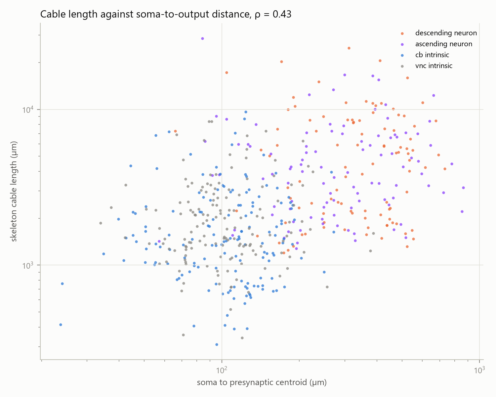

# Cable length validation

## Hypothesis (committed in `e62c6df`, in `wiring_economy_extensions.md`)

Skeletons from neuPrint for a stratified random sample of neurons (100 descending, 100 ascending, 150 central brain intrinsic, 150 nerve cord intrinsic, fixed seed). Total cable length is compared with the Euclidean distance from soma to the centroid of the neuron's presynaptic sites, the geometric quantity node positions stand in for.

> **H9**: skeleton cable length is **positively** correlated with soma-to-output distance (Spearman, one-sided, α = 0.05).

## Results

500 neurons sampled; 0 have no skeleton in neuPrint, leaving 500. Cable length is the summed length of parent-child segments of the unhealed skeleton, so gaps between fragments are not counted.

Spearman ρ = 0.428, one-sided p = 5.47e-24. **H9 is supported.**

| superclass | n | Spearman ρ | p | median cable | median soma to output | median ratio |
|---|---|---|---|---|---|---|
| descending neuron | 100 | 0.051 | 0.617 | 4,592 µm | 349 µm | 11.6 |
| ascending neuron | 100 | 0.120 | 0.236 | 3,898 µm | 272 µm | 13.6 |
| cb intrinsic | 150 | 0.015 | 0.853 | 1,428 µm | 111 µm | 13.9 |
| vnc intrinsic | 150 | 0.018 | 0.831 | 1,713 µm | 99 µm | 18.0 |

Per-superclass correlations are descriptive. Within every superclass |ρ| is below 0.12, so the overall correlation comes from differences between superclasses: neurons whose outputs lie far from the soma, such as descending and ascending neurons, have more cable, but among neurons of one superclass soma-to-output distance does not predict cable length. Node positions therefore track the between-class structure of wiring cost, not the cable of individual neurons. Per-neuron values: `cable_length.csv`.

