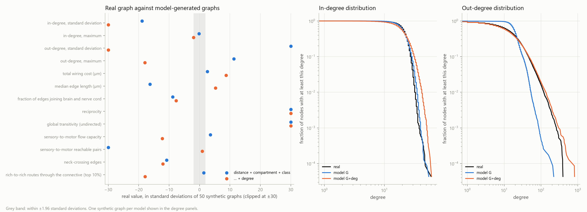

# Generative wiring model

## Hypothesis and protocol (stated before any model was fitted)

**Data.** Every ordered pair (i, j), i ≠ j, of the 23,073 (cell type, hemisphere) nodes; the response is 1 when the edge i → j is in the graph.

**Model G (primary, as specified).** Logistic regression of edge presence on: distance between the two node positions (in units of 100 µm) and its logarithm, log(distance + 1 µm); an indicator that both nodes share a compartment; and a one-hot term for the ordered pair (source superclass, target superclass). Fitted with scikit-learn `LogisticRegression` (lbfgs, L2 penalty, C = 1.0, which keeps superclass pairs without any edge from diverging).

**Negative sampling.** All real edges plus 5 non-edges per real edge, drawn uniformly without replacement from all ordered non-edge pairs with a fixed seed. Case-control sampling changes only the intercept; the fitted intercept is corrected by log(sampled non-edges / all non-edges) before generating graphs.

**Fit quality.** McFadden pseudo-R² (1 − log-likelihood of the model / log-likelihood of an intercept-only model, on the fitting sample), AIC, and 5-fold cross-validated ROC AUC. Nested models are reported to show what each term adds: distance only; distance + compartment; model G. A secondary model G+deg adds log(1 + out-degree of i) and log(1 + in-degree of j).

**Synthetic graphs.** 50 graphs from model G, and 50 from model G+deg as a secondary. Each ordered pair is an independent Bernoulli draw with probability σ(corrected logit + c), where the scalar shift c is solved so that the expected number of edges equals the number of real edges; realized edge counts are reported.

**Compared properties** (each computed on the real graph and on every synthetic graph): standard deviation and maximum of in-degree and of out-degree; total wiring cost; median edge length; fraction of edges joining the two compartments; reciprocity; global transitivity of the undirected graph; sensory-to-motor flow capacity and reachable pairs (sets as in `results/connective_value.md`); number of neck-crossing edges; and the rich-to-rich route statistic R of `results/connective_richclub.md`. The Kolmogorov-Smirnov distance between real and synthetic in- and out-degree distributions is reported descriptively.

**Criterion.** A property counts as reproduced when the real value lies within the central 95% of the 50 synthetic values (2.5th to 97.5th percentile). The report states the fraction of properties reproduced and lists each one either way. No threshold for a "good" model is set; the model reproducing many or few properties is equally reportable.

## Fit

Protocol committed in `e62c6df` before any model was fitted.

Fitting sample: all 490,884 edges and 2,454,420 uniformly sampled non-edges, out of 531,849,372 non-edge ordered pairs. Intercept correction for the sampling: -5.378.

| model | parameters | McFadden pseudo-R² | AIC | 5-fold CV AUC (range over folds) |
|---|---|---|---|---|
| distance only | 3 | 0.1646 | 2,217,311 | 0.7859 (0.7849–0.7869) |
| distance + compartment | 4 | 0.1650 | 2,216,170 | 0.7868 (0.7858–0.7878) |
| distance + compartment + class pairing (G) | 404 | 0.2755 | 1,923,558 | 0.8475 (0.8460–0.8482) |
| G + source out-degree + target in-degree | 406 | 0.3809 | 1,644,045 | 0.8992 (0.8984–0.8999) |

Model G coefficients: -0.248 per 100 µm of distance and -0.705 per unit of log distance; same compartment 0.698. Largest class-pairing coefficients: `descending_neuron->vnc_efferent` 4.88, `descending_neuron->vnc_intrinsic` 4.03, `descending_neuron->vnc_motor` 3.88, `descending_neuron->ascending_neuron` 3.82, `ascending_neuron->cb_motor` 3.61. Smallest: `descending_neuron->ol_intrinsic` -3.26, `vnc_motor->vnc_intrinsic` -4.06, `vnc_intrinsic->cb_intrinsic` -6.07, `cb_intrinsic->vnc_intrinsic` -6.07, `cb_intrinsic->ol_intrinsic` -6.61.

After the intercept correction, model G expects 497,689 edges over all ordered pairs against 490,884 real edges; the shift that matches the count exactly is -0.014 (model G+deg: expected 511,033, shift -0.041).

## Synthetic graphs

- model G: 50 graphs, 490,923 edges on average (489,172–492,206; real 490,884); mean Kolmogorov-Smirnov distance to the real degree distribution 0.050 (in) and 0.351 (out).
- model G+deg: 50 graphs, 490,848 edges on average (488,996–492,529; real 490,884); mean Kolmogorov-Smirnov distance to the real degree distribution 0.113 (in) and 0.039 (out).

| property | real | model G: synthetic mean [central 95%] | reproduced | model G+deg: synthetic mean [central 95%] | reproduced |
|---|---|---|---|---|---|
| in-degree, standard deviation | 5.259 | 5.674 [5.633–5.719] | no | 7.867 [7.814–7.915] | no |
| in-degree, maximum | 60 | 61.14 [49.23–78.1] | yes | 70.5 [61.45–81.78] | no |
| out-degree, standard deviation | 25.19 | 9.649 [9.555–9.75] | no | 29.07 [28.86–29.22] | no |
| out-degree, maximum | 395 | 235 [212–264] | no | 858 [814–913] | no |
| total wiring cost (µm) | 93,094,951 | 92,665,573 [92,326,370–92,945,604] | no | 91,418,567 [91,121,601–91,766,221] | no |
| median edge length (µm) | 154 | 158 [157–158] | no | 153 [153–154] | no |
| fraction of edges joining brain and nerve cord | 0.07777 | 0.08133 [0.08062–0.08202] | no | 0.0803 [0.07976–0.08093] | no |
| reciprocity | 0.07934 | 0.003789 [0.003597–0.004005] | no | 0.005068 [0.004803–0.005411] | no |
| global transitivity (undirected) | 0.07989 | 0.005085 [0.005016–0.005156] | no | 0.009703 [0.009564–0.00983] | no |
| sensory-to-motor flow capacity | 8,731 | 8,365 [8,168–8,580] | no | 9,995 [9,820–10,225] | no |
| sensory-to-motor reachable pairs | 269,011 | 275,573 [275,250–275,617] | no | 267,807 [265,341–270,112] | yes |
| neck-crossing edges | 36,943 | 39,241 [38,931–39,587] | no | 39,181 [38,885–39,550] | no |
| rich-to-rich routes through the connective (top 10%) | 7,454 | 6,636 [5,540–7,600] | yes | 15,495 [14,852–16,489] | no |

**Model G reproduces 2 of 13 properties (15%).** Reproduced: in-degree, maximum, rich-to-rich routes through the connective (top 10%). Not reproduced: in-degree, standard deviation, out-degree, standard deviation, out-degree, maximum, total wiring cost (µm), median edge length (µm), fraction of edges joining brain and nerve cord, reciprocity, global transitivity (undirected), sensory-to-motor flow capacity, sensory-to-motor reachable pairs, neck-crossing edges.

**Model G+deg reproduces 1 of 13 properties (8%).** Reproduced: sensory-to-motor reachable pairs. Not reproduced: in-degree, standard deviation, in-degree, maximum, out-degree, standard deviation, out-degree, maximum, total wiring cost (µm), median edge length (µm), fraction of edges joining brain and nerve cord, reciprocity, global transitivity (undirected), sensory-to-motor flow capacity, neck-crossing edges, rich-to-rich routes through the connective (top 10%).

Neither model produces the local structure of the real graph: it has 21 and 16 times the reciprocity of model G and model G+deg graphs, and 16 and 8 times their transitivity, which is expected of models that draw every ordered pair independently. Adding degree fixes the out-degree distribution (Kolmogorov-Smirnov distance 0.039 against 0.351) but makes rich-to-rich routing through the connective 2.1 times too frequent. Distance, compartment and cell class alone produce as many rich-to-rich routes as the real graph: the enrichment over degree-preserving rewiring reported in `connective_richclub.md` is matched by a model built from those three factors, without the real degree sequence.

