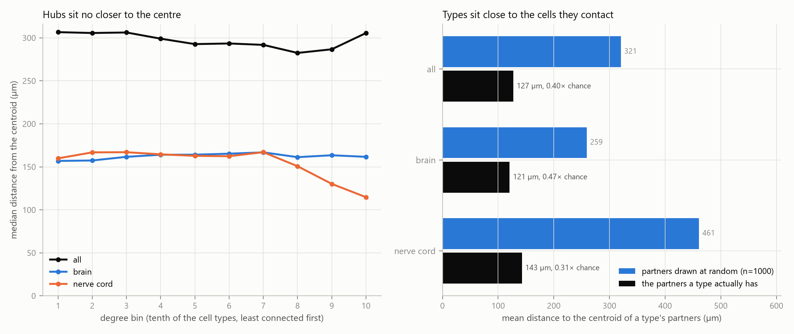

# Hub placement

A cell type that is heavily connected pays its position on every one of its connections, so wiring economy predicts that the best connected types sit centrally. Over all 23,073 cell types the rank correlation between total degree and distance from the centroid of every type's position is -0.043: no relationship. Split by compartment it is +0.018 in the brain and -0.144 in the nerve cord, which do not even agree in sign.

## Where the types sit

| scope | types | centroid_um | median_distance_um | max_distance_um |
|---|---|---|---|---|
| all | 23073 | 391.7, 271.3, 391.5 | 297.1 | 689.27 |
| brain | 16052 | 387.2, 195.4, 213.3 | 162.48 | 865.52 |
| nerve cord | 7021 | 401.8, 444.9, 799 | 157.75 | 755.81 |

Distance is measured from the centroid of the cell types of that scope, not of the whole specimen: the brain and the nerve cord occupy different volumes, and a shared centre would rank a type by which compartment it belongs to rather than by where it sits inside it.

## Degree and wire against distance from the centre

| scope | measure | types | spearman_rho | spearman_p | pearson_log_r | pearson_log_p |
|---|---|---|---|---|---|---|
| all | degree | 23073 | -0.0428 | 0.0 | -0.0055 | 0.40187 |
| all | wire | 23073 | 0.0015 | 0.824353 | 0.0439 | 0.0 |
| brain | degree | 16052 | 0.0181 | 0.021494 | 0.0501 | 0.0 |
| brain | wire | 16052 | -0.0979 | 0.0 | 0.0698 | 0.0 |
| nerve cord | degree | 7021 | -0.1443 | 0.0 | -0.1061 | 0.0 |
| nerve cord | wire | 7021 | -0.054 | 6e-06 | 0.0275 | 0.021252 |

`spearman_rho` is over every type in the scope; `pearson_log_r` is Pearson's r between the base-10 logarithm of the measure and the distance, over the types with a positive value (3 of 23,073 types have no connection at all). `degree` is a type's total degree and `wire` is the summed length of the connections it takes part in.

The largest correlation in the table is -0.144, for degree in the nerve cord scope; every other one is smaller in absolute value. The brain and the nerve cord lean opposite ways, which is why they are reported apart: pooling them would have cancelled two weak tendencies into one number that belongs to neither compartment. This is a null result: at the level of whole cell types, how well connected a type is says next to nothing about how far from the centre of its compartment it sits.

## Distance to one's own partners

The same cell types are, however, placed close to the cells they actually contact. Each type is compared with a null in which it keeps its degree but draws that many partners uniformly at random from the other cell types, never itself, with replacement; 1000 draws, seeded from 20360916.

| scope | real_um | null_mean_um | null_sd_um | z_score | ratio | n_at_or_below_real | p_value | permutations |
|---|---|---|---|---|---|---|---|---|
| all | 127.31 | 320.67 | 0.311 | -622.7 | 0.397 | 0 | 0.000999 | 1000 |
| brain | 120.61 | 259.32 | 0.352 | -393.7 | 0.4651 | 0 | 0.000999 | 1000 |
| nerve cord | 142.64 | 460.91 | 0.6 | -530.6 | 0.3095 | 0 | 0.000999 | 1000 |

Over the 23,070 types with at least one connection the mean distance to the centroid of a type's partners is 127.3 µm against 320.7 µm for random partners, a ratio of 0.397 (z = -622.7, p = 0.0010). 95.4% of types sit nearer their own partners than their own null mean.

The types furthest below their own null, in units of that null's standard deviation:

| cell_type | side | compartment | degree | distance_to_partners_um | z_score |
|---|---|---|---|---|---|
| SNppxx | R | vnc | 402 | 18.4 | -29.1 |
| SNta37 | R | vnc | 260 | 48.55 | -26.9 |
| SNppxx | L | vnc | 292 | 16.87 | -26.1 |
| IN12B002 | R | vnc | 390 | 78.34 | -25.9 |
| IN12B002 | L | vnc | 370 | 99.62 | -25.0 |
| SNta29 | L | vnc | 317 | 46.54 | -23.8 |
| SNta37 | L | vnc | 222 | 44.03 | -23.2 |
| SNta29 | R | vnc | 300 | 46.94 | -22.9 |
| IN02A030 | L | vnc | 147 | 57.65 | -22.5 |
| SNta20 | R | vnc | 224 | 51.25 | -22.0 |
| SNta38 | R | vnc | 194 | 69.54 | -21.6 |
| INXXX258 | R | vnc | 126 | 56.36 | -21.6 |

Taken together the two tests say that placement economy here is local rather than radial. A type is placed among its partners, but being well connected does not pull it towards the middle of its compartment.

