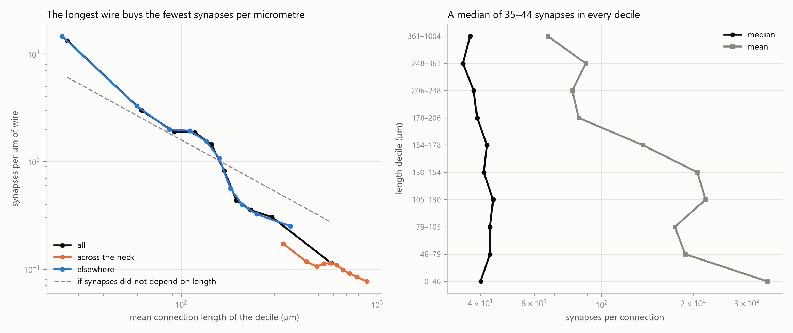

# What the wire buys

The 490,884 connections of the cell-type graph hold 93.09 m of wire and 78,192,944 synapses, 0.840 synapses per micrometre overall. Sorted by length into deciles, the shortest tenth buys 13.37 synapses per micrometre and the longest tenth 0.11, a factor of 117. That fall is almost entirely the length in the denominator: the rank correlation between a connection's length and the number of synapses it carries is -0.054, so a long connection carries about the same number of synapses as short ones.

## Synapses per micrometre by length decile

| decile | edges | min_length_um | max_length_um | mean_length_um | synapses | mean_synapses | median_synapses | synapses_per_um | expected_per_um | observed_over_expected |
|---|---|---|---|---|---|---|---|---|---|---|
| 1 | 49089 | 0.32 | 46.03 | 26.16 | 17172183 | 349.8 | 40.0 | 13.3737 | 6.0897 | 2.196 |
| 2 | 49088 | 46.03 | 78.59 | 62.86 | 9228320 | 188.0 | 43.0 | 2.9906 | 2.534 | 1.18 |
| 3 | 49088 | 78.59 | 104.78 | 92.06 | 8538399 | 173.9 | 43.0 | 1.8894 | 1.7303 | 1.092 |
| 4 | 49089 | 104.78 | 130.12 | 117.34 | 10761396 | 219.2 | 44.0 | 1.8683 | 1.3576 | 1.376 |
| 5 | 49088 | 130.12 | 154.33 | 142.48 | 10124219 | 206.2 | 41.0 | 1.4476 | 1.118 | 1.295 |
| 6 | 49088 | 154.33 | 177.75 | 165.9 | 6697240 | 136.4 | 42.0 | 0.8224 | 0.9601 | 0.857 |
| 7 | 49089 | 177.75 | 206.26 | 191.22 | 4124877 | 84.0 | 39.0 | 0.4394 | 0.833 | 0.528 |
| 8 | 49088 | 206.26 | 248.39 | 225.5 | 3930275 | 80.1 | 38.0 | 0.3551 | 0.7064 | 0.503 |
| 9 | 49088 | 248.4 | 360.56 | 290.27 | 4350969 | 88.6 | 35.0 | 0.3054 | 0.5488 | 0.556 |
| 10 | 49089 | 360.56 | 1003.9 | 582.68 | 3265066 | 66.5 | 37.0 | 0.1141 | 0.2734 | 0.418 |

`expected_per_um` is the mean synapse count over all 490,884 connections divided by the decile's mean length, the density the decile would show if synapse count did not depend on length at all; `observed_over_expected` is the observed density against it. A decile that buys its synapses at the going rate sits at 1.

## Length against synapse count

| group | edges | wire_um | synapses | synapses_per_um | mean_synapses | median_synapses | spearman_rho | spearman_p | pearson_log_r | pearson_log_p |
|---|---|---|---|---|---|---|---|---|---|---|
| all | 490884 | 93094951.3 | 78192944 | 0.8399 | 159.3 | 40.0 | -0.0536 | 0.0 | -0.063 | 0.0 |
| across the neck | 36943 | 22371156.5 | 2296720 | 0.1027 | 62.2 | 37.0 | 0.0891 | 0.0 | 0.0915 | 0.0 |
| elsewhere | 453941 | 70723794.8 | 75896224 | 1.0731 | 167.2 | 40.0 | -0.0479 | 0.0 | -0.0538 | 0.0 |

This is a null result and it carries the section. Length and synapse count are all but uncorrelated: rho = -0.054 over 490,884 connections, and -0.063 for Pearson's r on the logarithm of both. With this many connections a correlation this small still returns a p-value at the floor of double precision, which is a statement about the sample size and not about the size of the effect. The median connection carries 40 synapses in the shortest decile and 37 in the longest, a ratio of 0.93. Nothing here says that a connection which cost more to build carries a heavier synaptic load; what the extra wire buys is reach, not weight.

## Across the neck against everywhere else

Neck-crossing connections are the longest in the graph, mean 606 µm against 156 µm elsewhere. They hold 24.0% of the wire and 2.9% of the synapses, so they buy 0.103 synapses per micrometre against 1.073 elsewhere, a factor of 10.4 worse. Per connection, though, they carry a median of 37 synapses against 40 elsewhere. Within the neck-crossing connections themselves the correlation between length and synapse count is +0.089, against -0.048 for everything else. Both are negligible, so inside each group as well as across the whole graph the price per micrometre is set by the length and not by what the connection carries.

## Reading

Synapses per micrometre is a ratio whose numerator is flat and whose denominator spans the length distribution, so its decline with length is close to arithmetic rather than a discovered relationship. The finding worth stating is the flat numerator. A cell type pays for reach by the micrometre and receives, for each connection it makes, a synaptic contact of much the same size wherever the partner sits. Long connections here are not compensated with extra synapses for their cost.

