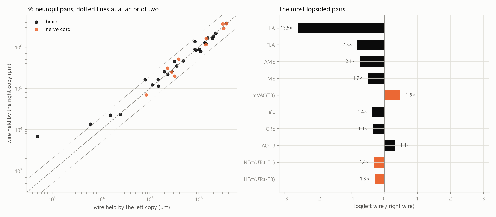

# Wire symmetry

Of the 89 neuropils that hold cell types, 72 form 36 left-right pairs and carry 75.38% of the wire. Within a pair the two sides hold wire within a factor of 1.13 of each other at the median and 1.30 on average; the widest gap is LA, where the right copy holds 13.5 times the wire of the other. Across all pairs the right side holds a geometric mean of 1.132 times the wire of the other, which a sign-flip null does not separate from chance (p = 0.109).

## Pairs

| neuropil | compartment | types_left | types_right | wire_left_um | wire_right_um | wire_share_left | wire_share_right | cost_ratio_left | cost_ratio_right | log_ratio |
|---|---|---|---|---|---|---|---|---|---|---|
| AVLP | brain | 1075 | 1135 | 3571779.1 | 3772115.1 | 0.038367 | 0.040519 | 0.879 | 0.8632 | -0.0546 |
| LegNp(T2) | vnc | 799 | 803 | 3654372.6 | 3681527.0 | 0.039254 | 0.039546 | 0.8947 | 0.8854 | -0.0074 |
| LegNp(T3) | vnc | 636 | 759 | 3082269.8 | 3672529.2 | 0.033109 | 0.039449 | 0.9221 | 0.8942 | -0.1752 |
| LegNp(T1) | vnc | 667 | 590 | 3191968.1 | 2845393.5 | 0.034287 | 0.030564 | 0.8906 | 0.8852 | 0.1149 |
| AL | brain | 551 | 570 | 2218767.7 | 2165311.5 | 0.023833 | 0.023259 | 0.974 | 0.9603 | 0.0244 |
| LH | brain | 668 | 620 | 1971313.5 | 1834853.3 | 0.021175 | 0.019709 | 0.8898 | 0.862 | 0.0717 |
| SMP | brain | 549 | 500 | 1894853.7 | 1625481.6 | 0.020354 | 0.01746 | 0.8196 | 0.8441 | 0.1533 |
| PLP | brain | 438 | 485 | 1514165.3 | 1667719.5 | 0.016265 | 0.017914 | 0.8313 | 0.8344 | -0.0966 |
| Ov | vnc | 301 | 341 | 1409114.3 | 1597230.6 | 0.015136 | 0.017157 | 0.8002 | 0.8296 | -0.1253 |
| SLP | brain | 533 | 455 | 1390206.8 | 1229844.5 | 0.014933 | 0.013211 | 0.7964 | 0.7812 | 0.1226 |
| SPS | brain | 299 | 311 | 1314154.7 | 1283418.0 | 0.014116 | 0.013786 | 0.7634 | 0.8202 | 0.0237 |
| WTct(UTct-T2) | vnc | 305 | 257 | 1390407.8 | 1137664.7 | 0.014935 | 0.01222 | 0.8733 | 0.8809 | 0.2006 |
| ME | brain | 278 | 448 | 829585.5 | 1369071.7 | 0.008911 | 0.014706 | 0.6806 | 0.7593 | -0.501 |
| LO | brain | 248 | 228 | 1024972.2 | 887601.8 | 0.01101 | 0.009534 | 0.7491 | 0.7404 | 0.1439 |
| AOTU | brain | 360 | 247 | 1078284.5 | 787093.8 | 0.011583 | 0.008455 | 0.536 | 0.5163 | 0.3148 |
| gL | brain | 219 | 214 | 873591.1 | 848253.0 | 0.009384 | 0.009112 | 0.4282 | 0.5661 | 0.0294 |
| CA | brain | 200 | 227 | 829797.7 | 890666.7 | 0.008913 | 0.009567 | 0.6482 | 0.667 | -0.0708 |
| WED | brain | 120 | 106 | 474849.0 | 462619.4 | 0.005101 | 0.004969 | 0.7372 | 0.5768 | 0.0261 |
| HTct(UTct-T3) | vnc | 90 | 126 | 385807.3 | 516315.4 | 0.004144 | 0.005546 | 0.7799 | 0.8858 | -0.2914 |
| CRE | brain | 68 | 90 | 317698.4 | 449547.0 | 0.003413 | 0.004829 |  |  | -0.3471 |
| IPS | brain | 94 | 85 | 350327.3 | 349091.6 | 0.003763 | 0.00375 |  |  | 0.0035 |
| SIP | brain | 71 | 79 | 280141.3 | 257283.6 | 0.003009 | 0.002764 |  |  | 0.0851 |
| NTct(UTct-T1) | vnc | 20 | 32 | 228053.1 | 308075.8 | 0.00245 | 0.003309 |  |  | -0.3008 |
| mVAC(T2) | vnc | 44 | 34 | 277247.8 | 252148.3 | 0.002978 | 0.002709 |  |  | 0.0949 |
| mVAC(T3) | vnc | 47 | 39 | 321266.2 | 196978.5 | 0.003451 | 0.002116 |  |  | 0.4892 |
| ICL | brain | 47 | 47 | 196216.1 | 256334.2 | 0.002108 | 0.002753 |  |  | -0.2673 |
| ATL | brain | 52 | 51 | 229995.4 | 221141.9 | 0.002471 | 0.002375 |  |  | 0.0393 |
| LOP | brain | 47 | 51 | 146853.8 | 162594.9 | 0.001577 | 0.001747 | 0.8546 | 0.8431 | -0.1018 |
| PVLP | brain | 51 | 38 | 148290.7 | 113867.6 | 0.001593 | 0.001223 |  |  | 0.2641 |
| AME | brain | 30 | 56 | 79289.1 | 162749.3 | 0.000852 | 0.001748 |  |  | -0.7191 |
| LAL | brain | 26 | 33 | 111627.5 | 121220.6 | 0.001199 | 0.001302 |  |  | -0.0824 |
| mVAC(T1) | vnc | 15 | 15 | 83806.7 | 69414.9 | 0.0009 | 0.000746 |  |  | 0.1884 |
| aL | brain | 9 | 10 | 24747.1 | 23591.1 | 0.000266 | 0.000253 |  |  | 0.0478 |
| a'L | brain | 6 | 3 | 15534.3 | 22259.5 | 0.000167 | 0.000239 |  |  | -0.3597 |
| FLA | brain | 3 | 6 | 6022.1 | 13576.5 | 6.5e-05 | 0.000146 |  |  | -0.8129 |
| LA | brain | 1 | 4 | 503.4 | 6798.6 | 5e-06 | 7.3e-05 |  |  | -2.6031 |

`wire_um`, `wire_share`, `types` and `cost_ratio` are read from `results/wire_atlas.json` rather than recomputed; `cost_ratio` is blank for a side the atlas left untested because it holds too few cell types or too few internal connections. `log_ratio` is the natural logarithm of the left side's wire over the right side's, so it is zero for a pair in balance and positive when the left copy holds more.

## Is the asymmetry larger than expected?

Two nulls, because the question has two halves.

**A systematic side bias.** If the two hemispheres are wired alike, the sign of a pair's `log_ratio` is arbitrary, so negating each pair's log ratio at random gives the null distribution of their mean. Observed mean -0.1244 against a null spread of 0.0836 (z = -1.49, two-sided p = 0.1089 over 1000 sign flips). There is no side bias in the wiring budget that this test can separate from chance.

**The size of the gap within a pair.** Matching each left neuropil to a right neuropil drawn at random instead of to its own counterpart gives the asymmetry expected between two unrelated structures of this atlas. The observed mean absolute log ratio is 0.2598 against 1.8687 ± 0.1785 for random matching (0 of 1000 random matchings at or below the observed value, p = 0.0010). Counterparts are far more alike than arbitrary neuropils, which is what the name pairing asserts and is worth confirming, but it is a weak null: it sets no scale for how alike two copies of the same structure ought to be.

On neither test is the observed asymmetry larger than expected. It is smaller than random matching, and its direction is not consistent enough across pairs to register. The left-right difference in the wiring budget of this specimen is a null result.

## Internal placement economy

20 pairs have an internal cost ratio on both sides. The mean left-minus-right difference is -0.0074 against a sign-flip null spread of 0.0132 (z = -0.56, p = 0.6074), and the mean absolute difference is 0.0389 on ratios that all sit below one. Whatever placement economy a neuropil has, its opposite copy has about the same amount of it.

## Neuropils that are not part of a pair

12 neuropils carry no hemisphere suffix and together hold 24.58% of the wire:

| neuropil | compartment | types | wire_um | wire_share |
|---|---|---|---|---|
| GNG | brain | 1918 | 9445105.9 | 0.101457 |
| ANm | vnc | 1108 | 5420444.2 | 0.058225 |
| SAD | brain | 677 | 3030044.6 | 0.032548 |
| PB | brain | 820 | 2718639.5 | 0.029203 |
| IB | brain | 195 | 904675.5 | 0.009718 |
| PRW | brain | 106 | 432575.6 | 0.004647 |
| IntTct | vnc | 86 | 373675.9 | 0.004014 |
| LTct | vnc | 49 | 297901.3 | 0.0032 |
| CV-anterior | brain | 28 | 153415.0 | 0.001648 |
| CRN | brain | 10 | 88370.7 | 0.000949 |
| FB | brain | 5 | 17960.2 | 0.000193 |
| EB | brain | 2 | 3672.3 | 3.9e-05 |

5 are one side of a structure whose other side holds no cell type in this specimen, holding 0.03% of the wire between them. They are excluded from the tests above and listed here rather than dropped:

| neuropil | compartment | types | wire_um | wire_share |
|---|---|---|---|---|
| bL(R) | brain | 2 | 9401.4 | 0.000101 |
| AB(L) | brain | 1 | 9350.3 | 0.0001 |
| SCL(R) | brain | 2 | 5171.4 | 5.6e-05 |
| VES(R) | brain | 1 | 2956.0 | 3.2e-05 |
| b'L(L) | brain | 1 | 2326.8 | 2.5e-05 |

